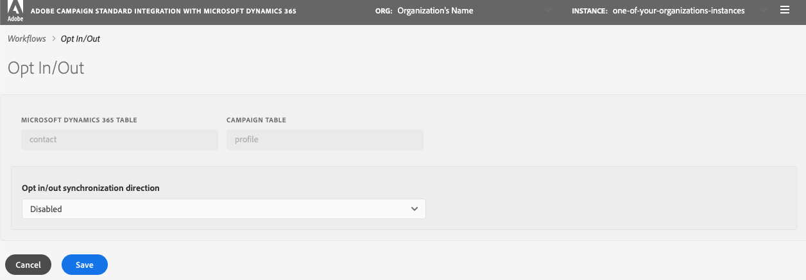

# 同步資料

您可以將表格從Microsoft Dynamics 365同步至促銷活動，以及將促銷活動行銷量度同步至Microsoft Dynamics 365。 同步會透過三個專用的技術工作流程執行： **[!UICONTROL Microsoft Dynamics 365 to Campaign]**, **[!UICONTROL Campaign to Microsoft Dynamics 365]**, **[!UICONTROL Opt-In/Out]**. 請參閱本區段以 [了解更多](../../integrating/using/d365-acs-self-service-app-workflows.md).

>[!IMPORTANT]
>您需要停止/啟動 **[!UICONTROL Microsoft Dynamics 365 to Campaign]** 工作流程，將您的變更納入考量。 [了解更多](../../integrating/using/d365-acs-self-service-app-workflows.md)

## 將表格從Microsoft Dynamics 365對應至Campaign

此 **[!UICONTROL Microsoft Dynamics 365 to Campaign]** 頁面顯示Microsoft Dynamics 365中的實體清單，以及將同步的Adobe Campaign中自訂資源。 您可以新增對應、編輯或刪除現有對應。

下表對此表中各列的說明如下：

* **[!UICONTROL MICROSOFT DYNAMICS 365 TABLE]**:此欄會識別Microsoft Dynamics 365中的哪個實體將是對應的資料來源。

* **[!UICONTROL CAMPAIGN TABLE]**:此欄會識別Adobe Campaign中的哪個資源將是對應的資料目的地。

* **[!UICONTROL ACTIONS]**:可能的動作列於下列：

   * 按一下 **[!UICONTROL Edit]** 圖示來編輯此對應。

   * 使用  **[!UICONTROL Delete]** 表徵圖，刪除表映射。

   * 按一下 **[!UICONTROL Replay Data]** 表徵圖，重新同步Microsoft Dynamics 365表中的所有資料。 一般而言，整合應用程式只會同步Microsoft Dynamics 365中最近已變更的資料。  但是，在某些情況下（例如，您已進行變更或發生錯誤），您可能會想要將所有資料重新同步。  在這些情況下，您可以按一下此按鈕，並在下次停止/啟動 **[!UICONTROL Microsoft Dynamics 365 to Campaign]** 工作流程中，您的資料會開始同步。

      如果您按一下 **[!UICONTROL Replay Data]** 按鈕，且檢查成功，圖示就會變為停用：它指示此表映射對的資料將隨著下次執行 **[!UICONTROL Microsoft Dynamics 365 to Campaign]** 工作流程。

      如果下列情況成立，則無法選擇重播資料：

      * 如果「積壓」量度中有2,000,000（或更多）個項目與 **[!UICONTROL Microsoft Dynamics 365 to Campaign]** 工作流程(顯示於 **[!UICONTROL Workflows]** page)
      * 如果Microsoft Dynamics 365表格中有2,000,000或更多記錄

      需要重新同步的記錄數不同。 如果您有大量記錄，則可能需要一些時間才能完成同步過程。 請參閱 **[!UICONTROL Backlog]** 量度 **[!UICONTROL Workflows]** 頁面，而整合應用程式可運作以完成同步程式。

      >[!IMPORTANT]
      >
      > 強烈建議您在發佈對Adobe Campaign Standard或Microsoft Dynamics 365的變更時停止整合工作流程。 適用的變更包括：資源/實體（及其關聯欄位）、連結、識別碼欄等的更新。 整合目前正在使用。

## 建立新對應 {#add-a-new-mapping}

若要建立新對應，請遵循下列步驟：

1. 在 **[!UICONTROL Microsoft Dynamics 365 to Campaign]** 頁面，按一下 **[!UICONTROL Add New Mapping]** 按鈕。

1. 使用下拉式清單來選取要對應的Microsoft Dynamics 365和Campaign表格。
頁面上的大部分其他輸入內容將取決於您選擇的表格。

   

   >[!NOTE]
   >無法多次映射每個表。 因此，您會注意到下拉式清單選取項目將不包含已映射的表格。

1. 按一下 **[!UICONTROL OK]** 若要確認：應用程式需要一個短暫的時間來讀取與所選表相關聯的欄位資訊。

然後，您可以繼續進行對應設定。 [了解更多](#new-mapping-settings)

>[!IMPORTANT]
>
>只有首次添加映射時，才能選擇此頁中的表。 在按一下 **[!UICONTROL Save]** 按鈕：儲存後，表格選取欄位將會 **只讀**.

### 編輯現有對應

如果編輯現有映射，您將看到表選擇不可編輯。

這是設計的，因為頁面中的進一步輸入是根據與這些表格相關聯的欄位。 更改表會使與這些表關聯的所有欄位無效。  如果要將表更改為映射，則需要返回上一頁，刪除要更改的映射，然後添加新的映射。

### 配置單個表映射 {#new-mapping-settings}

在本節中，您將學習如何設定 **單一** 將一個Microsoft Dynamics 365表格對應至一個Adobe Campaign表格。

您可以定義下列設定：

* **[!UICONTROL Tables]**:本節列出Microsoft Dynamics 365表格的名稱，以及將對應至其的Campaign表格。
* **[!UICONTROL Field Mappings]**:深入了解 [本節](#field-mappings)
* **[!UICONTROL Field Replacements]**:深入了解 [本節](#field-replacements)
* **[!UICONTROL Filters]**:深入了解 [本節](#filters)
* **[!UICONTROL Advanced Settings]**:深入了解 [本節](#advanced-settings)

### 欄位對應 {#field-mappings}

#### 主鍵

將新的Microsoft Dynamics 365新增至Campaign表格對應時，您需要識別ID欄位。

Microsoft Dynamics 365主鍵為唯讀，因為應用程式會偵測到它。

對於Campaign，您需要選取將是唯一索引鍵的欄位。 必須將其設定為 [CRM ID自訂資源](../../developing/using/uc-calling-resource-id-key.md) 且不得有重複項目。

>[!NOTE]
>
>您只能在選取後，選擇表格上的ID欄位 **[!UICONTROL Add New Mapping]**. 如果按一下「編輯」按鈕可編輯現有的表映射，則ID欄位將為只讀。

主鍵一律為 **[!UICONTROL Field Mappings]** 區段。 提醒您，右側會列出下列圖示，以提醒您這些是主要金鑰。

#### 添加其他欄位映射

此 **[!UICONTROL Field Mappings]** 區段可讓您新增「主要索引鍵」以外的欄位對應。 若要將欄位從Microsoft Dynamics 365新增至Adobe Campaign，請按一下 **[!UICONTROL Add new field mapping]** 按鈕。

在清單中選取Microsoft Dynamics 365和促銷活動欄位：

這些清單包含與您在頁面頂端選取的Microsoft Dynamics 365和Campaign表格相關聯的欄位名稱。

此 **[!UICONTROL Apply updates]** switcher可讓您控制此欄位的更新是否會從Microsoft Dynamics 365傳播至Campaign:
* 如果已開啟 ,Microsoft Dynamics 365中值的更新將會在更新發生時傳播至Adobe Campaign。

* 如果你關掉了 ，值將在資料首次載入（或重播）時傳播，但Microsoft Dynamics 365中欄位的增量更新將不會傳播。

>[!NOTE]
>
>按一下 **[!UICONTROL Apply updates]** 列標題更新 **all** 開關或關閉。

選取欄位值時，您會看到下拉式功能表下方顯示資料類型。   將值從一個欄位對應至另一個欄位時，請謹記這一點。

>[!NOTE]
>
> 您無法將多個Microsoft Dynamics 365欄位對應至單一促銷活動欄位。

### 現場替換 {#field-replacements}

使用 **[!UICONTROL Add New Field Replacement]** 按鈕來定義新欄位替換。

現場替換允許您識別：

* Microsoft Dynamics 365欄位名稱（已在欄位對應區段中於上方新增）,
* 現有值(存在於Microsoft Dynamics 365中)，以及
* 寫給Adobe Campaign的新值

將提供供選擇清單、列舉和布林值使用的下拉式清單。 文字方塊將用於其他字串和數值類型。

### 篩選器 {#filters}

使用 **[!UICONTROL Add New Filter]** 按鈕，以選取將哪些Microsoft Dynamics 365記錄傳播至Campaign。 您可以選擇與記錄相關聯的任何欄位以新增至篩選器（欄位名稱不需要新增至欄位對應）。

您可以填寫下列資訊來指定篩選：

* Microsoft Dynamics 365欄位名稱
* 比較值，以及
* 值(來自Microsoft Dynamics 365)如果指定記錄的欄位名稱、比較和值評估為true，則記錄將傳播至Adobe Campaign。

您可以設定標示為的輸入，以選擇評估這些篩選的方式 **[!UICONTROL Choose the filter comparison operator]**.  如果您選擇 **和**，所有篩選條件都必須為true，記錄才會傳播至Campaign。 如果您選擇 **或**，則若其中任何記錄評估為true，則會傳播該記錄。

選項 **[!UICONTROL Do you want to delete records in Adobe Campaign Standard that will be filtered out from Microsoft Dynamics 365?]** 控制是否要從Campaign中刪除已篩選掉的記錄。 如果您選取 **否** 記錄會留在Adobe Campaign。 選擇 **是** 以讓整合邏輯刪除。

>[!NOTE]
>
> 如果未新增篩選器，則所有已修改的記錄將傳播至Adobe Campaign。

### 進階設定 {#advanced-settings}

設定對應時，您可以設定下列其他選項：

* 設定 **[!UICONTROL Apply deletes in Microsoft Dynamics 365 to Campaign?]** 選項 **是**，您可以將Microsoft Dynamics 365中發生的刪除內容傳播至Adobe Campaign中的對應欄位（根據欄位名稱對應）。 選擇 **否** 忽略Microsoft Dynamics 365中的刪除。

* 設定 **[!UICONTROL Use technical values in Microsoft Dynamics 365 picklists?]** 選項 **否** 如果您想要傳播至促銷活動，則顯示值會與Microsoft Dynamics 365選取清單相關聯。 選擇 **是** 來傳播技術值。

## 將促銷活動行銷事件同步至Microsoft Dynamics 365

此 **[!UICONTROL Campaign to Microsoft Dynamics 365]** 頁面可讓您識別將從Adobe Campaign對應到Microsoft Dynamics 365的電子郵件行銷事件。

您可以控制的四個量度為： **傳送**, **點按次數**, **開啟**，和 **跳出數**.

選擇 **是** 確認您確實希望該類型的事件流至Microsoft Dynamics 365。

按一下 [此處](../../integrating/using/d365-acs-self-service-app-workflows.md) 以取得這些電子郵件事件流程的詳細資訊。

## 選擇加入/退出工作流程 {#opt-in-out-wf}

此 **選擇加入/退出** 工作流程可讓您識別Microsoft Dynamics 365和Adobe Campaign之間的選擇加入/退出資訊流程。 這會假設資料與Microsoft Dynamics 365實體「聯絡」和Adobe Campaign資源「設定檔」相關聯。

進一步了解 [本節](../../integrating/using/d365-acs-notices-and-recommendations.md#opt-out).

請記住，您需要按一下「儲存」才能儲存您的選取項目。 也請記住，您必須停止 **促銷活動至Microsoft Dynamics 365** 工作流程，然後按一下「播放」以整合您的變更。

### 選擇加入/退出同步方向

以下是用於同步資料的可用選項清單：

* **[!UICONTROL Disabled]**:選取此選項時，Adobe Campaign和Microsoft Dynamics 365之間不會移動任何選擇加入/退出資訊。

* **[!UICONTROL Unidirectional (Microsoft Dynamics 365 to Campaign)]**:此選項僅用於將選擇加入/退出從Microsoft Dynamics 365流送至Adobe Campaign。 整合應用程式不會讓您在此畫面中設定流量；而是按一下 **[!UICONTROL Save button]**，並導覽至 **[!UICONTROL Microsoft Dynamics 365 to Campaign]** 工作流程。 在此工作流程中，您可以編輯聯絡人/設定檔表格對應，以識別您要如何對應選擇加入/退出欄位。

* **[!UICONTROL Unidirectional (Campaign to Microsoft Dynamics 365)]**:此選項會顯示 **對應** 區段。 這些輸入可讓您定義哪些Adobe Campaign欄位將資料對應至Microsoft Dynamics 365中的哪些欄位。 這表示，如果您碰巧在Microsoft Dynamics 365中手動更新值，則其值會在Adobe Campaign值恰好變更時被其覆寫。

* **[!UICONTROL Bidirectional]**:此選項會顯示 **對應** 區段。 這些配對將識別Microsoft Dynamics 365和Adobe Campaign中哪些欄位將彼此對應。 [深入瞭解](../../integrating/using/d365-acs-notices-and-recommendations.md)。

### 對應

只有在「選擇加入/退出」同步方向欄位設為 **[!UICONTROL Unidirectional (Campaign to Microsoft Dynamics 365)]** 或 **[!UICONTROL Bidirectional]**. 您可以定義Microsoft Dynamics 365中的哪些欄位對應至Adobe Campaign中的哪些輸入。

Microsoft Dynamics 365欄位名稱包含所有類型的名稱 **布林值**.

Adobe Campaign欄位名稱是一組固定的值，專用於選擇加入/退出。 Adobe Campaign欄位名稱是一組固定的值，專用於選擇加入/退出。 **無法更改此清單中的值集**.
