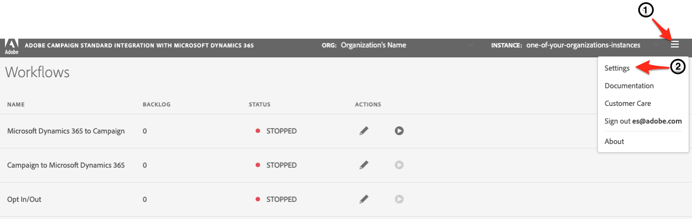

# 開始使用自助服務整合應用 {#gs-self-service-app}

Adobe Campaign Standard與MicrosoftDynamics 365自助服務整合應用程式的整合使您能夠配置資料流、控制資料流是否正在運行以及在哪個環境中運行。 但是，在開始使用自助服務整合應用程式之前，必須完成一些先決條件。

## 概念和限制 {#concepts-and-restrictions}

在開始使用整合工具之前，您需要瞭解與整合相關的概念和護欄，並採取一些初始步驟以獲得訪問權限。

在以下各節中瞭解更多資訊：

* [開始使用 Microsoft Dynamics 365 整合](../../integrating/using/d365-acs-get-started.md)
* [整合最佳做法和限制](../../integrating/using/d365-acs-notices-and-recommendations.md)
* [瞭解實施此整合的關鍵步驟](../../integrating/using/d365-acs-get-started.md#request-and-implement-this-integration)
* [使用 Microsoft Dynamics 365 整合](../../integrating/using/d365-acs-using-the-integration.md)

## 必要條件 {#self-service-app-prerequisites}

您需要配置MicrosoftDynamics 365和Adobe Campaign Standard，以便整合應用能夠訪問您的資料。 在Dynamics 365、Adobe Campaign Standard和Adobe I/O中進行配置需要一些時間；但是，一旦配置了這些應用程式，您就可以通過自助服務整合應用程式的用戶介面來控制整合。

在以下各節中瞭解更多資訊：

* [設定 Microsoft Dynamics 365 以進行 Campaign 整合](../../integrating/using/d365-acs-configure-d365.md)
* [設定 Adobe I/O](../../integrating/using/d365-acs-configure-adobe-io.md)
* [映射市場活動自定義資源和MicrosoftDynamics 365自定義實體](../../integrating/using/d365-acs-notices-and-recommendations.md)

## 配置自助服務整合應用的關鍵步驟 {#self-service-app-configuration-steps}

然後，可以從整合工具開始。 按步驟執行：

1. [獲取整合應用的訪問權限](../../integrating/using/d365-acs-self-service-app-control-access.md)
1. [配置整合應用程式以供使用](../../integrating/using/d365-acs-self-service-app-settings.md)
1. [實現資料同步](../../integrating/using/d365-acs-self-service-app-data-sync.md)
1. [配置同步工作流](../../integrating/using/d365-acs-self-service-app-workflows.md)

## 連結到整合應用 {#self-service-app-link}

開啟瀏覽器並瀏覽到與您的區域關聯的連接器：

* [亞太](https://d365-acs-ap.ea.adobe.com/)
* [歐洲、中東或非洲(EMEA)](https://d365-acs-em.ea.adobe.com/)
* [美洲](https://d365-acs-am.ea.adobe.com/)

## 隱私請求確認 {#self-service-app-acknowledgement}

首次瀏覽到自助服務UI時，將顯示隱私確認。 您需要確認，在繼續之前，您已瞭解自己在「市場活動」和MicrosoftDynamics 365中分別執行隱私請求時的角色。
瞭解有關您的隱私責任以及如何管理隱私請求的詳細資訊 [此部分](../../integrating/using/d365-acs-notices-and-recommendations.md#acs-msdyn-manage-privacy)。

## 設定憑據 {#self-service-app-credentials}

當您首次瀏覽到UI時，您應看到頁面的標題如下所示：

>[!NOTE]
>
> 如果尚未配置應用設定，則通常會收到提到它「無法連接」到Adobe Campaign Standard或MicrosoftDynamics 365的警報。

請驗證「ORG」和「INSTANCE」選項是否是您計畫配置的選項。  否則，按一下下拉清單並選擇正確的組織和實例。

>[!IMPORTANT]
>
> 如果您是首次配置連接器，並且/或您是此流程的新成員，則我們 **強烈** 敦促您選擇「stage」或「dev」實例。 在生產中嘗試安裝之前，您需要確保驗證配置是否工作正常。

如果您擁有正確的組織和實例，則按一下「漢堡包」菜單以顯示下拉菜單。 然後按一下 **[!UICONTROL Settings...]** 在下拉菜單中，訪問在其中輸入MicrosoftDynamics 365和市場活動憑據的頁面（請參閱下面）。

在 **[!UICONTROL Settings]** 的子菜單。

* MicrosoftDynamics 365憑據
* Adobe憑據

開始 [這裡](../../integrating/using/d365-acs-self-service-app-settings.md) 的子菜單。 完成後，按一下 **[!UICONTROL Save]** 按鈕。

## 檢查初始配置 {#self-service-app-initial-config}

假定您已完成上述先決條件並正確添加了所有憑據，現在，我們導航到 **[!UICONTROL Workflows]** 的子菜單。 瞭解有關中整合應用工作流的詳細資訊 [此頁](../../integrating/using/d365-acs-self-service-app-workflows.md)。

在  **[!UICONTROL Workflows]** 中，按一下與 **[!UICONTROL Microsoft Dynamics 365 to Campaign]** 工作流，以編輯其配置。

在 **[!UICONTROL Microsoft Dynamics 365 to Campaign]** 頁中，您可以訪問已配置的表映射的清單。  它將預設您為現成聯繫人/配置檔案映射。 需要單獨配置所有其他自定義實體。

在 **[!UICONTROL Edit Table Mapping]** 的 **[!UICONTROL Mappings]** 部分，以確保將MicrosoftDynamics 365中的欄位映射到市場活動中的正確欄位。 如果需要添加任何其他映射，請立即添加，並添加任何替換項或篩選器。 [了解更多](../../integrating/using/d365-acs-self-service-app-data-sync.md)。

如果要添加新映射，請參閱 [此部分](../../integrating/using/d365-acs-self-service-app-data-sync.md#add-a-new-mapping) 的子菜單。

配置正確後，按一下 **[!UICONTROL Play]** 按鈕 **[!UICONTROL Microsoft Dynamics 365 to Campaign]** 工作流是為了啟動整合和資料流。

>[!IMPORTANT]
>
>我們 **強烈** 建議您先在Stage或Dev環境中運行此程式，然後再在Production中運行。 請檢查是否在標題中選擇了階段/開發實例。

運行後，您應該能夠test，方法是在MicrosoftDynamics 365中添加或修改條目，並在幾分鐘內觀察Adobe Campaign的這些更改。 如果您需要隨時停止此進程，只需按同一按鈕即可停止。 [了解更多](../../integrating/using/d365-acs-self-service-app-workflows.md#workflow-status)

## 整合應用工作區 {#self-service-app-workspace}

### 應用標頭 {#app-header}

自助應用中的標題允許您定義當前正在查看和/或配置的組織和實例。

選擇 **組織** 和 **實例** 要檢視/編輯。 這些欄位顯示為只讀，但是，當您將滑鼠游標置於其上時，它們將變為可編輯。

按一下帶有三條水準線的按鈕時，將顯示一個下拉菜單  在頭的右側。

下拉菜單中的條目有：

* **設定**:選擇此選項將將您發送到一個螢幕，該螢幕允許您指定MicrosoftDynamics 365和Adobe Campaign的API憑據以及應用程式的其他常規設定。

* **文檔**:此選項是指向此整合特定的Adobe Campaign文檔的連結

* **客戶服務**:這是指向與開啟客戶服務票證相關的Experience Cloud文檔的連結

* **註銷**:這會將您從應用程式中註銷，並允許您以其他用戶身份重新登錄。

* **關於**:此時將顯示一個對話框，其中包含有關應用程式的資訊，包括版權資訊。

### 麵包屑 {#app-breadcrumbs}

瀏覽應用時，Breadcrumbs會出現在某些螢幕的頂部。

**範例:**

下面是 **[!UICONTROL Edit Table Mapping]** 顯示breadcrumbs和頁面標題的螢幕。 在這種情況下，您可以按一下 **[!UICONTROL Workflows]** 或 **[!UICONTROL Microsoft Dynamics 365 to Campaign]** 文本，可轉到以前的螢幕之一。 **[!UICONTROL Edit Table Mapping]** 在此情況下，不能按一下breadcrumbs，因為它是當前螢幕。

### 常用按鈕 {#app-buttons}

以下表徵圖用於自助應用的多個頁面。

  — 將新項目添加到清單。

  — 編輯已存在的內容

  — 從項清單中刪除項
