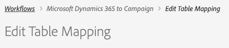

# 開始使用自助服務整合應用程式{#gs-self-service-app}

Adobe Campaign Standard與Microsoft Dynamics 365自助服務整合應用程式的整合，讓您能夠設定資料流、控制資料流是否在執行，以及在哪個環境中執行。 不過，您必須先完成一些必要條件，才能開始使用自助服務整合應用程式。

## 概念與限制{#concepts-and-restrictions}

在從整合工具開始之前，您必須瞭解與整合相關的概念和護欄，並採取一些初始步驟以取得存取權。

請從下列章節進一步瞭解：

* [開始使用 Microsoft Dynamics 365 整合](../../integrating/using/d365-acs-get-started.md)
* [整合最佳實務與限制](../../integrating/using/d365-acs-notices-and-recommendations.md)
* [瞭解實施此整合的關鍵步驟](../../integrating/using/d365-acs-get-started.md#request-and-implement-this-integration)
* [使用 Microsoft Dynamics 365 整合](../../integrating/using/d365-acs-using-the-integration.md)

## 必要條件 {#self-service-app-prerequisites}

您必須設定Microsoft Dynamics 365和Adobe Campaign Standard，讓整合應用程式能夠存取您的資料。 在Dynamics 365、Adobe Campaign Standard和Adobe I/O中進行設定需要一些時間；不過，一旦設定好這些功能後，您就可以透過自助服務整合應用程式的使用者介面來控制整合。

請從下列章節進一步瞭解：

* [設定 Microsoft Dynamics 365 以進行 Campaign 整合](../../integrating/using/d365-acs-configure-d365.md)
* [設定 Adobe I/O](../../integrating/using/d365-acs-configure-adobe-io.md)
* [映射促銷活動自訂資源和Microsoft Dynamics 365自訂實體](../../integrating/using/d365-acs-notices-and-recommendations.md)

## 設定自助服務整合應用程式{#self-service-app-configuration-steps}的關鍵步驟

然後，您就可以從整合工具開始。 請依照下列步驟進行：

1. [存取整合應用程式](../../integrating/using/d365-acs-self-service-app-control-access.md)
1. [針對您的使用情況設定整合應用程式](../../integrating/using/d365-acs-self-service-app-settings.md)
1. [實施資料同步](../../integrating/using/d365-acs-self-service-app-data-sync.md)
1. [配置同步工作流](../../integrating/using/d365-acs-self-service-app-workflows.md)

## 連結至整合應用程式{#self-service-app-link}

開啟瀏覽器並瀏覽至與您所在地區關聯的連接器：

* [亞太地區](http://d365-acs-ap.ea.adobe.com/)
* [歐洲、中東或非洲(EMEA)](http://d365-acs-em.ea.adobe.com/)
* [美洲](http://d365-acs-na.ea.adobe.com/)

## 隱私權要求確認{#self-service-app-acknowledgement}

首次瀏覽至自助服務使用者介面時，將會顯示隱私權確認。 您必須瞭解您在Campaign和Microsoft Dynamics 365中分別執行隱私權要求時的角色，才能繼續。
進一步瞭解您的隱私權責任，以及如何在[本節](../../integrating/using/d365-acs-notices-and-recommendations.md#acs-msdyn-manage-privacy)中管理隱私權要求。

## 設定憑據{#self-service-app-credentials}

當您第一次瀏覽至UI時，您應該會看到頁首如下所示：

>[!NOTE]
>
> 如果應用程式設定尚未設定，通常會收到警報，提醒您「無法連線」至Adobe Campaign Standard或Microsoft Dynamics 365。

請確認「ORG」和「INSTANCE」選項是您計畫配置的選項。  如果沒有，請按一下下拉式清單並選取正確的組織和例項。

>[!IMPORTANT]
>
> 如果您是第一次設定連接器，且／或您是此程式的新手，則我們&#x200B;**強烈**&#x200B;建議您選取「stage」或「dev」例項。 在生產中嘗試進行設定之前，請務必先確認您的設定是否正常運作。

如果您擁有正確的組織和例項，請按一下「漢堡包」功能表以顯示下拉式功能表。 然後按一下下拉式選單中的&#x200B;**[!UICONTROL Settings...]**，以造訪您輸入Microsoft Dynamics 365和Campaign認證的頁面（請參閱下面）。

在&#x200B;**[!UICONTROL Settings]**&#x200B;頁面中，填寫下列章節：

* Microsoft Dynamics 365認證
* Adobe認證

請前往[這裡](../../integrating/using/d365-acs-self-service-app-settings.md)，以取得有關在何處找到每個輸入資訊的詳細資訊。 完成後，按一下底部的&#x200B;**[!UICONTROL Save]**&#x200B;按鈕。

## 檢查初始配置{#self-service-app-initial-config}

假設您已完成上述預先要求並正確新增所有認證，現在讓我們導覽至&#x200B;**[!UICONTROL Workflows]**&#x200B;頁面。 進一步瞭解[本頁](../../integrating/using/d365-acs-self-service-app-workflows.md)中的整合應用程式工作流程。

在&#x200B;**[!UICONTROL Workflows]**&#x200B;頁面中，按一下與&#x200B;**[!UICONTROL Microsoft Dynamics 365 to Campaign]**&#x200B;工作流程關聯的鉛筆圖示以編輯其設定。

在&#x200B;**[!UICONTROL Microsoft Dynamics 365 to Campaign]**&#x200B;頁中，您可以訪問已配置的表映射清單。  它會預設為立即可用的聯絡人／描述檔對應。 所有其他自訂實體都需要個別設定。

在&#x200B;**[!UICONTROL Edit Table Mapping]**&#x200B;頁面中，勾選&#x200B;**[!UICONTROL Mappings]**&#x200B;區段，以確保Microsoft Dynamics 365的欄位已對應至促銷活動中的正確欄位。 如果您需要新增任何其他映射，請立即新增，以及任何替換項或篩選器。 [進一步瞭解](../../integrating/using/d365-acs-self-service-app-data-sync.md)。

如果要添加新映射，請參閱[此部分](../../integrating/using/d365-acs-self-service-app-data-sync.md#add-a-new-mapping)以瞭解詳細資訊。

配置正確後，按一下&#x200B;**[!UICONTROL Microsoft Dynamics 365 to Campaign]**&#x200B;工作流旁的&#x200B;**[!UICONTROL Play]**&#x200B;按鈕，以啟動整合和資料流。

>[!IMPORTANT]
>
>我們&#x200B;**強烈**&#x200B;建議您先在舞台或開發環境中執行此動作，然後再在Production中執行。 請檢查標題中是否選擇了階段／開發實例。

在執行後，您應該可以在Microsoft Dynamics 365中新增或修改項目，並在幾分鐘內觀察Adobe Campaign中的這些變更，以進行測試。 如果您需要隨時停止此程式，只需按相同的按鈕即可停止。 [進一步瞭解](../../integrating/using/d365-acs-self-service-app-workflows.md#workflow-status)

## 整合應用程式工作區{#self-service-app-workspace}

### 應用程式標題{#app-header}

自助服務應用程式中的頁首可讓您定義目前檢視和／或設定的組織和例項。

選擇要檢視／編輯的&#x200B;**ORG**&#x200B;和&#x200B;**INSTANCE**。 但是，當您將滑鼠游標置於欄位上方時，這些欄位會變成唯讀。

當您按一下標題右側有三行水準線的按鈕時，將會顯示下拉式功能表。

下拉式選單中的項目為

* **設定**:選取此選項會傳送您至螢幕，讓您指定Microsoft Dynamics 365和Adobe Campaign的API認證，以及應用程式的其他一般設定。

* **檔案**:此選項是此整合專用之Adobe Campaign檔案的連結

* **客戶服務**:這是Experience Cloud檔案的連結，與開立客戶服務票證有關

* **登出**:這會將您登出應用程式，並允許您以其他使用者的身分登入。

* **關於**:這會顯示對話方塊，其中包含應用程式的相關資訊，包括版權資訊。

### Breadcrumbs {#app-breadcrumbs}

瀏覽應用程式時，網站導覽路徑標示會出現在某些畫面的頂端。

**範例:**

以下是&#x200B;**[!UICONTROL Edit Table Mapping]**&#x200B;畫面中顯示階層連結和頁面標題的範例。 在這種情況下，您可以按一下&#x200B;**[!UICONTROL Workflows]**&#x200B;或&#x200B;**[!UICONTROL Microsoft Dynamics 365 to Campaign]**&#x200B;文字，前往其中一個先前的畫面。 **[!UICONTROL Edit Table Mapping]** 在此例中，瀏覽路徑標示無法點按，因為它是目前的畫面。

### 常用按鈕{#app-buttons}

自助服務應用程式中的多個頁面會使用下列圖示。

 -將新項目添加到清單。

 -編輯已存在的項目

 -從項目清單中刪除項目
