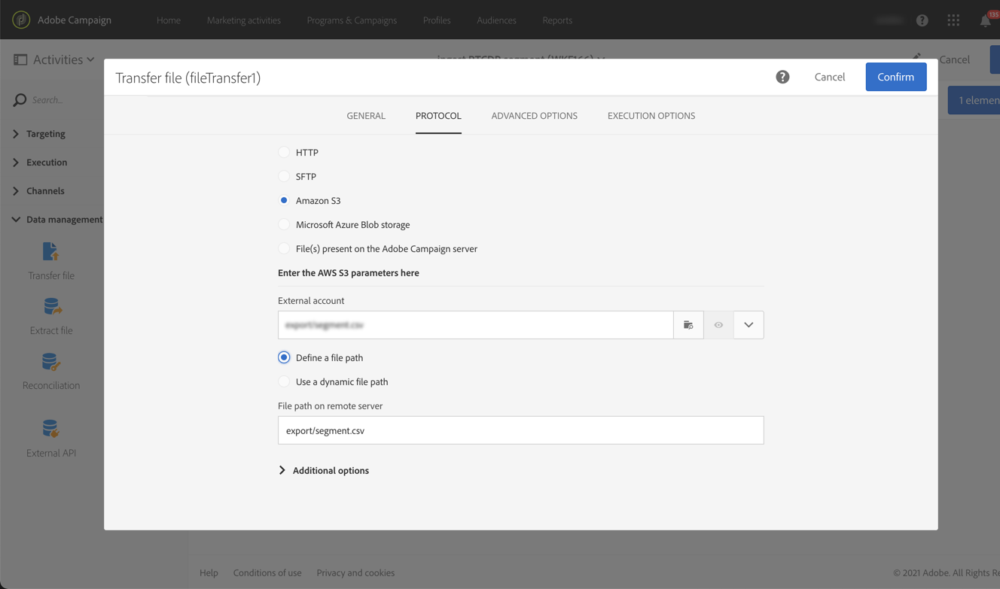

# 將資料從 Campaign 匯出至 Adobe Experience Platform {#sources}

若要將Campaign Standard資料匯出至Adobe即時客戶資料平台(RTCDP)，您必須先在Campaign Standard中建置工作流程，以將您要共用的資料匯出至Amazon儲存服務(S3)或Azure Blob儲存位置。

設定工作流程並將資料傳送至您的儲存位置後，您需要將S3或Azure blob儲存位置連結為Adobe體驗平台中的&#x200B;**Source**。

>[!NOTE]
>
>請注意，我們建議僅匯出Campaign產生的資料（例如傳送、開啟、點按等） Adobe Experience Platform。 從第三方來源（例如您的CRM）擷取的資料，應直接匯入至Adobe Experience Platform。

## 在Campaign Standard中建立匯出工作流程

若要將資料從Campaign Standard匯出至您的S3或Azure Blob儲存位置，您需要建置工作流程，以定位您要匯出的資料，並將其傳送至儲存位置。

若要這麼做，請新增及設定：

* **[!UICONTROL Extract file]**&#x200B;活動，將目標資料擷取至CSV檔案。 有關如何配置此活動的詳細資訊，請參閱[此部分](../../automating/using/extract-file.md)。

   

* **[!UICONTROL Transfer file]**&#x200B;活動，將CSV檔案傳輸至您的儲存位置。 有關如何配置此活動的詳細資訊，請參閱[此部分](../../automating/using/transfer-file.md)。

   

例如，以下工作流程會定期將記錄擷取為CSV檔案，然後將檔案傳輸至儲存位置。

[工作流程使用案例](../../automating/using/about-workflow-use-cases.md#management)區段中提供資料管理工作流程的範例。

相關主題：

* [資料管理活動](../../automating/using/about-data-management-activities.md)
* [關於資料匯入和匯出](../../automating/using/about-data-import-and-export.md)

## 將儲存位置連接為源

以下列出將您的Amazon儲存服務(S3)或Azure Blob儲存位置連結為Adobe體驗平台中&#x200B;**來源**&#x200B;的主要步驟。 [源連接器文檔](https://experienceleague.adobe.com/docs/experience-platform/sources/home.html)中提供了有關這些步驟的詳細資訊。

1. 在Adobe Experience Platform **[!UICONTROL Sources]**&#x200B;功能表中，建立與儲存位置的連線：

   * [建立Amazon S3來源連線](https://experienceleague.adobe.com/docs/experience-platform/sources/ui-tutorials/create/cloud-storage/s3.html)
   * [Azure Blob連接器](https://experienceleague.adobe.com/docs/experience-platform/sources/connectors/cloud-storage/blob.html)

   >[!NOTE]
   >
   >儲存位置可以是Amazon S3、含密碼的SFTP、含SSH金鑰的SFTP或Azure Blob連線。 要將資料傳送至Adobe Campaign的慣用方法是透過Amazon S3或Azure Blob:

   

1. 為雲儲存批處理連接配置資料流。 資料流是一項排程任務，可從儲存位置擷取資料，並內嵌至Adobe Experience Platform資料集。 此步驟可讓您設定從儲存位置擷取資料的功能，包括資料選取以及CSV欄位與XDM架構的對應。

   有關詳細資訊，請參見[此頁](https://experienceleague.adobe.com/docs/experience-platform/sources/ui-tutorials/dataflow/cloud-storage.html)。

   

1. 設定來源後，Adobe Experience Platform會從您提供的儲存位置匯入檔案。

   可根據您的需求排程此作業。 建議您根據例項上已存在的負載，每天最多執行6次匯出。
