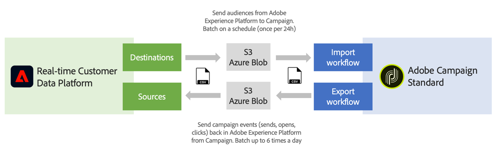

# 開始使用來源和目標 {#rtcdp}

## 關於來源和目的地

有了Adobe Experience Platform，您可以在Campaign Standard和Adobe Real-time Customer Data Platform (RTCDP)之間共用資料。 這可讓您在行銷活動工作流程中鎖定Adobe Experience Platform對象，然後將與這些對象相關的資料傳回Adobe Real-time Customer Data Platform，如傳送、開啟和點按。

* 透過&#x200B;**Destinations**，將對象從Adobe Experience Platform擷取至Campaign Standard。 這可讓您針對行銷活動啟用已知和未知的資料。
* 使用&#x200B;**來源**，將Campaign Standard資料（例如傳送、開啟、點按）匯出至Adobe Experience Platform。 這可讓您將從不同來源收集的資料集中到單一位置，並使用從中獲得的見解做更多工作。

>[!IMPORTANT]
>
>在執行此整合時，請謹記Adobe Campaign合約中的SFTP儲存空間限制、資料庫儲存空間限制和作用中設定檔限制。

如需Adobe Real-time Customer Data Platform、目的地和來源的詳細概觀，請參閱以下頁面：

* [Adobe Real-time Customer Data Platform](https://experienceleague.adobe.com/docs/experience-platform/rtcdp/overview.html?lang=zh-Hant)
* [目的地文件](https://experienceleague.adobe.com/docs/experience-platform/destinations/home.html?lang=zh-Hant)
* [來源文件](https://experienceleague.adobe.com/docs/experience-platform/sources/home.html?lang=zh-Hant)

## 連結Campaign Standard與Adobe Experience Platform

若要在Adobe Experience Platform和Campaign Standard之間共用資料，您必須先連線Adobe Campaign做為&#x200B;**目的地**，並在Adobe Experience Platform中將您的AWS S3或Azure Blob儲存位置連結為&#x200B;**Source**。

聯結器設定完成後，您就可以使用工作流程設定資料匯入或匯出至Campaign Standard。

如需如何設定這些匯入和匯出流程的詳細資訊，請參閱以下章節：

* [將 Adobe Experience Platform 客群內嵌至 Campaign](../../integrating/using/ingest-aep-data.md)
* [將資料從 Campaign 匯出至 Adobe Experience Platform](../../integrating/using/export-campaign-data.md)
