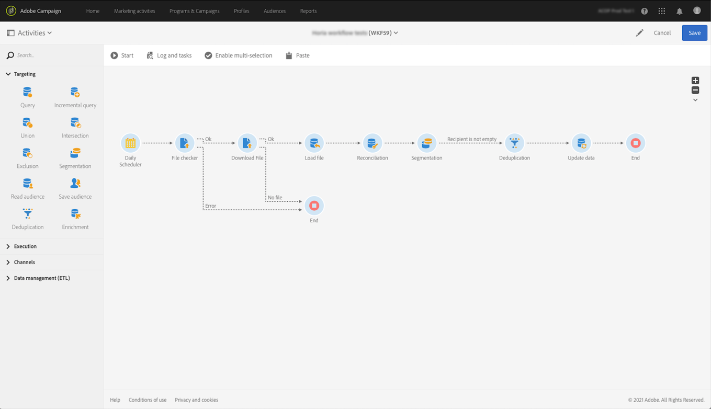

# 將 Adobe Experience Platform 客群內嵌至 Campaign {#destinations}

若要將Adobe Experience Platform對象擷取至Campaign並用於您的工作流程，您首先需要將Adobe Campaign as a Adobe Experience Platform **目的地**&#x200B;連線，並使用要匯出的區段進行設定。

設定目的地後，系統會將資料匯出至您的儲存位置，而且您將需要在Campaign Standard中建置專用的工作流程來擷取資料。

## 將Adobe Campaign連線為目的地

在Adobe Experience Platform中，選取匯出區段的儲存位置，以設定與Adobe Campaign的連線。 此步驟也可讓您選取要匯出的區段，並指定要包含的其他XDM欄位。

如需詳細資訊，請參閱[Destinations檔案](https://experienceleague.adobe.com/docs/experience-platform/destinations/catalog/email-marketing/adobe-campaign.html)。

設定目的地後，Adobe Experience Platform會在您提供的儲存位置中建立以Tab分隔的.txt或.csv檔案。 此作業會排程並每24小時執行一次。

您現在可以設定Campaign Standard工作流程，將區段擷取至Campaign。

## 在Campaign Standard中建立匯入工作流程

將Campaign Standard設定為目的地後，您需要建立專用的工作流程，以匯入Adobe Experience Platform已匯出的檔案。

若要這麼做，您必須新增及設定&#x200B;**[!UICONTROL Transfer file]**&#x200B;活動。 如需如何設定此活動的詳細資訊，請參閱[本節](../../automating/using/transfer-file.md)。

接著，您就可以根據需求建立工作流程（使用區段資料更新資料庫、傳送跨管道傳遞至區段等）

例如，以下工作流程會每天從您的儲存位置下載檔案，然後使用區段資料更新Campaign資料庫。

資料管理工作流程範例可在[工作流程使用案例](../../automating/using/about-workflow-use-cases.md#management)區段中取得。

相關主題：

* [資料管理活動](../../automating/using/about-data-management-activities.md)
* [關於資料匯入和匯出](../../automating/using/about-data-import-and-export.md)
