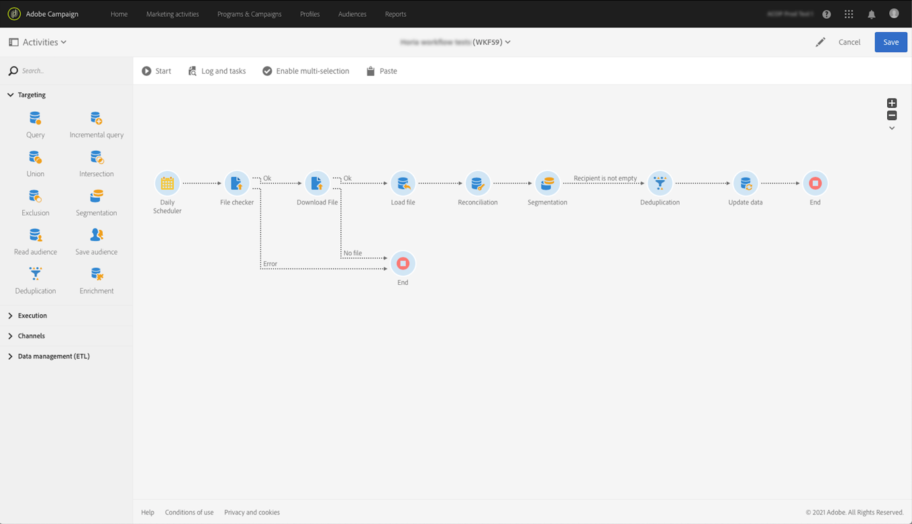

# 將Adobe Experience Platform觀眾收錄至促銷活動{#destinations}

若要將Adobe Experience Platform觀眾收錄到Campaign並在工作流程中使用，您首先需要以Adobe Experience Platform **目標**&#x200B;的身分連接Adobe Campaign，並設定要匯出的區段。

一旦配置了「目標」，資料將導出到儲存位置，您需要在Campaign Standard中構建專用的工作流，以便將其收錄。

## 將Adobe Campaign連接為目的地

在Adobe Experience平台中，選取匯出區段的儲存位置，以設定與Adobe Campaign的連線。 此步驟也可讓您選取要匯出的區段，並指定要包含的其他XDM欄位。

有關詳細資訊，請參閱[目標文檔](https://experienceleague.adobe.com/docs/experience-platform/destinations/catalog/email-marketing/adobe-campaign.html)。

設定目標後，Adobe Experience Platform會在您提供的儲存位置中建立以定位點分隔的。txt或。csv檔案。 此操作已排程，每24小時執行一次。

您現在可以設定Campaign Standard工作流程，將區段內嵌至促銷活動。

## 在Campaign Standard中建立匯入工作流程

一旦將Campaign Standard配置為「目標」後，您需要構建專用的工作流以導入由Adobe Experience Platform導出的檔案。

若要這麼做，您必須新增並設定&#x200B;**[!UICONTROL Transfer file]**&#x200B;活動。 有關如何配置此活動的詳細資訊，請參閱[本節](../../automating/using/transfer-file.md)。

然後，您可以根據您的需求建立工作流程（使用區段資料更新資料庫、傳送跨通道傳送至區段等）

例如，下方的工作流程會每日從您的儲存位置下載檔案，然後使用區段資料更新促銷活動資料庫。

[工作流程使用案例](../../automating/using/about-workflow-use-cases.md#management)區段中提供資料管理工作流程的範例。

相關主題：

* [資料管理活動](../../automating/using/about-data-management-activities.md)
* [關於資料匯入和匯出](../../automating/using/about-data-import-and-export.md)
