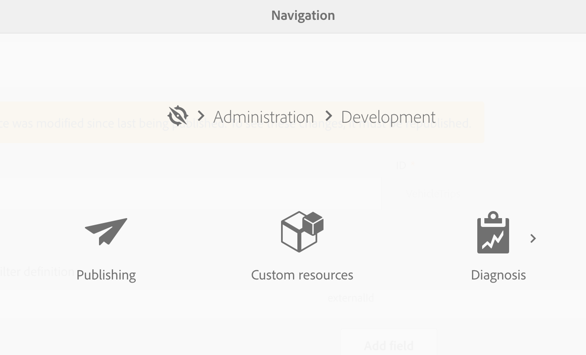
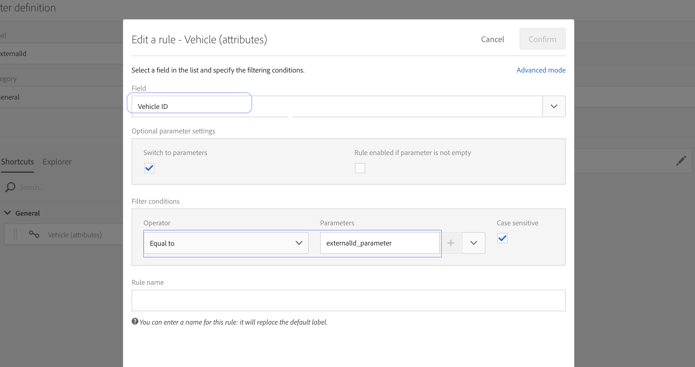

# 映射促銷活動自訂資源和Dynamics 365自訂實體

瞭解如何在Adobe Campaign Standard和Microsoft Dynamics 365整合的背景下，對應自訂資源和自訂實體。

## 必要條件

新版 [Microsoft Dynamics 365-Adobe Campaign Standard整合為自訂實體提供支援](../../integrating/using/working-with-campaign-standard-and-microsoft-dynamics-365.md) 。  這可讓Dynamics 365中的自訂實體複製至Campaign中的對應自訂資源。

複製後，自訂資源中的新資料可用於數種用途，包括分段和個人化。

>[!CAUTION]
>
>如果任何促銷活動自訂資源記錄包含客戶使用促銷活動時適用的個人資訊，該記錄應連結至對應的促銷活動描述檔記錄（直接或透過其他自訂資源），如此，描述檔記錄上的隱私權相關刪除也可以刪除包含個人資訊的連結自訂資源記錄；必須配置實體之間的連結和刪除選項，以啟用連結記錄的類級聯刪除。 個人資訊不應輸入至未連結至描述檔的自訂資源。

如需更完整的促銷活動自訂資源概觀，請參 [閱此連結](../../developing/using/key-steps-to-add-a-resource.md)。

若要設定自訂實體的整合，請連絡 [adobe-support@unifisoftware.com](mailto:adobe-support@unifisoftware.com) ，要求完成此作業。  Unifi需要兩個系統中的自定義實體表的名稱以及所需的屬性映射。  Unifi隨後將建立相應的作業和時間表。

自訂實體支援的範例使用案例可在「使用案例」區 [段中看到](../../integrating/using/map-campaign-custom-resources-and-dynamics-365-custom-entities.md#UC)。

>[!CAUTION]
>
>* 必須重新發佈在Campaign Standard 19.4版之前發佈的自 **訂資源** ，才能與整合搭配使用。
>* 建立和修改促銷活動標準自訂資源是敏感作業，必須僅由專業使用者執行。

## 使用案例

### 開始狀態

客戶有在Dynamics 365中預先定義的自訂實體工具，以及在Campaign Standard中預先定義的對應自訂資源工具。  客戶已提供自定義實體映射詳細資訊至Unifi，而Unifi已在Unifi中設定車輛自定義資源的作業和計畫。

|   | Microsoft Dynamics 365 | Adobe Campaign Standard | 注意 |
|---|---|---|---|
| 頂層實體 | 聯絡人 | 個人資料 | 標準、現成可用的實體 |
| 連結實體 | 車輛——新的自訂實體 | 車輛——新的自訂資源 | 新的自訂實體 |
| 連結類型 | 與N:1聯繫的家長連結 | 類似Dynamics 365 —— 如需詳細資訊，請參閱下方的促銷活動區段 |   |

### Dynamics 365中的設定

按一下Dynamics 365旁的下拉式清單，即可在「銷售儀表板」中檢視此客戶在Dynamics 365中的自訂實體。  此客戶的自訂實體群組在下方 **[!UICONTROL Extensions]**。

透過按一下自訂實體，即可檢視 **[!UICONTROL vehicle]** 車輛資料。  請參閱以下車輛清單。

實體與實 **[!UICONTROL vehicle]** 體之關 **[!UICONTROL Contact]** 系見下文。 **[!UICONTROL Parental]** 被選中 **[!UICONTROL Type of Behavior]**。

### Campaign Standard中的設定

在促銷活動中，按一下左上角的，然後選擇，即可 **[!UICONTROL Adobe Campaign]** 檢視客戶的自訂資源 **[!UICONTROL Client data]**。

### 映射自訂資源和自訂實體

自 **[!UICONTROL vehicle]** 訂資源應由客戶預先定義，並顯示在用戶端資料中；不過，我們將在下面介紹建立此自定義資 **[!UICONTROL vehicle]** 源的步驟。

按一 **[!UICONTROL Adobe Campaign]** 下左上角的，然後按一下 **[!UICONTROL Administration > Development > Custom Resources]**。

1. 按一下 **[!UICONTROL Custom Resources]**。
1. Click the **[!UICONTROL Create]** button.  這會開啟快顯視窗。
1. 選擇 **[!UICONTROL Create a new resource]** 並輸 **[!UICONTROL Vehicle]** 入作為標籤和ID。
1. 按一下 **[!UICONTROL Create]**.

然後，促銷活動會顯示資料結構和連結頁面。  您可以看到已新增數個欄位。

* 車輛識別碼是實體的唯一識 **[!UICONTROL Vehicle]** 別碼；其ID必須完全 **[!UICONTROL externalId]**&#x200B;正確，如下所示，整合才能運作。
* 關聯描述檔是車輛記錄所連結之描述檔的ID;連結時，它將連結到Profile表 **[!UICONTROL externalId]** 的欄位。
* VIN和車輛名稱是用於捕獲車輛資訊的欄位。

>[!CAUTION]
>
>每個自訂資源都必須有一個唯一欄位，其ID為externalId（完全）。  此欄位將對應至Dynamics 365中自訂資源的ID欄位（請參閱下方）。

### 定義識別碼

下一步是定義識別鍵。  首先，建立識別碼，如下所示。

在「鍵定義」畫面中，請確定選取欄 **[!UICONTROL externalId]** 位。

>[!CAUTION]
>
>每個自訂資源都必須有一個識別碼，路徑為&quot;externalId&quot;（完全）。

### 定義篩選

下一步是指定篩選定義。

在下 **[!UICONTROL Filter Definition]**&#x200B;面，按一下 **[!UICONTROL Add an element]**。\
為標籤和ID指定名稱 **[!UICONTROL ExternalId]**。
按一下 **[!UICONTROL Add]**.

現在，按一下新新增的篩選元素上的編輯，並依下方的影像設定篩選。  如果您在欄 **[!UICONTROL externalId]** 位中輸 **[!UICONTROL Parameters]** 入並按一下加號，將會 **[!UICONTROL externalId_parameter]** 出現。  選擇此參數。

### 定義連結

接下來，我們將指定自訂資源的連結。  在這種情況下，我們選擇使用 **[!UICONTROL Vehicles]** 自訂實體（來源）連結至描述檔實體（目標） **[!UICONTROL 1 cardinality simple link]**。

(../assets/DefineTheLink.png)

1. 在畫面 **[!UICONTROL Link definitions]** 中，選擇刪除選項： **[!UICONTROL Deleting the target record implies deleting records referenced by the link]**。 我們選擇此選項，這樣當某個配置檔案被刪除時，所有鏈 **[!UICONTROL Vehicle]** 接到該配置檔案的記錄也會被刪除。
1. 在中 **[!UICONTROL Join Definitions]**，選擇 **[!UICONTROL Define specific join conditions]**。
1. 然後按一 **[!UICONTROL Add an element]**&#x200B;下。

對於聯接定義，我們輸入以下值。

請注意， **[!UICONTROL @externalId]** 條目是描述檔表格的externalId欄位，條目 **[!UICONTROL ProfileExternalId]** 是車輛自訂資源中對應欄位的ID。  當將描述檔記錄的externalId值輸入到車輛記 **[!UICONTROL ProfileExternalId]** 錄的欄位中時，這兩個記錄會連結在一起。

確認變更並儲存自訂實體。

### 發佈並檢查更新

最後一步是發佈自訂資源。

1. 按一下 **[!UICONTROL Adobe Campaign]** 左上角的按一下，按一下 **[!UICONTROL Administration > Development > Publishing]**。
1. 保留預設選項： **[!UICONTROL Determine modifications since the last publication]**。
1. 按一 **[!UICONTROL Prepare Publication]** 下並等候完成。

然後按 **[!UICONTROL Publish]** 一下並等待完成。

### Unifi入口計畫

假設客戶已在Dynamics 365中填入車輛定制實體，且Unifi已設定其車輛定制實體作業和計畫，則客戶應能夠啟動車輛實體的入口計畫。

進入作業完成後，車輛資料現在可在促銷活動中新填入的自 **[!UICONTROL Vehicle]** 訂資源中顯示。

**相關主題**

* 使用Adobe Campaign Standard - Microsoft Dynamics 365
* 在促銷活動中新增自訂資源的關鍵步驟
