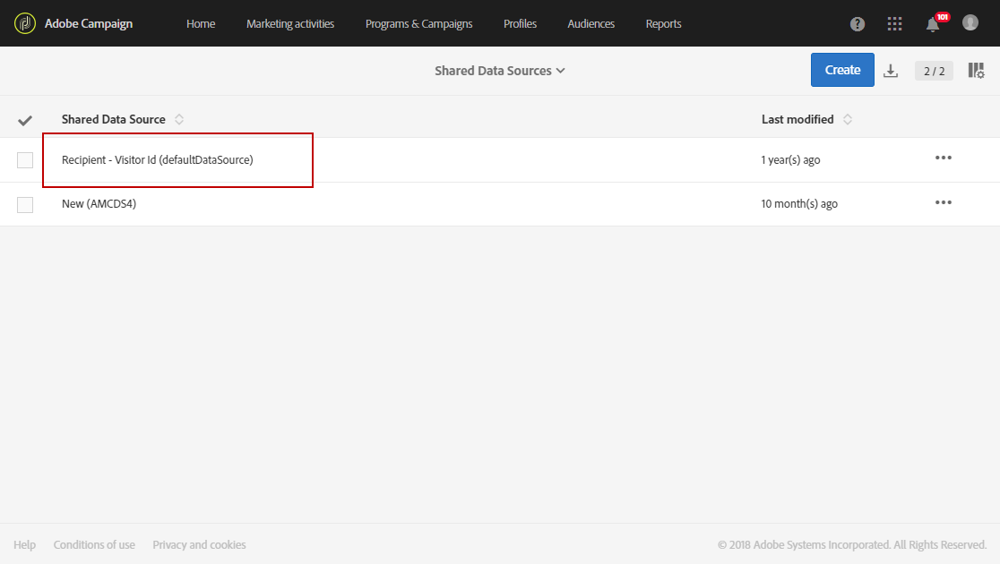

# 佈建及設定與 Audience Manager 或 People 核心服務的整合{#provisioning-and-configuring-integration-with-audience-manager-or-people-core-service}

Adobe Campaign中的「Audience Manager與人員」核心布建和設定會執行兩個步驟：[提交請求以Adobe](#submitting-request-to-adobe)然後設定Adobe Campaign](#configuring-the-integration-in-adobe-campaign)中的整合。[

## 向 Adobe 提交請求 {#submitting-request-to-adobe}

Audience Manager(AAM)或人員核心服務整合可讓您匯入和匯出Adobe Campaign中的受眾或區段。

必須先設定此整合。若要請求佈建此整合，請傳送電子郵件寄至 [Digital-Request@adobe.com](mailto:Digital-Request@adobe.com)，並提供下列資訊：

<table> 
 <tbody> 
  <tr> 
   <td> <strong>請求類型：</strong>  </td> 
   <td> 設定AAM/People核心服務 — Campaign整合 </td> 
  </tr> 
  <tr> 
   <td> <strong>組織名稱：</strong>  </td> 
   <td> 您的組織名稱 </td> 
  </tr> 
  <tr> 
   <td> <strong>IMS 組織 ID</strong>  </td> 
   <td> 您的IMS組織ID。   您可以在Experience Cloud的「管理」功能表中找到您的IMS組織ID。當您首次連線至Adobe Experience Cloud時，也會提供此功能。 </td> 
  </tr> 
  <tr> 
   <td> <strong>環境:</strong>  </td> 
   <td> 範例：生產 </td> 
  </tr> 
  <tr> 
   <td> <strong>AAM或People Service</strong>  </td> 
   <td> 範例：Adobe Audience Manager。 請務必向布建團隊提及您是否擁有Audience Manager授權。</td> 
  </tr> 
  <tr> 
   <td> <strong>宣告ID或訪客ID</strong>  </td> 
   <td> 範例：宣告ID </td> 
  </tr> 
  <tr> 
   <td> <strong>其他資訊</strong>  </td> 
   <td> 您可能擁有的任何有用資訊或注釋 </td> 
  </tr> 
 </tbody> 
</table>

## 在Adobe Campaign中設定整合 {#configuring-the-integration-in-adobe-campaign}

提交此請求後，Adobe將繼續為您布建整合，並聯絡您，以提供您必須完成配置的詳細資訊和資訊：

* [步驟1:在Adobe Campaign中設定或檢查外部帳戶](#step-1--configure-or-check-the-external-accounts-in-adobe-campaign)
* [步驟2:設定資料來源](#step-2--configure-the-data-sources)
* [步驟3:設定促銷活動追蹤伺服器](#step-3--configure-campaign-tracking-server)
* [步驟4:設定訪客ID服務](#step-4--configure-the-visitor-id-service)

### 步驟1:在Adobe Campaign中設定或檢查外部帳戶 {#step-1--configure-or-check-the-external-accounts-in-adobe-campaign}

我們必須先在Adobe Campaign中設定或檢查外部帳戶。 這些帳戶應已由Adobe設定，並應將必要資訊傳送給您。

若要這麼做：

1. 從高級菜單中，選擇&#x200B;**管理>應用程式設定>外部帳戶**。

   選取下列可用於此整合的外部帳戶之一：

   

1. 以下格式輸入&#x200B;**[!UICONTROL Receiver server]**
1. 輸入&#x200B;**[!UICONTROL AWS Access Key ID]**、**[!UICONTROL Secret Access Key]**&#x200B;和&#x200B;**[!UICONTROL AWS Region]**。

您的外部帳戶現在已針對此整合進行設定。

### 步驟2:設定資料來源 {#step-2--configure-the-data-sources}

以下兩個資料來源是在Audience Manager內建立：Adobe Campaign(MID)和Adobe Campaign(DelacedId)。 同時，Adobe Campaign也提供以下兩個資料來源：

* **[!UICONTROL Recipient - Visitor ID (Defaultdatasources)]**:這是預設為訪客ID設定的現成可用資料來源。從Campaign建立的區段將屬於此資料來源。
* **宣告** ID資料來源：此資料來源需要建立，並與來自Audience Manager的 **[!UICONTROL DeclaredId]** 資料來源定義對應。

請注意，若是多個網站具有不同網域，Adobe Campaign不支援根據ECID進行調解。

配置&#x200B;**[!UICONTROL Recipient - Visitor ID (Defaultdatasources)]**&#x200B;資料源：

1. 在&#x200B;**[!UICONTROL Administration]** > **[!UICONTROL Application settings]** > **[!UICONTROL Shared Data Sources]**&#x200B;中，選擇&#x200B;**[!UICONTROL Recipient - Visitor ID (Defaultdatasources)]**。

   

1. 在&#x200B;**[!UICONTROL Data Source/ Alias]**&#x200B;下拉式清單中選擇&#x200B;**[!UICONTROL Adobe Campaign]**。
1. 輸入由Adobe提供的&#x200B;**[!UICONTROL AAM Destination ID]**。

   

1. 在&#x200B;**[!UICONTROL Reconciliation process]**&#x200B;類別中，我們建議您不要變更調解標準，並一律使用&#x200B;**[!UICONTROL Visitor ID]**。
1. 按一下&#x200B;**[!UICONTROL Save]**。

要建立&#x200B;**[!UICONTROL Declared ID]**&#x200B;資料源：

1. 在&#x200B;**[!UICONTROL Administration]** > **[!UICONTROL Application settings]** > **[!UICONTROL Shared Data Sources]**&#x200B;中，按一下&#x200B;**[!UICONTROL Create]**&#x200B;按鈕。
1. 編輯資料源的&#x200B;**[!UICONTROL Label]**。
1. 在&#x200B;**[!UICONTROL Data Source/ Alias]**&#x200B;下拉式清單中，從Audience Manager中選擇與&#x200B;**[!UICONTROL DeclaredID]**&#x200B;資料源對應的資料源。
1. 輸入Adobe提供的&#x200B;**[!UICONTROL Data Source / Alias]**&#x200B;和&#x200B;**[!UICONTROL AAM Destination ID]**&#x200B;以配置資料源。
1. 視需要設定&#x200B;**[!UICONTROL Reconciliation process]**。
1. 按一下&#x200B;**[!UICONTROL Save]**。

>[!NOTE]
>
>如果您要為[Campaign-Triggers整合](../../integrating/using/configuring-triggers-in-experience-cloud.md)配置共用資料來源，則不需要&#x200B;**[!UICONTROL AAM Destination ID]**&#x200B;欄位。 **[!UICONTROL Priority]** 只有在設定觸發器 — 促銷活動整合時才需要。優先順序決定要先配置哪個資料源。 優先順序可以是任何數字，例如1或100。 優先順序越高，調解期間的優先順序越高。

### 步驟3:設定促銷活動追蹤伺服器 {#step-3--configure-campaign-tracking-server}

若要設定與People核心服務或Audience Manager的整合，我們也需要設定Campaign追蹤伺服器。

在此，您必須確定已在網域(CNAME)上註冊促銷活動追蹤伺服器。 您可以在[本文](https://helpx.adobe.com/tw/campaign/kb/domain-name-delegation.html)中找到有關域名配置的詳細資訊。

### 步驟4:設定訪客ID服務 {#step-4--configure-the-visitor-id-service}

如果您的訪客ID服務從未在您的Web屬性或網站上設定，請參閱下列[document](https://experienceleague.adobe.com/docs/id-service/using/implementation/setup-aam-analytics.html)以了解如何設定您的服務或下列[video](https://helpx.adobe.com/tw/marketing-cloud/how-to/email-marketing.html#step-two)。

您的設定和布建已完成，現在可以使用整合來匯入和匯出對象或區段。
