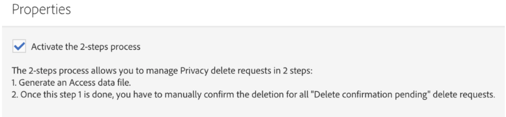

# 使用Microsoft Dynamics 365整合

此整合會執行數個工作：

* **聯絡同步**:連絡人會從Dynamics 365傳送至Campaign(注意：單向同步)。
* **自訂實體同步**:自訂實體記錄會從Dynamics 365傳送至Campaign（請注意單向同步）。  如需詳細資訊，請參閱自訂實體的頁面。
* **事件顯示**:某些電子郵件行銷事件會從Campaign傳送至Dynamics 365。 請參閱下方的附註。
* **刪除連絡人**:在Dynamics 365中刪除對應的「連絡人」時，促銷活動設定檔會新增至隱私權相關的刪除佇列。
* **選擇退出同步**:退出選項會根據客戶在上線期間選擇的設定（例如，Dynamics 365到促銷活動同步、促銷活動到Dynamics 365同步或雙向同步），在Dynamics 365和Campaign之間同步。
* **單一登入(SSO)**:您可以直接從Campaign使用Adobe IMS驗證存取Unifi的整合詳細資訊。

>[!NOTE]
>
>對於 **事件顯示**，每次在Unifi中執行輸出作業時，將檢索最多10k個事件。

## Adobe Campaign Standard使用者體驗

當在Dynamics 365中建立新的或修改連絡人時，在連絡人同步執行後，該連絡人會同步至促銷活動。  這些連絡人會顯示在促銷活動的「設定檔」畫面中，並可定位在行銷促銷活動中。  請參閱下方的「描述檔」畫面。

在Dynamics 365中刪除連絡人時，促銷活動中的對應描述檔會新增至促銷活動中「隱私權要求」畫面中的隱私權服務刪除佇列。  如需依Campaign中適用資料隱私權法規定執行資料主體刪除要求的詳細資訊，請參閱Adobe Campaign Standard中如何執行依法授權的刪除要求。

請務必注意，如果您在屬性畫面中啟動了2步驟的程式，您必須先手動確認每個記錄在隱私權畫面中的刪除，才能最終刪除這些記錄。  請參閱以下的2步流程畫面：

當促銷活動中修改選擇退出／黑名單屬性時，如果您已選取「促銷活動轉換動態」365或雙向選擇退出設定，而且您已正確對應該特定屬性，則該屬性會反映在Dynamics 365中。

若要透過單一登入存取您的整合詳細資訊，請前往促銷活動導覽功能表，然後按一下「管理> Microsoft Dynamics 365整合」。

本頁包含整合檔案的連結，以及如何根據您可能的法律義務使用功能的准則。 按一下全球圖示，此圖示會自動傳送並登入您的Unifi例項，您可在其中管理整合詳細資訊。

您可在以下視訊中看到此功能的影片。

>[!VIDEO](https://video.tv.adobe.com/v/29254)

>[!NOTE]
>
>您必須提交票證給Adobe客戶服務（直接或透過您的Adobe聯絡人），才能在您的Campaign實例中啟用單一登入功能標幟。

>[!NOTE]
>
>您的管理面板現成可用的功能中，將看不到Microsoft Dynamics 365整合圖示。  您（或您的Adobe聯絡人）必須提交票證，才能為您的促銷活動實例啟用此功能標幟。
>
>此外，Unifi必須啟用使用者的SSO存取權，才能從促銷活動透過SSO成功登入。

## Microsoft Dynamics 365使用者體驗

對於事件顯示，下列電子郵件行銷事件會從Campaign傳送至Dynamics 365，並在Dynamics 365時間軸檢視中顯示為自訂活動：

* Adobe Campaign電子郵件傳送

* Adobe Campaign電子郵件開啟

* Adobe Campaign電子郵件URL點按

* Adobe Campaign電子郵件彈回數

若要檢視連絡人的時間軸，請按一下Dynamics 365下拉式選單中的Sales Hub，以導覽至您的連絡人清單。  然後，按一下左側菜單欄上的「聯繫人」並選擇聯繫人。

>[!NOTE]
>
>AppSource中的Adobe Campaign for Dynamics 365應用程式必須安裝在Dynamics 365例項中，才能檢視這些事件。

下面是「Dynamics User」的「Contact」（聯繫人）螢幕快照。  在「時間軸」檢視中，您會注意到Dynamics使用者已寄送電子郵件，與促銷活動名稱「2019LoyaltyCamp」和傳送名稱「DM190」相關。  Dynamics使用者開啟電子郵件，並點選了電子郵件中的URL;這兩個動作都會建立事件，如下所示。  如果您往右拐，就會看到「關係助理(RA)」卡；目前，它包含要追蹤所點按URL的工作。

請參閱以下，以取得動態使用者時間軸檢視的詳細資訊。

以下是關係助理(RA)卡的特寫。  AppSource應用程式包含會監視Adobe電子郵件URL點按事件的工作流程。  發生此事件時，它會建立工作並設定到期日。  這可讓工作顯示在RA卡中，讓它更加可見。  Adobe電子郵件彈回數事件的工作流程類似，新增了協調無效電子郵件地址的任務。  這些工作流程可在解決方案中關閉。

如果您按一下傳送事件的主題，您會看到類似下方的表格。  開啟和彈回事件的表格類似。

電子郵件URL點按事件的表單會為被點按的URL新增其他屬性：

以下是屬性清單和說明：

* 主旨：活動主體；由電子郵件傳送的促銷活動ID和傳送ID組成

* 擁有者：在布建後步驟中建立的應用程式用戶

* 關於：Contact的名稱

* 促銷活動名稱：Campaign Standard中的促銷活動ID

* 傳送名稱：Campaign Standard中的傳送ID

* 傳送／開啟／點按／退回日期：建立事件的日期／時間

* 追蹤URL:已點按的URL

* 鏡像頁URL:傳送／開啟／點按／彈回之電子郵件之鏡像頁面的URL

您可以在以下視訊中看到使用鏡像頁面URL的視訊。

>[!VIDEO](https://video.tv.adobe.com/v/29253)

>[!NOTE]
>
>對於選擇退出，在Dynamics 365中修改選擇退出屬性時，如果您已選取Dynamics 365到促銷活動或雙向選擇退出設定，且您已正確對應該特定屬性，則該屬性會反映在促銷活動中。

**相關主題**

* 設定促銷活動／動態365整合的促銷活動
* 設定Campaign/Dynamics 365整合的Dynamics
* 設定Campaign/Dynamics 365整合的Unifi
* 瞭解如何對應自訂資源和自訂實體