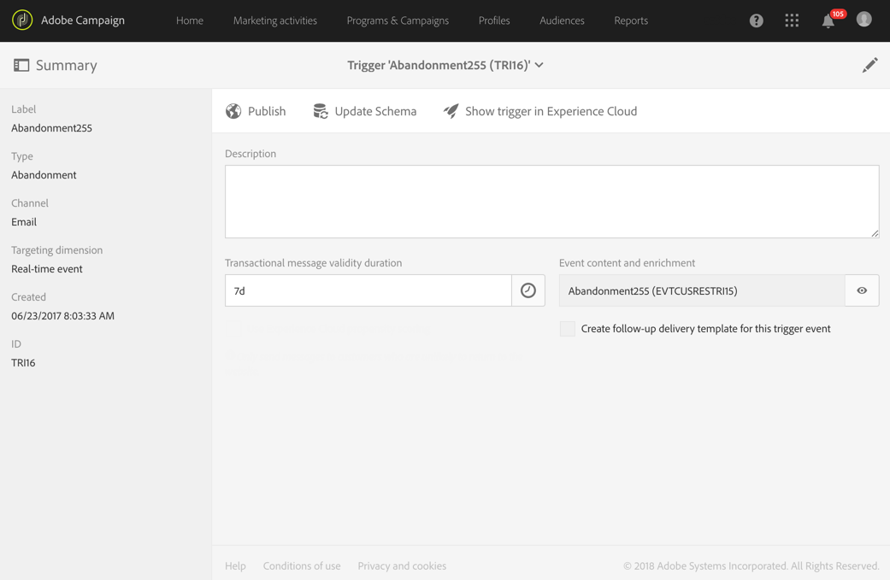

# 在 Campaign 中使用觸發程式{#using-triggers-in-campaign}

## 在 Campaign 中建立對應的觸發程式 {#creating-a-mapped-trigger-in-campaign}

您應確保在 Adobe Experience Cloud（**[!UICONTROL Triggers]** 核心服務）中預先定義要監控之行為。如需詳細資訊，請參閱 [Adobe Experience Cloud 文件](https://docs.adobe.com/content/help/en/core-services/interface/activation/triggers.html)。請注意，定義觸發程式時需要啟用別名。對於每個行為（瀏覽/放棄表單、新增/刪除產品、工作階段過期等），必須在 Adobe Experience Cloud 中新增一個新的觸發程式。

您現在必須依據現有的 Adobe Experience Cloud 觸發程式，在 Adobe Campaign 中建立觸發程式事件。

您可以觀看此[影片](https://helpx.adobe.com/marketing-cloud/how-to/email-marketing.html#step-two)，有助於您瞭解如何在 Adobe Campaign 中設定觸發程式。

設定步驟如下：

1. 按一下左上方的 **[!UICONTROL Adobe Campaign]** 標誌，然後選取「**[!UICONTROL Marketing plans]** > **[!UICONTROL Transactional messages]** > **[!UICONTROL Experience Cloud Triggers]**」。

   

1. 按一下 **[!UICONTROL Create]** 按鈕。開啟的建立精靈會顯示 Adobe Experience Cloud 中定義的所有觸發程式清單。**[!UICONTROL Fired by Analytics]** 欄會顯示 Adobe Experience Cloud 觸發程式傳送至 Campaign 的事件數量。這是在 Experience Cloud 介面中建立的觸發程式對應。

   

1. 選取您要使用的 Adobe Experience Cloud 觸發程式，然後按一下 **[!UICONTROL Next]**。
1. 設定觸發程式的一般屬性。在精靈的這個步驟中，也請指定要用於觸發程式的頻道和目標維度（請參閱[目標維度及資源](../../automating/using/query.md#targeting-dimensions-and-resources)）。然後確認已建立觸發程式。
1. 按一下 **[!UICONTROL Event content and enrichment]** 欄位右側的按鈕，以檢視裝載的內容。此畫面也可讓您使用儲存在 Adobe Campaign 資料庫中的設定檔資料，以擴充事件資料的內容。此項擴充是以與標準交易式訊息相同的方式執行。

   

1. 在 **[!UICONTROL Transactional message validity duration]** 欄位中，定義由 Analytics 傳送的事件後，訊息將維持有效的持續時間。如果定義的持續時間為 2 天，則在該持續時間過後，將不再傳送訊息。如果讓多則訊息處於保留狀態，這將確保在一段時間後恢復這些訊息時，系統將不會將之傳送出去。

   

1. 您現在可以發佈觸發器。 如需詳細資訊，請參閱「 [在促銷活動中發佈觸發器」](../../integrating/using/using-triggers-in-campaign.md#publishing-trigger-in-campaign)。

## 在Campaign中發佈觸發器 {#publishing-trigger-in-campaign}

根據現有的Adobe Experience Cloud觸發器在Adobe Campaign中建立觸發器事件後，您現在需要發佈它。

1. 在您先前建立的觸發器中，按一下 **[!UICONTROL Publish]** 按鈕以開始發佈觸發器事件。

   

1. 您可以在下查看觸發器發佈的進度 **[!UICONTROL Publication]**。

   

1. 發佈完成後，下列訊息會出現在下方 **[!UICONTROL Publication]**。

   

1. 如果您在發佈觸發程式事件後，仍需在觸發程式綱要中進行變更，請按一下 **[!UICONTROL Update schema]** 按鈕以擷取最新變更。

   請注意，此動作會取消發佈您的觸發程式與交易式訊息，之後您將需要重新發佈。

   

1. Click **[!UICONTROL Show Trigger in Experience Cloud]** button allows you to view the trigger definition in Adobe Experience Cloud.

發佈事件之後，就會自動建立連結至新事件的交易式範本。之後，您必須修改並發佈剛建立的範本。如需詳細資訊，請參閱[編輯範本](../../start/using/marketing-activity-templates.md)一節。

## 編輯交易式訊息範本 {#editing-the-transactional-message-template}

在您建立並發佈觸發程式事件後，即會自動建立相對應的交易式範本。如需詳細資訊，請參閱[在 Campaign 中建立對應觸發程式](#creating-a-mapped-trigger-in-campaign)一節。

為了讓事件觸發傳送交易式訊息，您必須個人化訊息，然後測試之後再發佈訊息。這些步驟與標準交易式訊息的步驟相同。如需詳細資訊，請參閱[交易式範本](../../channels/using/event-transactional-messages.md#personalizing-a-transactional-message)一節。

>[!NOTE]
>
>如果您取消發佈範本，則會自動取消發佈觸發程式事件。

編輯內容時，您可以依據 Analytics 觸發程式傳送的資訊，新增個人化欄位。如果您使用 Adobe Campaign 設定檔資料擴充事件資料，則可依據此資訊來個人化該訊息。若要個人化您的訊息，請選取「 **[!UICONTROL Transactional event]** > **[!UICONTROL Event context]** 」並選取欄位。

## 存取報告 {#accessing-the-reports}

若要在 Adobe Campaign 中檢視專用的觸發程式報告，請開啟您之前建立的觸發程式事件，然後按一下 **[!UICONTROL Show trigger report]**。

該報告會顯示與 Analytics 所傳送事件數量相較的已處理事件數量。它也會顯示所有最近觸發程式的清單。

