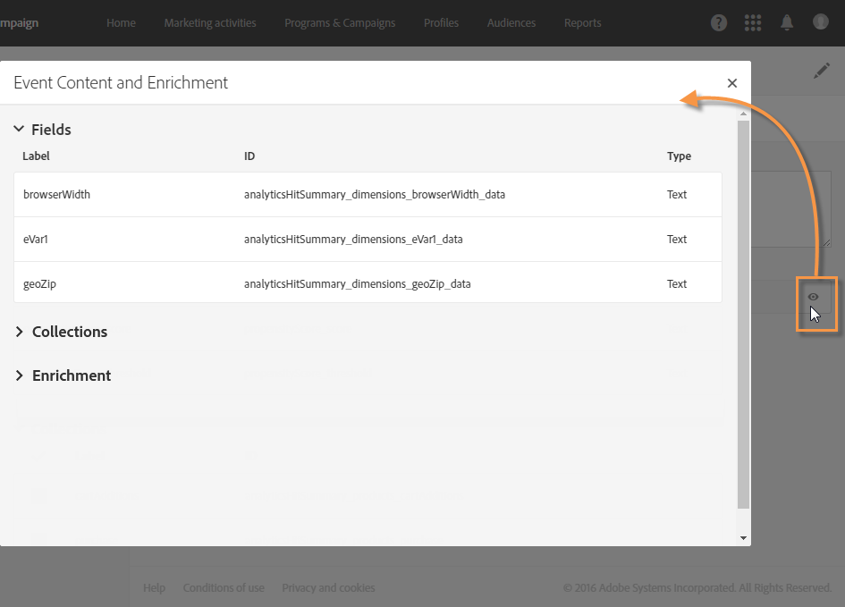

# 在 Campaign 中使用觸發程式{#using-triggers-in-campaign}

## 在Campaign中建立映射觸發器 {#creating-a-mapped-trigger-in-campaign}

您應確定在Adobe Experience Cloud（核心服務）中預先定義要監 **[!UICONTROL Triggers]** 控的行為。 For more on this, refer to the [Adobe Experience Cloud documentation](https://docs.adobe.com/content/help/en/core-services/interface/activation/triggers.html). 請注意，在定義觸發器時，需要啟用別名。 對於每個行為（瀏覽／表單放棄、新增／刪除產品、作業過期等）,Adobe Experience Cloud中都必須新增觸發器。

您現在必鬚根據現有的Adobe Experience Cloud觸發器，在Adobe Campaign中建立觸發器事件。

您可以觀看此 [影片](https://helpx.adobe.com/marketing-cloud/how-to/email-marketing.html#step-two) ，以協助您瞭解如何在Adobe Campaign中設定觸發器。

將其放置到位的步驟如下：

1. 按一下 **[!UICONTROL Adobe Campaign]** 左上角的標誌，然後選取 **[!UICONTROL Marketing plans]** > **[!UICONTROL Transactional messages]** > **[!UICONTROL Experience Cloud Triggers]**。

   

1. 按一下&#x200B;**[!UICONTROL Create]**&#x200B;按鈕。開啟的建立精靈會顯示Adobe Experience Cloud中定義的所有觸發器清單。 此 **[!UICONTROL Fired by Analytics]** 欄會顯示Adobe Experience Cloud觸發器傳送至Campaign的事件數。 這是在Experience Cloud介面中建立的觸發器對應。

   

1. 選取您要使用的Adobe Experience Cloud觸發器，然後按一下 **[!UICONTROL Next]**。
1. 配置觸發器的常規屬性。 在精靈的這個步驟中，也指定要用於觸發器的頻道和定位維度(請參 [閱定位維度和資源](../../automating/using/query.md#targeting-dimensions-and-resources))。 然後確認觸發器的建立。
1. 按一下欄位右側的按 **[!UICONTROL Event content and enrichment]** 鈕，以檢視裝載內容。 此螢幕也可讓您以儲存在Adobe Campaign資料庫中的描述檔資料豐富事件資料。 該擴充以與標準事務消息相同的方式執行。

   

1. 在欄位 **[!UICONTROL Transactional message validity duration]** 中，定義在Analytics傳送事件後，訊息將保持有效的持續時間。 如果定義了2天的持續時間，則在該持續時間過後，將不再傳送訊息。 如果將多條消息置於保留狀態，這將確保在一段時間後恢復這些消息時不會發送這些消息。

   

1. 按一下 **[!UICONTROL Publish]** 按鈕，開始發佈觸發器事件。
1. 如果您需要在發佈觸發器事件後仍在觸發器結構中進行變更，請按一下按 **[!UICONTROL Update schema]** 鈕以擷取最新變更。

   請注意，此動作會解除發佈您的觸發器和交易訊息，之後您必須重新發佈。

   

此 **[!UICONTROL Show Trigger in Experience Cloud]** 按鈕可讓您在Adobe Experience Cloud中檢視觸發器定義。

發佈事件後，就會自動建立連結至新事件的交易範本。 然後，您必須修改並發佈剛建立的範本。 有關詳細資訊，請參閱「編 [輯模板](../../start/using/marketing-activity-templates.md) 」部分。

## 編輯事務性消息模板 {#editing-the-transactional-message-template}

在您建立並發佈觸發器事件後，就會自動建立對應的交易範本。 如需詳細資訊，請參閱「在促銷 [活動中建立映射觸發器](#creating-a-mapped-trigger-in-campaign) 」一節。

為了讓事件觸發傳送交易訊息，您必須個人化範本，然後加以測試並發佈。 這些步驟與標準事務性消息的步驟相同。 有關詳細資訊，請參閱「事務 [性模板](../../channels/using/event-transactional-messages.md#personalizing-a-transactional-message) 」部分。

>[!NOTE]
>
>如果您解除發佈範本，則會自動解除發佈觸發器事件。

編輯內容時，您可以根據Analytics觸發器傳送的資訊，新增個人化欄位。 如果您使用Adobe Campaign設定檔資料豐富事件資料，則可以根據此資訊個人化訊息。 若要個人化您的訊息，請選 **[!UICONTROL Transactional event]** 取> **[!UICONTROL Event context]** 並選取欄位。

## 存取報表 {#accessing-the-reports}

若要在Adobe Campaign中檢視專用的觸發器報表，請開啟您先前建立的觸發器事件，然後按一下 **[!UICONTROL Show trigger report]**。

報表會顯示與Analytics傳送之事件數相較的已處理事件數。 它也會顯示所有最近觸發器的清單。

