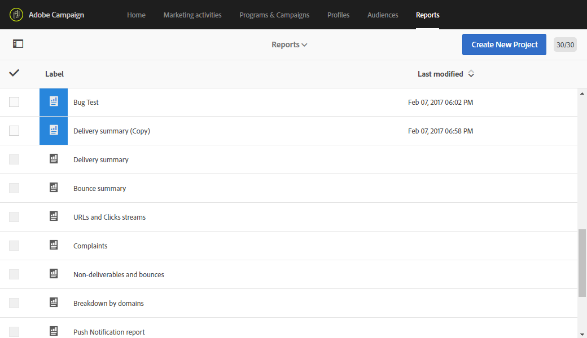

# 動態報告快速入門 {#about-dynamic-reports}

動態報表提供可完全自訂的即時報表。 它新增了對描述檔資料的存取權，除了功能性電子郵件宣傳資料（如開啟和點按）外，還可依描述檔維度（例如性別、城市和年齡）進行人口統計分析。 透過拖放介面，您可以探索資料、判斷電子郵件促銷活動對最重要客戶細分的執行方式，並評估其對收件者的影響。

>[!NOTE]
>
>只有具有管理權限或組織單位設為「全部 **」(All** )的用戶可以建立或保存新報告。 如需詳細資訊，請參閱本[區段](../../administration/using/users-management.md)。

## 存取動態報表 {#accessing-dynamic-reports}

可存取報表：

* 在首頁中，選取頂 **[!UICONTROL Reports]** 欄或卡片中的標籤，以 **[!UICONTROL Reports]** 存取所有傳送的報表。

   

* 在每個方案、促銷活動和訊息中，從「報 **表** 」按鈕按一下「動態報表 **** 」，只檢視特定於傳送的報表。

   

某些報表無法在傳送後立即使用，這取決於收集和處理資訊所花的時間。

動態報表分為兩類：

* **範本**，可使用「另存新檔」選項（「專案」>「另存新檔」） **複製範本** ，以進行修&#x200B;**改。**)。
* **自訂報表** （以藍色標識），您可按一下「報表」首頁上的「建立新 **專案」按鈕，直接****** 建立。

>[!NOTE]
>
>系統會根據您的組織單位篩選資料。

## 動態報告使用協定 {#dynamic-reporting-usage-agreement}

動態報告使用合約的目的，是做為資料處理的快顯同意。 依預設，合約僅可見，且只能由指派有管理權限的使用者接受或拒絕。

有三個選項可供使用：

* **[!UICONTROL Ask me later]**:按一下「 **稍後詢問我**」，視窗將會在24小時內停止顯示。 在您接受或拒絕合約之前，描述檔維度不會顯示在您的報表中，也不會收集或傳送客戶的個人識別資訊。
* **[!UICONTROL Accept]**:接受本合約後，您即授權Adobe Campaign收集客戶的個人身分識別資訊，並將這些資訊傳送至報告或資料中心。
* **[!UICONTROL Decline]**:拒絕合約後，描述檔維度將不會出現在您的報表中，而且客戶的個人識別資訊也不會收集或傳送。 請注意，在此情況下，仍會收集外部ID並用於識別使用者。

下表依您所在地區，顯示接受本合約後的情況。

|  | 動態報告 | Microsoft Dynamics 365連接器 |
|---|---|---|
| 美洲與亞太地區（亞太地區） | **功能已推出**。  立即可用（例如，依年齡劃分的城市、國家／地區、州、性別和細分）和自訂個人檔案資訊推入美國報告中心。 For more information on profile dimensions, refer to this [page](../../reporting/using/list-of-components-.md) | **功能已推出**。  所有現成可用的設定檔和自訂設定檔欄位，以及Adobe Campaign Standard事件欄位，都會在美國資料中心處理。 |
| EMEA（歐洲中東和非洲） | **功能已推出**。  立即可用（例如，根據年齡劃分的城市、國家／地區、州、性別和細分）和自訂個人檔案資訊推送至EMEA報告中心。 For more information on profile dimensions, refer to this [page](../../reporting/using/list-of-components-.md) | **功能已推出。**  在EMEA資料中心處理的所有現成可用和自訂描述檔欄位和Adobe Campaign Standard事件欄位。  **[!UICONTROL Control data]**其中包含Adobe I/O註冊資料，以及在美國資料中心傳送及儲存之客戶使用者事件的ID。 |

下表顯示拒絕此協定後會發生的情況，具體取決於您的地區。 請注意，即使您拒絕本合約，仍可報告傳送和Microsoft Dynamics 365整合。

| 地區 | 動態報告 | Microsoft Dynamics 365連接器 |
|---|---|---|
| 美洲與亞太地區（亞太地區） | **功能已推出**。   除ExternalID外，沒有立即可用的自訂設定檔資訊推送至美國報告中心。 | **功能已推出**。  除「外部ID」和「收件者ID」外，沒有立即可用的或自訂的描述檔欄位傳送至美國資料中心。  除鏡像頁面ID外，所有在美國資料中心處理的Adobe Campaign Standard事件欄位。  有關Microsoft Dynamics 365整合的詳細資訊，請參閱本 [頁](../../integrating/using/working-with-campaign-standard-and-microsoft-dynamics-365.md)。 |
| EMEA（歐洲中東和非洲） | **功能已推出**。  除ExternalID外，沒有將現成可用的自訂設定檔資訊推送至EMEA報告中心。 | **功能已推出。**  除「外部ID」和「收件者ID」外，沒有立即可用或自訂的描述檔欄位傳送至EMEA資料中心。  除鏡像頁面ID外，所有在EMEA資料中心處理的Adobe Campaign Standard事件欄位。   **[!UICONTROL Control data]**其中包含Adobe I/O註冊資料，以及在美國資料中心傳送及儲存之客戶使用者事件的ID。 有關Microsoft Dynamics 365整合的詳細資訊，請參閱本[頁](../../integrating/using/working-with-campaign-standard-and-microsoft-dynamics-365.md)。 |

這個選項不是最終選項，您隨時都可以在 **[!UICONTROL Enable PII data to be transferred to US region to use reporting on Profile data]** > **[!UICONTROL Administration]** > **[!UICONTROL Application Settings]** 中變更 **[!UICONTROL Options]**。

值可隨時變更。 值1對應於 **[!UICONTROL Ask me later]**、2 **[!UICONTROL Decline]** 和3 **[!UICONTROL Accept]**。

