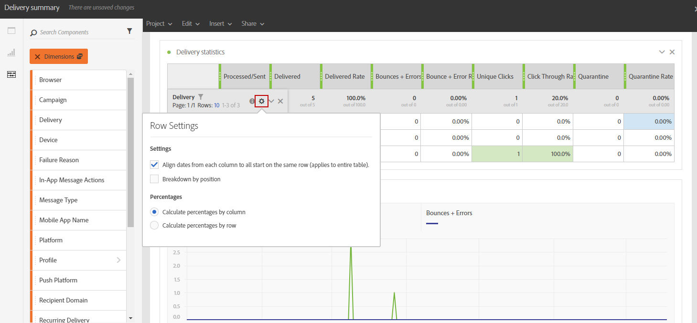

# 新增元件{#adding-components}

元件可幫助您使用不同的維度、度量和時段自定義報表。

1. 按一下 **[!UICONTROL Components]** 頁籤。

   

1. 在 **[!UICONTROL Components]** 頁籤顯示五個最常用的項，按一下類別名稱以訪問其元件的完整清單。

   元件表分為四類：

   * **Dimension**:從遞送日誌（如收件人的瀏覽器或域）獲取詳細資訊，或者遞送成功。
   * **度量**:獲取有關消息狀態的詳細資訊。 例如，如果已傳遞消息，並且用戶已將其開啟。
   * **[!UICONTROL Segments]**:根據收件人的年齡範圍篩選資料。 **[!UICONTROL Segments]** 可以直接在自由形式表中或面板的頂欄中拖放。

      只有在管理員批准了螢幕上顯示的動態報告使用協定的條款和條件後，此類別才可用。 如果管理員拒絕協定，則在中將不顯示這些段 **[!UICONTROL Components]** 頁籤和資料將不收集。

   * **時間**:為表設定時間段。

1. 拖放面板中的元件以開始篩選資料。

   

1. 拖放元件後，可以使用 **[!UICONTROL Row settings]** 的雙曲餘切值。

   

1. 還可以通過按一下 **搜索** 表徵圖 通過此搜索，您可以查找特定結果，例如特定的傳遞或瀏覽器。

   

您可以根據需要拖放任意多個元件，並將它們相互比較。

**相關主題：**

* [元件清單](../../reporting/using/list-of-components-.md)
* [報告清單](../../reporting/using/defining-the-report-period.md)
