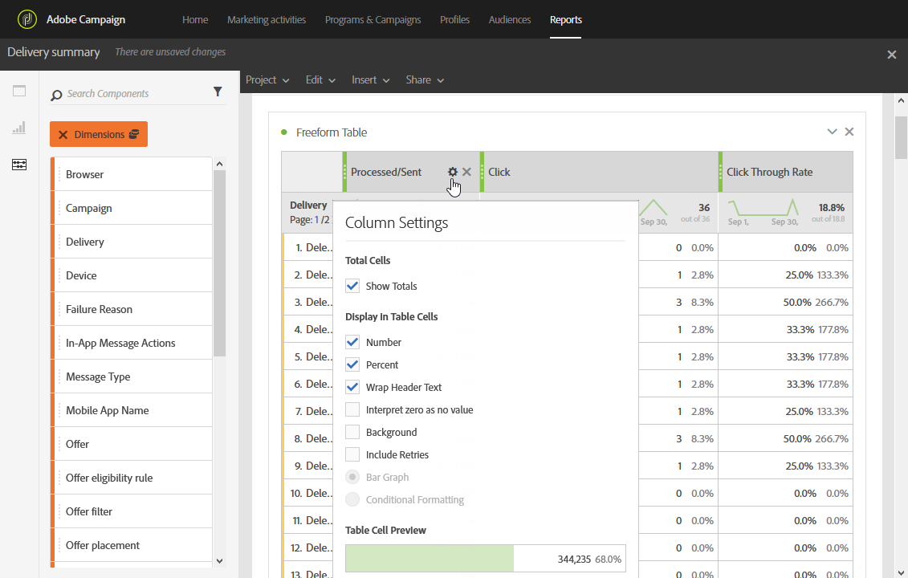

# 新增面板{#adding-panels}

## 新增空白麵板{#adding-a-blank-panel}

若要啟動報表，您可以新增一組面板至現成可用的或自訂報表。 每個面板包含不同的資料集，由自由表格和視覺化組成。

此面板可讓您視需要建立報表。 您可以在報表中新增任意數量的面板，以便以不同的時段來篩選資料。

1. 按一下&#x200B;**面板**&#x200B;表徵圖。 您也可以按一下「插入」標籤&#x200B;**，然後選取「新增空白麵板」**，以新增面板。****

   

1. 將&#x200B;**空白麵板**&#x200B;拖放至控制面板。

   

您現在可以新增自由表格至面板，以開始定位資料。

## 添加自由表格{#adding-a-freeform-table}

自由表格可讓您建立表格，以使用&#x200B;**Component**&#x200B;表格中可用的不同度量和維度來分析資料。

每個表格和視覺化都可調整大小，並可加以移動，以更好地自訂您的報表。

1. 按一下&#x200B;**面板**&#x200B;表徵圖。

   

1. 將&#x200B;**Freeform**&#x200B;項目拖放至控制面板。

   您也可以按一下「插入」標籤並選取「新增自由格式」標籤，或按一下「在空白麵板中新增自由表格」標籤，以新增表格。************

   

1. 預設已選取&#x200B;**[!UICONTROL Exclude proof]**&#x200B;區段。 如果需要，可以通過將&#x200B;**[!UICONTROL Components]**&#x200B;頁籤中的&#x200B;**[!UICONTROL Segments]**&#x200B;中的一個拖放到頂欄來更改它。

   

1. 將項目從&#x200B;**元件**&#x200B;標籤拖放至欄和列，以建立表格。

   

1. 按一下&#x200B;**Settings**&#x200B;圖示，變更資料在欄中的顯示方式。

   

   **[!UICONTROL Column settings]**&#x200B;由以下各部分組成：

   * **[!UICONTROL Number]**:可讓您顯示或隱藏欄中的摘要數字。
   * **[!UICONTROL Percent]**:可讓您顯示或隱藏欄中的百分比。
   * **[!UICONTROL Interpret zero as no value]**:可讓您在值等於零時顯示或隱藏。
   * **[!UICONTROL Background]**:可讓您顯示或隱藏儲存格中的水準進度列。
   * **[!UICONTROL Include retries]**:可讓您在結果中包含重試。這僅適用於&#x200B;**[!UICONTROL Sent]**&#x200B;和&#x200B;**[!UICONTROL Bounces + Errors]**。

1. 選取一或多列，然後按一下「視覺化」(Visualize)**圖示。**&#x200B;會新增視覺化以反映您選取的列。

   

您現在可以視需要新增多個元件，並新增視覺化，以提供資料的圖形表示。
