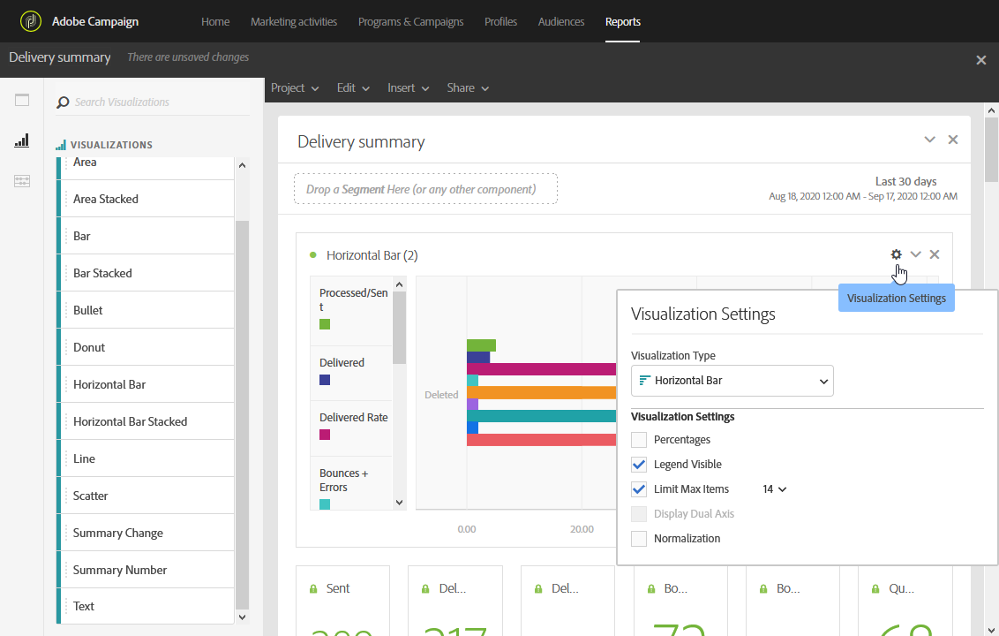

# 新增視覺效果{#adding-visualizations}

此 **視覺效果** tab可讓您拖放視覺效果專案，例如區域、環圈圖和圖表。 視覺效果可提供資料的圖形化表示。

1. 在 **[!UICONTROL Visualizations]** 標籤，將視覺效果專案拖放至面板中。

   

1. 將視覺效果新增至面板後，動態報告會自動偵測自由表格中的資料。 選取視覺效果的設定。
1. 如果您有多個自由表格，請在的圖表中選擇可用的資料來源 **資料來源設定** 視窗。 按一下視覺效果標題旁的彩色點，即可使用此視窗。

   

1. 按一下 **[!UICONTROL Visualization]** 設定按鈕，直接變更圖表型別或顯示的內容，例如：

   * **百分比**：以百分比顯示值。
   * **將Y軸固定於零**：即使值的範圍在零以上，也強制將y軸設為零。
   * **可見圖例**：可讓您隱藏圖例。
   * **標準化**：強制值相符。
   * **顯示雙軸**：將另一個軸新增至圖表。
   * **限制專案數量上限**：限制顯示的圖表數量。
   * **臨界值**：可讓您設定圖表的臨界值。 它會顯示為黑色虛線。

   

此視覺效果可讓您在報表中更清楚地檢視資料。
