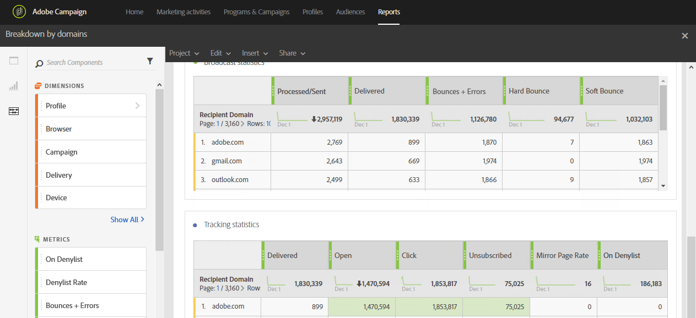

# 依網域劃分{#breakdown-by-domains}

此報表包含電子郵件傳送對象中每個網域的效能資料。 如果是促銷活動或方案報表，績效資料可供多個對象使用。 此資料可讓您分析每個網域對特定事件的反應行為。 例如，連結顯示、登入清單上的URL等。

表&#x200B;**廣播統計**&#x200B;包含每個域可能遇到的錯誤的可用資料，例如：

* **已處理／已傳送**:傳送的電子郵件數。
* **交付**:傳送的電子郵件數。
* **彈回數+錯誤**:無法傳送的訊息數。
* **硬跳**:永久錯誤的總數，例如錯誤的電子郵件地址。
* **軟彈跳**:臨時錯誤（如完整收件箱）的總數。

第二表&#x200B;**追蹤統計資料**&#x200B;包含接收者對交付反應的可用資料，例如：

* **交付**:傳送的電子郵件數
* **開啟**:傳送中訊息開啟的次數。
* **按一下**:內容在傳送中被點按的次數。
* **取消訂閱**:訂閱連結的點按次數。
* **鏡像頁**:鏡像頁連結上的點擊次數。
* **On denylist**:宣告電子郵件為垃圾訊息或垃圾訊息的收件者人數。[進一步瞭解](../../audiences/using/about-opt-in-and-opt-out-in-campaign.md)

