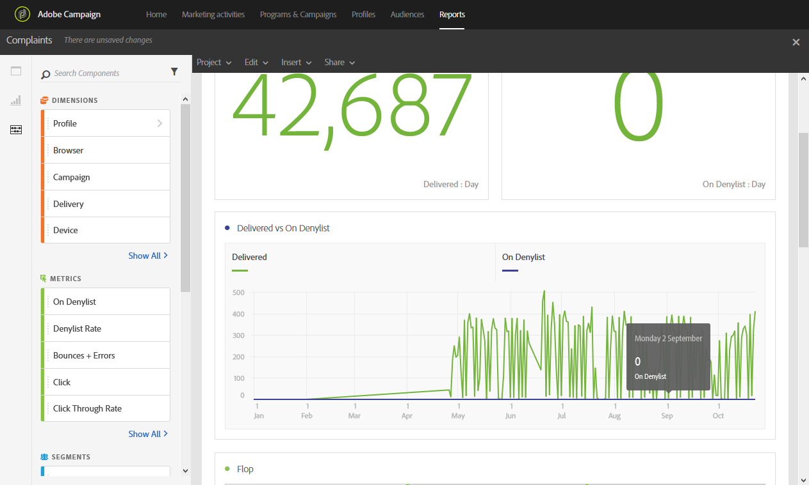

# 投訴{#complaints}

**[!UICONTROL Complaints]**&#x200B;報告會將收到最多聲明的傳送識別為垃圾訊息。

**Flop**&#x200B;表格依收件者網域排序，顯示已宣告電子郵件或垃圾訊息的收件者數目。 圖表和摘要數字中也提供了表格的結果。

**傳送與登入清單比較**&#x200B;表格會列出已宣告電子郵件為垃圾郵件或垃圾郵件的收件者人數。 表按傳送排序。
