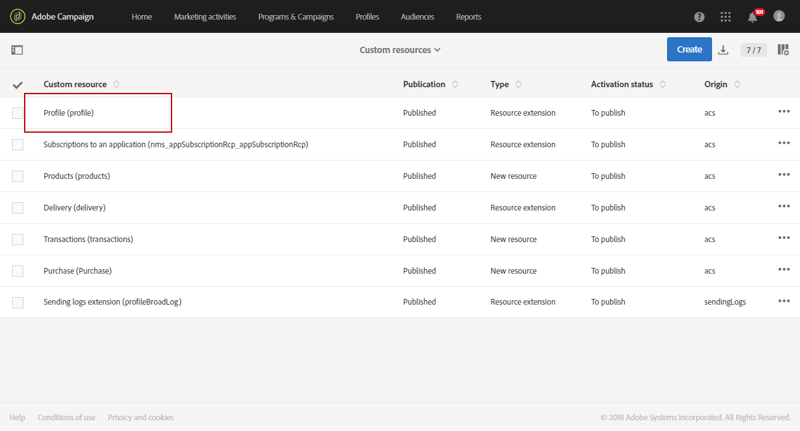
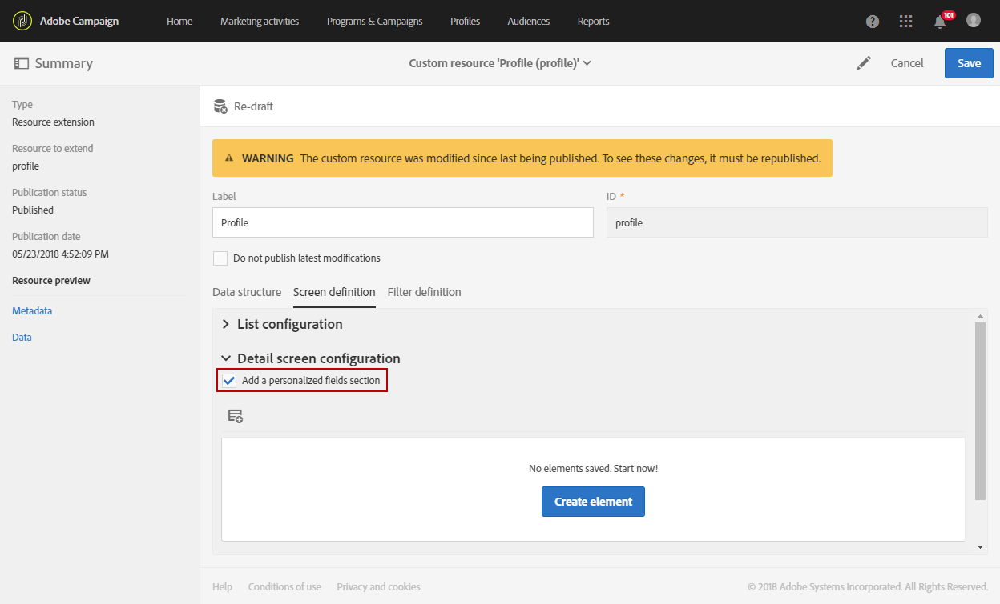
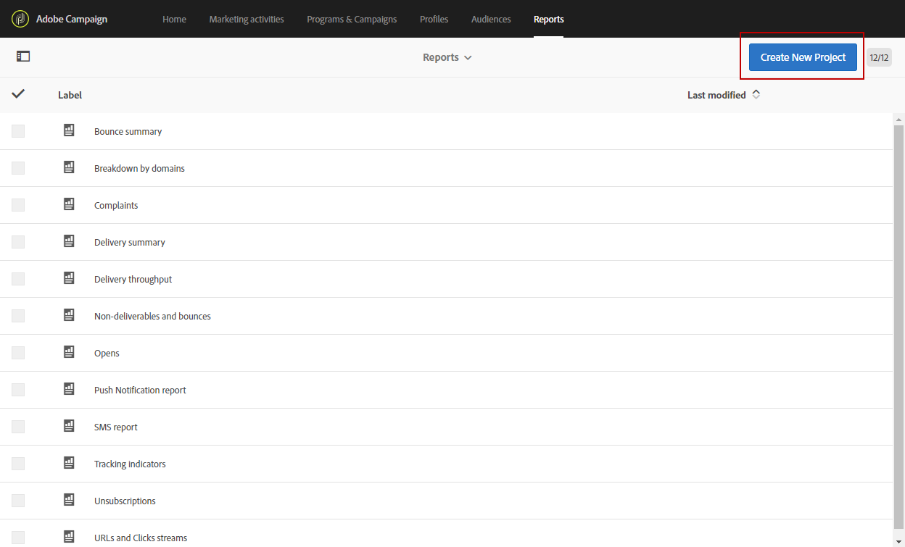
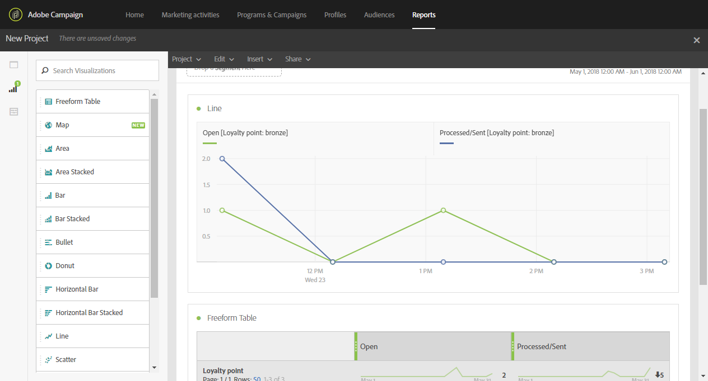

# 建立自訂設定檔維度{#creating-a-custom-profile-dimension}

您也可以根據在描述檔自訂資源擴充期間建立的自訂描述檔資料，來建立和管理報表。

在此範例中，我們要建立自訂描述檔欄位&#x200B;**Loyalty programs**，此欄位將分為三個層級：金、銀、銅。 然後，此自訂描述檔將會加以擴充，以便在動態報表中將它當做自訂描述檔維度使用。

* [步驟1:建立新的描述檔欄位](#step-1--create-a-new-profile-field)
* [步驟2:使用描述檔欄位擴充傳送記錄檔](#step-2--extend-the-sending-logs-with-the-profile-field)
* [步驟3:建立已註冊忠誠度方案的遞送定位收件者](#step-3--create-a-delivery-targeting-recipients-enrolled-in-the-loyalty-program)
* [步驟4:建立動態報表以篩選具有自訂描述檔維度的收件者](#step-4--create-a-dynamic-report-to-filter-recipients-with-the-custom-profile-dimension)

## 步驟1:建立新的描述檔欄位{#step-1--create-a-new-profile-field}

我們首先需要建立新的描述檔欄位&#x200B;**Loyalty program**，以指派忠誠度等級給收件者：金、銀或銅。

>[!NOTE]
>
>自訂資源只能由管理員管理。

若要這麼做：

1. 從高級菜單中，選擇&#x200B;**[!UICONTROL Administration]** > **[!UICONTROL Development]** > **[!UICONTROL Custom resources]** ，然後選擇&#x200B;**[!UICONTROL Profile (profile)]**&#x200B;自定義資源。

   

1. 在&#x200B;**[!UICONTROL Data structure]**&#x200B;標籤的&#x200B;**[!UICONTROL Fields]**&#x200B;類別中，按一下&#x200B;**[!UICONTROL Add field]**&#x200B;按鈕。

   

1. 輸入&#x200B;**[!UICONTROL Label]**、**[!UICONTROL ID]**&#x200B;並選擇自定義資源&#x200B;**[!UICONTROL Type]**。 在此，我們選擇了&#x200B;**[!UICONTROL Text]**，因為收件者可以選擇金、銀和銅。

   

1. 按一下圖示以定義欄位。

   

1. 在這裡，我們需要勾選&#x200B;**[!UICONTROL Specify a list of authorized valued]**&#x200B;來指定授權值，並按一下&#x200B;**[!UICONTROL Create element]**&#x200B;來建立每個值。

   

1. 輸入&#x200B;**[!UICONTROL Label]**&#x200B;和&#x200B;**[!UICONTROL Value]**，然後按一下&#x200B;**[!UICONTROL Add]**。 在此範例中，我們需要建立價值金、銀和銅。 完成後，按一下&#x200B;**[!UICONTROL Confirm]**。

   

1. 選取 **[!UICONTROL Screen definition]** 索引標籤。在&#x200B;**[!UICONTROL Detail screen configuration]**&#x200B;下拉式清單中，勾選&#x200B;**[!UICONTROL Add personalized fields]**&#x200B;區段，以在我們的描述檔中建立新區段。

   

1. 按一下&#x200B;**[!UICONTROL Add an element]**&#x200B;按鈕以建立新區段。 選擇&#x200B;**[!UICONTROL Type]**:**[!UICONTROL Input field]**、**[!UICONTROL Value]**&#x200B;或&#x200B;**[!UICONTROL List]**，然後新增至此新區段的欄位。

   

1. 您也可以在欄位&#x200B;**[!UICONTROL Customize the title of the section where the fields will be displayed]**&#x200B;中新增標題至您的區段。

   完成配置後，按一下&#x200B;**[!UICONTROL Save]**。

   

1. 從高級菜單中，選擇&#x200B;**[!UICONTROL Administration]** > **[!UICONTROL Development]** > **[!UICONTROL Publication]**&#x200B;開始發佈自定義資源。
1. 按一下&#x200B;**[!UICONTROL Prepare publication]** ，然後在準備完成時按一下&#x200B;**[!UICONTROL Publish]**&#x200B;按鈕。

   

您的新描述檔欄位現在可供收件者使用和選取。

## 步驟2:使用配置檔案欄位{#step-2--extend-the-sending-logs-with-the-profile-field}擴展發送日誌

現在您的描述檔欄位已建立，我們需要使用我們的描述檔欄位來擴充傳送記錄檔，以在動態報表中建立相關的自訂描述檔維度。

在使用我們的描述檔欄位擴充記錄檔之前，請確定已接受PII視窗以存取&#x200B;**[!UICONTROL Sending logs extension]**&#x200B;標籤。 如需關於此項目的詳細資訊，請參閱此[頁面](../../reporting/using/about-dynamic-reports.md#dynamic-reporting-usage-agreement)。

>[!NOTE]
>
>管理員只能使用配置檔案欄位擴展日誌。

1. 從高級菜單中，選擇&#x200B;**[!UICONTROL Administration]** > **[!UICONTROL Development]** > **[!UICONTROL Custom resources]** ，然後選擇&#x200B;**[!UICONTROL Profile (profile)]**&#x200B;自定義資源。
1. 開啟&#x200B;**[!UICONTROL Sending logs extension]**&#x200B;下拉式清單。
1. 按一下 **[!UICONTROL Create element]** 按鈕。

   

1. 選擇您先前建立的欄位，然後按一下&#x200B;**[!UICONTROL Confirm]**。
1. 勾選&#x200B;**[!UICONTROL Add this field in Dynamic reporting as a new dimension]**&#x200B;以建立您的自訂描述檔維度。

   

   此選項僅在接受PII視窗時才可用。 如需關於此項目的詳細資訊，請參閱此[頁面](../../reporting/using/about-dynamic-reports.md#dynamic-reporting-usage-agreement)。

1. 按一下&#x200B;**[!UICONTROL Add]**，然後儲存自訂資源。
1. 由於自訂資源已修改，因此我們需要發佈它以實作新的變更。

   從高級菜單中，選擇&#x200B;**[!UICONTROL Administration]** > **[!UICONTROL Development]** > **[!UICONTROL Publication]**&#x200B;開始發佈自定義資源。

1. 按一下&#x200B;**[!UICONTROL Prepare publication]** ，然後在準備完成時按一下&#x200B;**[!UICONTROL Publish]**&#x200B;按鈕。

   

您的自訂描述檔現在可在報表中當做自訂描述檔維度使用。

現在您的欄位已建立，而且傳送記錄已透過此描述檔欄位加以擴充，您就可以開始在傳送中鎖定收件者。

## 步驟3:建立已註冊忠誠度方案{#step-3--create-a-delivery-targeting-recipients-enrolled-in-the-loyalty-program}的傳送定位收件者

發佈您的設定檔欄位後，您就可以開始傳送。 在此範例中，我們要定位在忠誠度方案中註冊的每個收件者。

1. 在 **[!UICONTROL Marketing activities]** 索引標籤中，按一下 **[!UICONTROL Create]**，然後選取 **[!UICONTROL Email]**。
1. 選擇&#x200B;**[!UICONTROL Email type]**，然後輸入您電子郵件的屬性。
1. 若要定位在忠誠度方案中註冊的收件者，請拖放&#x200B;**[!UICONTROL Profiles (attributes)]**&#x200B;活動。
1. 從&#x200B;**[!UICONTROL Field]**&#x200B;下拉式清單中選取您先前建立的欄位。

   

1. 選擇&#x200B;**[!UICONTROL Filter conditions]**。 在此，我們要鎖定屬於三個忠誠度計畫等級之一的收件者。

   

1. 按一下&#x200B;**[!UICONTROL Confirm]**，然後在完成篩選後按一下&#x200B;**[!UICONTROL Next]**。
1. 定義並個人化訊息內容、傳送者名稱和主旨。 有關電子郵件建立的詳細資訊，請參閱此[頁](../../designing/using/designing-content-in-adobe-campaign.md)。

   然後，按一下&#x200B;**[!UICONTROL Create]**。

1. 準備就緒後，您可以預覽並傳送訊息。 有關如何準備和發送消息的詳細資訊，請參閱此[頁](../../sending/using/preparing-the-send.md)。

在您的電子郵件正確傳送給所選取的收件者後，您就可以開始篩選資料，並透過報表追蹤傳送的成功。

## 步驟4:建立動態報表以篩選自訂描述檔維度{#step-4--create-a-dynamic-report-to-filter-recipients-with-the-custom-profile-dimension}的收件者

在傳送傳送後，您可使用&#x200B;**[!UICONTROL Profile]**&#x200B;表格中的自訂描述檔維度來劃分報表。

1. 從&#x200B;**[!UICONTROL Reports]**&#x200B;標籤中，選擇現成可用的報表，或按一下&#x200B;**[!UICONTROL Create]**&#x200B;按鈕從頭開始。

   

1. 在&#x200B;**[!UICONTROL Dimensions]**&#x200B;類別中，按一下&#x200B;**[!UICONTROL Profile]**，然後將自訂&#x200B;**忠誠度計畫**&#x200B;描述檔維度拖放至自由表格。

   

1. 拖放&#x200B;**[!UICONTROL Processed/Sent]**&#x200B;和&#x200B;**[!UICONTROL Open]**&#x200B;量度，開始篩選資料。

   

1. 視需要將視覺化拖放至您的工作區。

   

**相關主題：**

* [使用自訂描述檔資料來建立深入洞察的報告](https://helpx.adobe.com/campaign/kb/simplify-campaign-management.html#Reportandshareinsightswithallstakeholders)
