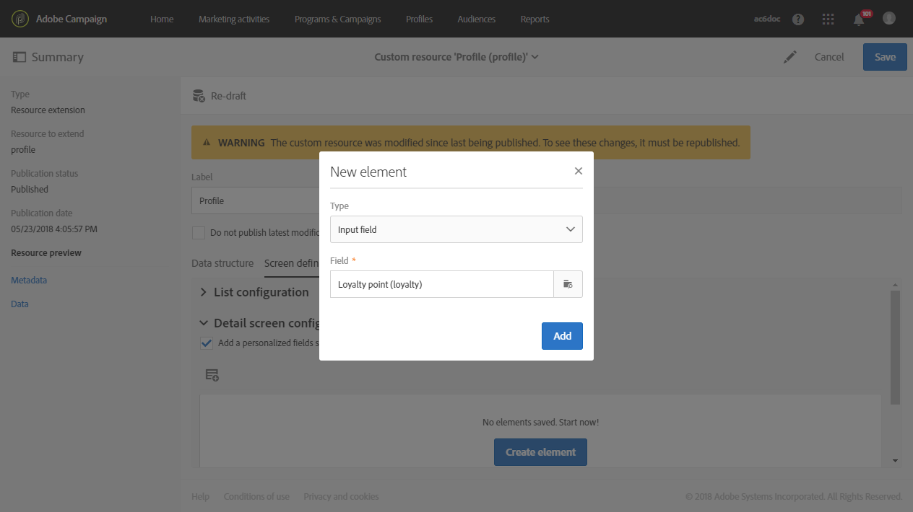

# 建立自訂設定檔維度{#creating-a-custom-profile-dimension}

您也可以根據在設定檔自訂資源擴充期間建立的自訂設定檔資料來建立和管理報表。

在此範例中，我們要建立自訂設定檔欄位 **忠誠計畫** 分為三個層次：金、銀、銅。 然後，此自訂設定檔將會延伸，以便在動態報告中作為自訂設定檔維度使用。

* [步驟1:建立新的設定檔欄位](#step-1--create-a-new-profile-field)
* [步驟2:使用設定檔欄位擴充傳送記錄檔](#step-2--extend-the-sending-logs-with-the-profile-field)
* [步驟3:建立傳遞目標定位已註冊到忠誠計畫的收件者](#step-3--create-a-delivery-targeting-recipients-enrolled-in-the-loyalty-program)
* [步驟4:建立動態報表以使用自訂設定檔維度篩選收件者](#step-4--create-a-dynamic-report-to-filter-recipients-with-the-custom-profile-dimension)

## 步驟1:建立新的設定檔欄位 {#step-1--create-a-new-profile-field}

我們首先需要建立新的設定檔欄位 **忠誠計畫** 會將忠誠度指派給收件者：金、銀或銅。

>[!NOTE]
>
>自訂資源只能由管理員管理。

若要這麼做：

1. 從進階功能表中，選取 **[!UICONTROL Administration]** > **[!UICONTROL Development]** > **[!UICONTROL Custom resources]** 然後 **[!UICONTROL Profile (profile)]** 自訂資源。

   

1. 從 **[!UICONTROL Data structure]** 標籤中 **[!UICONTROL Fields]** 類別，按一下 **[!UICONTROL Add field]** 按鈕。

   

1. 輸入 **[!UICONTROL Label]**, **[!UICONTROL ID]** 和選取自訂資源 **[!UICONTROL Type]**. 在這裡，我們選了 **[!UICONTROL Text]** 因為收件者將可以選擇金、銀和銅。

   

1. 按一下  圖示來定義欄位。

   

1. 在此，我們需要透過 **[!UICONTROL Specify a list of authorized valued]** 並透過 **[!UICONTROL Create element]**.

   

1. 輸入 **[!UICONTROL Label]** 和 **[!UICONTROL Value]** 然後按一下 **[!UICONTROL Add]**. 在此範例中，我們需要建立金、銀和銅的價值。 完成時，按一下&#x200B;**[!UICONTROL Confirm]**。

   

1. 選取 **[!UICONTROL Screen definition]** 索引標籤。在 **[!UICONTROL Detail screen configuration]** 下拉清單，檢查 **[!UICONTROL Add personalized fields]** 區段來在設定檔中建立新區段。

   

1. 按一下 **[!UICONTROL Add an element]** 按鈕以建立新區段。 選取 **[!UICONTROL Type]**: **[!UICONTROL Input field]**, **[!UICONTROL Value]** 或 **[!UICONTROL List]**，然後新增到此新區段的欄位。

   

1. 您也可以在欄位中新增標題至您的區段 **[!UICONTROL Customize the title of the section where the fields will be displayed]**.

   按一下 **[!UICONTROL Save]** 完成設定時。

   

1. 從進階功能表中，選取 **[!UICONTROL Administration]** > **[!UICONTROL Development]** > **[!UICONTROL Publication]** 以開始發佈自訂資源。
1. 按一下 **[!UICONTROL Prepare publication]** 準備完成後，按一下 **[!UICONTROL Publish]** 按鈕。

   

您的新設定檔欄位現在已準備好供收件者使用及選取。

## 步驟2:使用設定檔欄位擴充傳送記錄檔 {#step-2--extend-the-sending-logs-with-the-profile-field}

現在您的設定檔欄位已建立完畢，我們需要使用我們的設定檔欄位擴充傳送記錄檔，以在動態報表中建立相關聯的自訂設定檔維度。

使用設定檔欄位擴充記錄前，請確定已接受PII視窗，以存取 **[!UICONTROL Sending logs extension]** 標籤。 如需關於此項目的詳細資訊，請參閱此[頁面](../../reporting/using/about-dynamic-reports.md#dynamic-reporting-usage-agreement)。

>[!NOTE]
>
>管理員只能使用配置檔案欄位擴展日誌。

1. 從進階功能表中，選取 **[!UICONTROL Administration]** > **[!UICONTROL Development]** > **[!UICONTROL Custom resources]** 然後 **[!UICONTROL Profile (profile)]** 自訂資源。
1. 開啟 **[!UICONTROL Sending logs extension]** 下拉式清單。
1. 按一下 **[!UICONTROL Create element]** 按鈕。

   

1. 選取您先前建立的欄位，然後按一下 **[!UICONTROL Confirm]**.
1. 檢查 **[!UICONTROL Add this field in Dynamic reporting as a new dimension]** 來建立自訂設定檔維度。

   

   只有在接受PII視窗時，才能使用此選項。 如需關於此項目的詳細資訊，請參閱此[頁面](../../reporting/using/about-dynamic-reports.md#dynamic-reporting-usage-agreement)。

1. 按一下 **[!UICONTROL Add]** 然後儲存自訂資源。
1. 由於自訂資源已修改，因此我們需要發佈它以實作新的變更。

   從進階功能表中，選取 **[!UICONTROL Administration]** > **[!UICONTROL Development]** > **[!UICONTROL Publication]** 以開始發佈自訂資源。

1. 按一下 **[!UICONTROL Prepare publication]** 準備完成後，按一下 **[!UICONTROL Publish]** 按鈕。

   

您的自訂設定檔現在可作為報表中的自訂設定檔維度使用。

現在您的欄位已建立，且傳送記錄已透過此設定檔欄位擴充，您就可以開始在傳送中鎖定收件者。

## 步驟3:建立傳遞目標定位已註冊到忠誠計畫的收件者 {#step-3--create-a-delivery-targeting-recipients-enrolled-in-the-loyalty-program}

發佈設定檔欄位後，您就可以開始傳送。 在此範例中，我們想要鎖定已註冊忠誠計畫的每個收件者。

1. 在 **[!UICONTROL Marketing activities]** 索引標籤中，按一下 **[!UICONTROL Create]**，然後選取 **[!UICONTROL Email]**。
1. 選擇 **[!UICONTROL Email type]** 然後輸入您電子郵件的屬性。
1. 若要鎖定已註冊忠誠度方案的收件者，請拖放 **[!UICONTROL Profiles (attributes)]** 活動。
1. 從 **[!UICONTROL Field]** 下拉式清單。

   

1. 選取 **[!UICONTROL Filter conditions]**. 在此，我們要鎖定屬於三個忠誠計畫層級之一的收件者。

   

1. 按一下 **[!UICONTROL Confirm]** 完成篩選後，按一下 **[!UICONTROL Next]**.
1. 定義並個人化訊息內容、寄件者名稱和主旨。 如需建立電子郵件的詳細資訊，請參閱 [頁面](../../designing/using/designing-content-in-adobe-campaign.md).

   然後，按一下 **[!UICONTROL Create]**.

1. 準備就緒後，您可以預覽並傳送訊息。 有關如何準備和發送郵件的詳細資訊，請參閱 [頁面](../../sending/using/preparing-the-send.md).

將您的電子郵件正確傳送給您選取的收件者後，您就可以開始篩選資料，並透過報表追蹤傳送的成功。

## 步驟4:建立動態報表以使用自訂設定檔維度篩選收件者 {#step-4--create-a-dynamic-report-to-filter-recipients-with-the-custom-profile-dimension}

傳送傳遞後，您可以使用自訂設定檔維度來劃分報表， **[!UICONTROL Profile]** 表格。

1. 從 **[!UICONTROL Reports]** 標籤中，選取現成報表或按一下 **[!UICONTROL Create]** 按鈕，從頭開始。

   

1. 在 **[!UICONTROL Dimensions]** 類別，按一下 **[!UICONTROL Profile]** 然後拖放自訂 **忠誠計畫** 設定檔維度至自由表格。

   

1. 拖放 **[!UICONTROL Processed/Sent]** 和 **[!UICONTROL Open]** 量度來開始篩選資料。

   

1. 視需要在工作區中拖放視覺效果。

   

**相關主題：**

* [使用自訂設定檔資料建立有洞察力的報表](https://helpx.adobe.com/campaign/kb/simplify-campaign-management.html#Reportandshareinsightswithallstakeholders)
