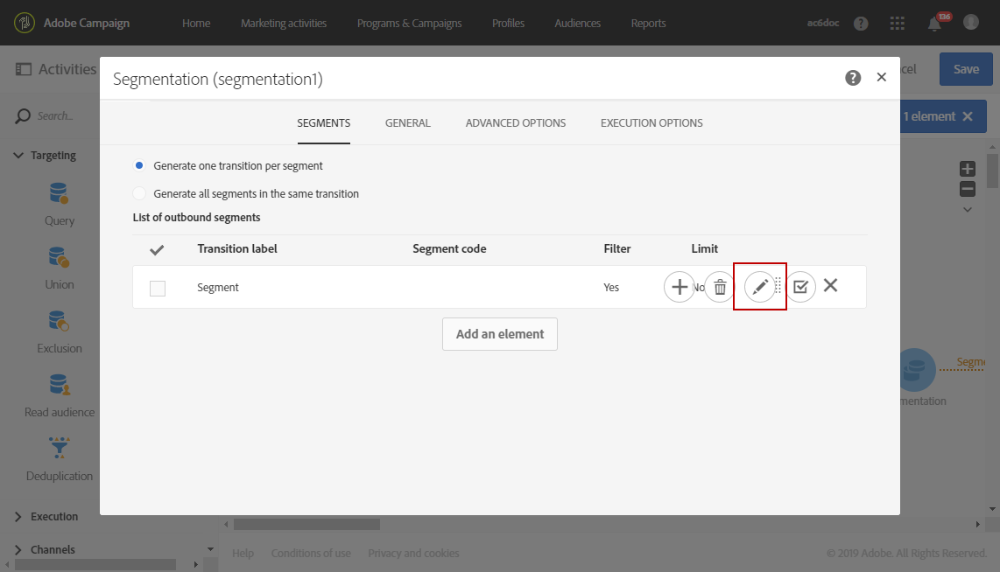
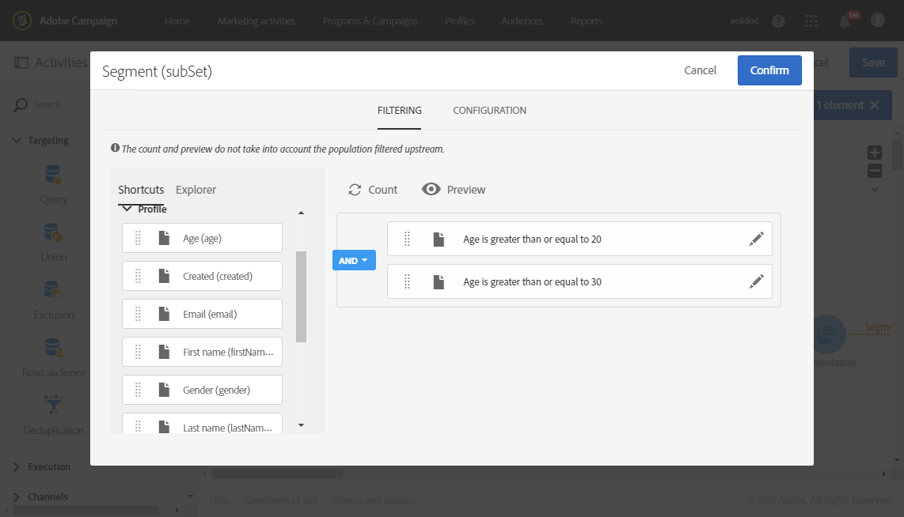
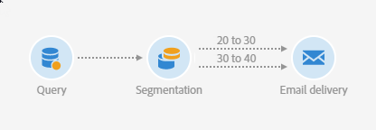
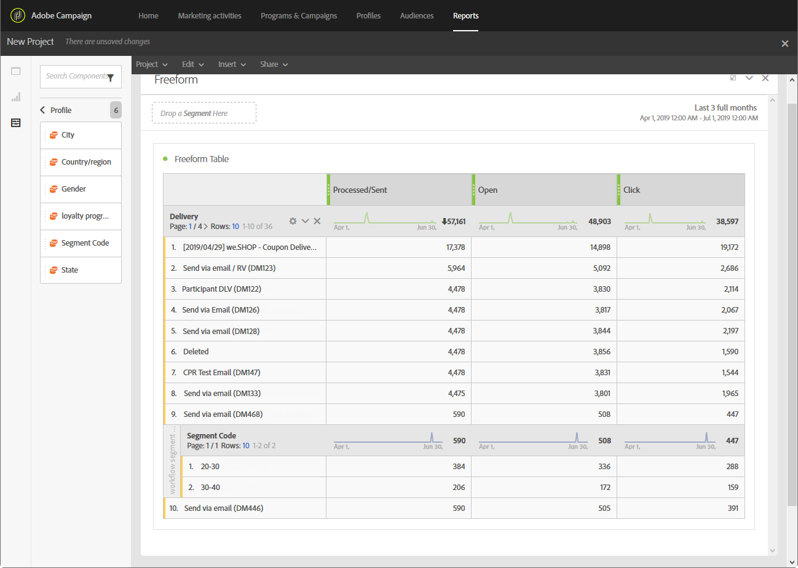

# 根據工作流程細分建立報告{#creating-a-report-workflow-segment}

>[!CAUTION]
> **[!UICONTROL Segment code]**&#x200B;只能定位電子郵件和簡訊傳遞。

建立工作流程並將母體篩選成不同的目標對象後，您可以根據此目標工作流程中定義的區段，評估行銷活動的效率。
若要在報表中鎖定這些區段：

* [步驟1：使用區段更新設定檔自訂資源](#step-1--update-profiles-custom-resource-segments)
* [步驟2：建立包含區段的工作流程](#step-2--create-a-workflow-segments)
* [步驟3：建立動態報表以篩選區段](#step-3--create-a-dynamic-report-filter-segments)

>[!CAUTION]
>必須接受動態報告使用協定才能開始收集這些資料。
>
>如需此合約的詳細資訊，請參閱此[頁面](../../reporting/using/about-dynamic-reports.md#dynamic-reporting-usage-agreement)。

## 步驟1：使用區段更新設定檔自訂資源{#step-1--update-profiles-custom-resource-segments}

在報告區段代碼之前，您必須更新&#x200B;**[!UICONTROL Profiles]**&#x200B;自訂資源，才能儲存區段代碼。

1. 從進階功能表，透過Adobe Campaign標誌，選取&#x200B;**[!UICONTROL Administration]** > **[!UICONTROL Development]** > **[!UICONTROL Custom resources]**，然後選取&#x200B;**[!UICONTROL Profile (profile)]**&#x200B;資源。
1. 在&#x200B;**[!UICONTROL Data structure]**&#x200B;索引標籤的&#x200B;**[!UICONTROL Sending logs extension]**&#x200B;功能表中，勾選&#x200B;**[!UICONTROL Add segment code]**&#x200B;以允許從目標工作流程儲存區段代碼，並將其傳送至動態報告。

   然後&#x200B;**[!UICONTROL Segment code]**&#x200B;將可在報表的&#x200B;**[!UICONTROL Profile]**&#x200B;維度區段中使用。

   

1. 儲存您的自訂資源。

1. 您現在需要發佈自訂資源。
從進階功能表，選取&#x200B;**[!UICONTROL Administration]** > **[!UICONTROL Development]** > **[!UICONTROL Publishing]**。

   

1. 按一下&#x200B;**[!UICONTROL Prepare publication]**，然後在準備完成時，按一下&#x200B;**[!UICONTROL Publish]**&#x200B;按鈕。 如需自訂資源的詳細資訊，請參閱此[頁面](../../developing/using/updating-the-database-structure.md)。

您現在可以開始使用區段代碼建立工作流程。

請注意，當您在&#x200B;**[!UICONTROL Sending logs extension]**&#x200B;中啟用區段代碼時，將會立即收集區段代碼。

## 步驟2：建立包含區段的工作流程 {#step-2--create-a-workflow-segments}

>[!NOTE]
>如果電子郵件傳送的輸入轉變空白，預設會新增上一個轉變的區段代碼。

您首先需要建立具有不同目標母體的工作流程。 在此，我們想要傳送將根據對象年齡進行個人化的電子郵件：一個適用於20至30歲的設定檔，另一個適用於30至40歲的設定檔。

1. 建立您的工作流程。 有關如何建立工作流程的詳細資訊，請參閱此[頁面](../../automating/using/building-a-workflow.md)。

1. 從浮動視窗拖曳&#x200B;**[!UICONTROL Query]**&#x200B;活動並放置在工作區中，以新增該活動。

1. 鎖定20至40歲的設定檔，並於稍後將其細分為更具針對性的母體。

   

1. 新增&#x200B;**[!UICONTROL Segmentation]**&#x200B;活動以將您的查詢結果分割成兩個目標母體。 如需分段的詳細資訊，請參閱此[頁面](../../automating/using/segmentation.md)。

1. 連按兩下&#x200B;**[!UICONTROL Segmentation]**&#x200B;活動以進行設定。 按一下&#x200B;**[!UICONTROL Edit properties]**&#x200B;以編輯第一個區段。

   

1. 查詢年齡介於20到30歲之間的設定檔，並在完成時按一下&#x200B;**[!UICONTROL Confirm]**。

   

1. 按一下&#x200B;**[!UICONTROL Add an element]**&#x200B;建立您的第二個區段，並依照上述步驟所述將其設定為目標30至40歲的設定檔。

1. 編輯每個要透過動態報告傳遞的母體的&#x200B;**[!UICONTROL Segment code]**。

   >[!NOTE]
   >此步驟為必要步驟，否則您將無法瞭解要報告哪些區段。

   

1. 將&#x200B;**[!UICONTROL Email delivery]**&#x200B;活動拖放到您的區段之後。

   

1. 根據不同的目標母體個人化您的傳遞。 如需電子郵件建立的詳細資訊，請參閱此[頁面](../../designing/using/designing-content-in-adobe-campaign.md)。

1. 儲存工作流程。

1. 在工作流程準備就緒時，按一下「**[!UICONTROL Start]**」。

您現在可以存取報表以追蹤區段代碼。

## 步驟3：建立動態報表以篩選區段 {#step-3--create-a-dynamic-report-filter-segments}

使用工作流程傳送傳遞後，您可以使用工作流程中的區段代碼來劃分報表。

1. 從「**[!UICONTROL Reports]**」索引標籤中，選取現成可用的報表，或按一下「**[!UICONTROL Create new project]**」按鈕以從頭開始建立。

   
1. 將&#x200B;**[!UICONTROL Delivery]**&#x200B;維度拖放至您的自由表格。

   

1. 將不同的量度（例如&#x200B;**[!UICONTROL Open]**&#x200B;和&#x200B;**[!UICONTROL Click]**&#x200B;量度）拖放至您的表格，以開始篩選您的資料。
1. 在&#x200B;**[!UICONTROL Dimensions]**&#x200B;類別中，按一下&#x200B;**[!UICONTROL Profile]**&#x200B;維度，然後將&#x200B;**[!UICONTROL Segment code]**&#x200B;維度拖放至工作流程的傳送上，以根據目標人口評估電子郵件傳送的成功程度。

   

1. 視需要在工作區中拖放視覺效果。

   
