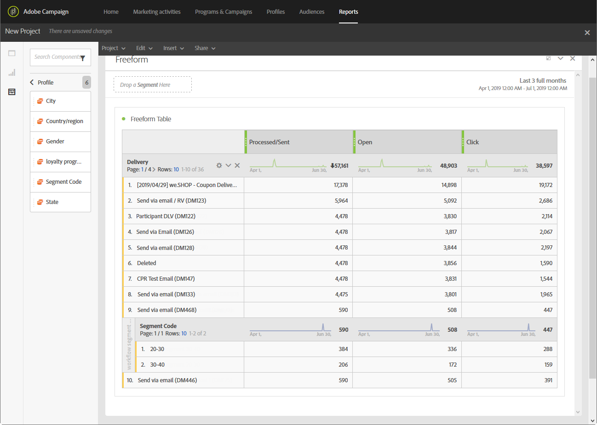

# 根據工作流程細分建立報告{#creating-a-report-workflow-segment}

在建立工作流程並將人口篩選到不同的目標對象後，您可以根據此目標工作流程中定義的區段來評估行銷宣傳的效率。
若要定位報表中的這些區段：

* [步驟1:使用區段更新描述檔自訂資源](#step-1--update-profiles-custom-resource-segments)
* [步驟2:建立含區段的工作流程](#step-2--create-a-workflow-segments)
* [步驟3:建立動態報表以篩選區段](#step-3--create-a-dynamic-report-filter-segments)

>[!CAUTION]
>必須接受動態報告使用協定，才能開始收集這些資料。
>For more on this agreement, refer to this [page](../../reporting/using/about-dynamic-reports.md#dynamic-reporting-usage-agreement).

## 步驟1:使用區段更新描述檔自訂資源{#step-1--update-profiles-custom-resource-segments}

在報告區段代碼之前，您必須更新要 **[!UICONTROL Profiles]** 儲存的區段代碼的自訂資源。

1. From the advanced menu, via the Adobe Campaign logo, select **[!UICONTROL Administration]** > **[!UICONTROL Development]** > **[!UICONTROL Custom resources]**, then select the **[!UICONTROL Profile (profile)]** resource.
1. 在標籤 **[!UICONTROL Sending logs extension]** 的功能表 **[!UICONTROL Data structure]** 中，勾選 **[!UICONTROL Add segment code]** 以允許從定位工作流程儲存區段代碼，並將它傳送至動態報表。

   然 **[!UICONTROL Segment code]** 後，報表的維度區 **[!UICONTROL Profile]** 段中就會提供。

   

1. 儲存自訂資源。

1. 您現在需要發佈自訂資源。
從進階功能表中，選取 **[!UICONTROL Administration]** > **[!UICONTROL Development]** > **[!UICONTROL Publishing]**。

   

1. 完 **[!UICONTROL Prepare publication]** 成準備後，按一下按 **[!UICONTROL Publish]** 鈕。 For more information on custom resource, refer to this [page](../../developing/using/updating-the-database-structure.md).

您現在可以開始使用區段代碼建立工作流程。

請注意，當您在中啟用區段代碼時，系統會立即收集區段代碼 **[!UICONTROL Sending logs extension]**。

## 步驟2:建立含區段的工作流程 {#step-2--create-a-workflow-segments}

>[!NOTE]
>如果電子郵件傳送的輸入轉場是空的，則預設會新增先前轉場的區段代碼。

您首先需要建立具有不同目標群體的工作流程。 在此，我們想要傳送會根據受眾年齡而個人化的電子郵件：一個是20到30歲的個人檔案，另一個是30到40歲的個人檔案。

1. 建立您的工作流程。 For more details on how to create your workflow, refer to this [page](../../automating/using/building-a-workflow.md).

1. Add a **[!UICONTROL Query]** activity by dragging it from the palette and dropping it in the workspace.

1. 將20到40歲的個人檔案分成目標群體，以後再將其分成目標群體。

   

1. 新增活 **[!UICONTROL Segmentation]** 動，將查詢結果分割為兩個目標人口族群。 For more on segmentation, refer to this [page](../../automating/using/segmentation.md).

1. 按兩下活 **[!UICONTROL Segmentation]** 動以進行設定。 按一下以編輯第一個區段 **[!UICONTROL Edit properties]**。

   

1. 在20到30歲之間查詢描述檔，然後在完成時按 **[!UICONTROL Confirm]** 一下。

   

1. 按一 **[!UICONTROL Add an element]** 下以建立第二個區段，並依上述步驟中所述加以設定，以定位年齡在30到40歲之間的描述檔。

1. 編輯 **[!UICONTROL Segment code]** 要透過動態報表傳遞的每個人口族群。

   >[!NOTE]
   >此步驟為必要步驟，否則您將無法瞭解要報告的區段。

   

1. Drag and drop an **[!UICONTROL Email delivery]** activity after your segments.

   

1. 根據不同的目標人口，個人化您的遞送。 For more on email creation, refer to this [page](../../designing/using/designing-content-in-adobe-campaign.md).

1. 儲存工作流程。

1. 當您 **[!UICONTROL Start]** 的工作流程準備就緒時，按一下。

您現在可以存取報表來追蹤區段代碼。

## 步驟3:建立動態報表以篩選區段 {#step-3--create-a-dynamic-report-filter-segments}

在傳送傳送至您的工作流程後，您可以使用工作流程中的區段代碼來劃分報表。

1. 從標 **[!UICONTROL Reports]** 簽中，選取現成可用的報表，或按一下按鈕從頭 **[!UICONTROL Create new project]** 開始建立報表。

   
1. 將維度拖放 **[!UICONTROL Delivery]** 至自由表格。

   

1. 將不同的度量拖放至表格，例如 **[!UICONTROL Open]** 和 **[!UICONTROL Click]** 度量，開始篩選資料。
1. 在類別 **[!UICONTROL Dimensions]** 中，按一下維 **[!UICONTROL Profile]** 度，然後拖放工作流程傳送的維度， **[!UICONTROL Segment code]** 以根據目標人口族群來測量電子郵件傳送的成功程度。

   

1. 視需要將視覺化拖放至您的工作區。

   
