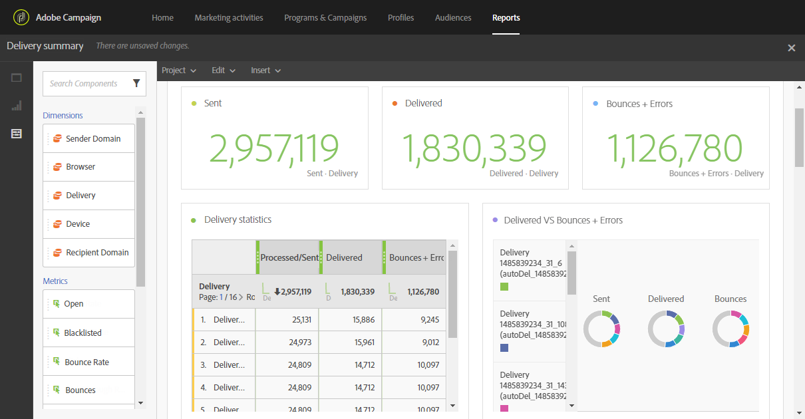

# 傳遞摘要{#delivery-summary}

**[!UICONTROL Delivery summary]**&#x200B;報告詳細說明與電子郵件或數封電子郵件相關的主要資訊。

每個表格都由摘要數字和圖表表示。 您可以變更詳細資訊在其各自視覺效果設定中的顯示方式。

**傳遞統計資料**&#x200B;表格包含可用於已傳送電子郵件的資料，例如：

* **[!UICONTROL Processed/sent]**：傳遞的傳送總數。
* **[!UICONTROL Delivered]**：成功傳送的訊息數，與已傳送的訊息總數相關。 產生的錯誤（退信）會納入考量。 但是，申訴（垃圾訊息宣告）和離開訊息（例如「不在辦公室」）不會考慮在內。
* **[!UICONTROL Bounces + Errors]**：傳遞期間累積的錯誤總數和自動傳回處理期間與已傳送訊息總數相關的錯誤總數。

**開啟與點按**&#x200B;表格包含每個傳遞的收件者活動可用的資料，例如：

* **點按**：內容在傳遞中被點按的次數。
* **開啟**：傳遞中開啟郵件的次數。
* **唯一開啟次數**：開啟傳遞的收件者人數。
* **不重複點按**：點按傳遞中內容的收件者人數。

**網域重新分割**&#x200B;表格會根據收件者的網域顯示傳遞的狀態。
