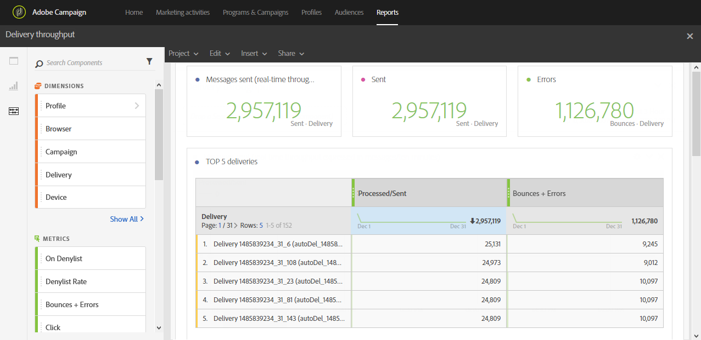

# 傳送總處理能力{#delivery-throughput}

此報表包含與傳送或數個傳送的傳送吞吐量相關的資料。 它提供：

* 每小時處理的訊息數
* **[!UICONTROL Top 5 deliveries]**&#x200B;表格和互補摘要數字，顯示5個傳送，重試次數增加最多。

>[!NOTE]
>
>**[!UICONTROL Delivery throughput]**&#x200B;頁顯示從Campaign到Adobe Campaign增強型MTA（消息傳輸代理）的消息中繼的吞吐量速度。
