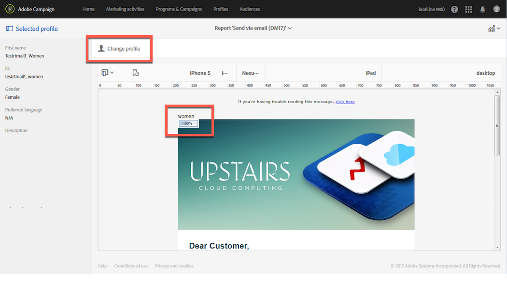

# 熱點點擊{#hot-clicks}

此報表可從每個傳送或交易式訊息的&#x200B;**[!UICONTROL Reports]**&#x200B;按鈕存取。

它會以每個連結的點按百分比呈現訊息內容（HTML和/或文字）。

如果您為傳送建立了動態內容，則可檢視您定義之每個條件的百分比。 如需在傳送中插入條件式內容的詳細資訊，請參閱[定義動態內容](../../designing/using/personalization.md#defining-dynamic-content-in-an-email)。

例如，假設您建立了具有下列條件的傳送：

* 如果收件者是男性或女性，則主影像上的連結會不同。
* 您也新增了特殊優惠方案的連結，該連結只會顯示給25歲以上的收件者。

傳送訊息後，請從傳送控制面板選取&#x200B;**[!UICONTROL Reports]** > **[!UICONTROL Hot clicks]**。

預設情況下，不選取任何設定檔。 只有性別未知的收件者，以及年齡未滿25歲或未知的收件者，才會顯示點按。

若要顯示女性的點按次數，請按一下&#x200B;**[!UICONTROL Change profile]**&#x200B;按鈕並選取女性測試設定檔。 若要顯示男性的點按次數，請以類似方式繼續，並選取男性測試設定檔。

若要顯示25歲以上收件者的點按次數，請按一下&#x200B;**[!UICONTROL Change profile]**&#x200B;按鈕並選取出生日期與此條件相符的測試設定檔。

如需測試設定檔的詳細資訊，請參閱[關於測試設定檔](../../audiences/using/managing-test-profiles.md)。

>[!NOTE]
>
>特定連結的點按次數是傳遞中所有條件內容點按總次數的百分比。 因此，如果您定義動態內容，特定測試設定檔所顯示的百分比總數可能不等於100。

同樣地，對於循環傳送和交易式訊息，您可以選取與您要顯示的動態內容相對應的測試設定檔，但您也可以根據選取的執行傳送檢視點按百分比。

執行傳送是在下列情況下建立的不可操作且無法運作的技術訊息：

* 每次執行或更新循環傳送時。

   例如，如果管理此傳送的工作流程每月執行一次，則每月將執行一次傳送。 此外，每次更新傳送內容時，都會建立額外的執行傳送。

   如需循環電子郵件傳送的詳細資訊，請參閱[電子郵件傳送](../../automating/using/email-delivery.md)。

* 預設情況下，交易式訊息每月一次，且每次編輯和發佈交易式訊息時皆是如此。

   如需交易式訊息的詳細資訊，請參閱[交易式訊息快速入門](../../channels/using/getting-started-with-transactional-msg.md)。

>[!NOTE]
>
>由於追蹤的URL ID對於每個執行都不同，因此無法針對指定訊息的所有執行傳送匯總熱門點按資料。 一次只能針對一個執行傳送顯示。

傳送訊息後，請從傳送控制面板選取&#x200B;**[!UICONTROL Reports]** > **[!UICONTROL Hot clicks]**。

依預設，會選取上次執行傳送。 按一下&#x200B;**[!UICONTROL Change execution delivery]**&#x200B;按鈕以選擇另一個按鈕。

系統只會顯示所選傳送執行的點按百分比。
