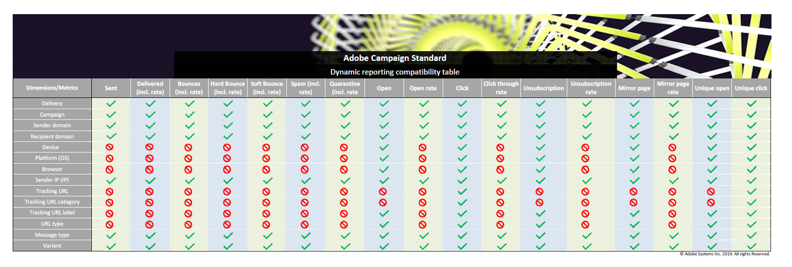

# 元件清單 {#list-of-components}

若要進一步瞭解維度和量度之間的相容性，請參閱此 [表格](/help/reporting/using/assets/dynamic_report_compatibility.pdf). 如果兩個元件不相容，儲存格會顯示值 **無**.

## 維度 {#dimensions}

下表列出報表中使用的維度及其定義。

<table> 
 <thead> 
  <tr> 
   <th> Dimension  </th> 
   <th> 定義  </th> 
  </tr> 
 </thead> 
 <tbody> 
  <tr> 
   <td> 瀏覽器  </td> 
   <td> 開啟或點選訊息的來源瀏覽器。  </td> 
  </tr> 
  <tr> 
   <td> Campaign  </td> 
   <td> 行銷活動的標籤和ID。  </td> 
  </tr> 
  <tr> 
   <td> 城市  </td> 
   <td> 在收件者設定檔中註冊的城市。  </td> 
  </tr> 
  <tr> 
   <td> 國家/地區  </td> 
   <td> 在收件者設定檔中註冊的國家/地區。  </td> 
  </tr> 
  <tr> 
   <td> 傳遞  </td> 
   <td> 傳遞的標籤和ID。  </td> 
  </tr> 
  <tr> 
   <td> 裝置  </td> 
   <td> 電子郵件/簡訊/推播通知開啟/檢視/點按的裝置。  </td> 
  </tr> 
  <tr> 
   <td> 失敗原因  </td> 
   <td> 導致每次傳遞跳出的錯誤型別，例如使用者不明、網域無效或信箱已滿。  </td> 
  </tr> 
  <tr> 
   <td> 性別  </td> 
   <td> 收件者的性別，例如男性或女性。 如果收件者設定檔中的性別欄位為空，則值將為無。  </td> 
  </tr> 
  <tr> 
   <td> 應用程式內訊息動作  </td> 
   <td> 應用程式內訊息傳送的動作，例如按鈕1或2的動作或解除。  </td> 
  </tr> 
  <tr> 
   <td> 訊息型別  </td> 
   <td> 用於傳遞的頻道，例如電子郵件、簡訊、推播通知或應用程式內。  </td> 
  </tr> 
  <tr> 
   <td> 行動應用程式名稱  </td> 
   <td> 行動應用程式的名稱  </td> 
  </tr> 
  <tr> 
   <td> Platform  </td> 
   <td> 開啟/檢視/點選訊息的來源裝置平台。  </td> 
  </tr> 
  <tr> 
   <td> 個人資料  </td> 
   <td> 對設定檔資源擴充期間建立的現成可用和自訂設定檔欄位進行重新分組，如需詳細資訊，請參閱本節 <a href="../../developing/using/key-steps-to-add-a-resource.md">頁面</a> 或這個 <a href="../../reporting/using/creating-a-custom-profile-dimension.md">範例</a>.  請注意，當連結至設定檔欄位的自訂資源發佈時，就會擷取此維度的資料。  </td> 
  </tr> 
  <tr> 
   <td> 推播平台  </td> 
   <td> 開啟推播通知的裝置平台，例如iOS或Android。  </td> 
  </tr> 
  <tr> 
   <td> 收件者網域  </td> 
   <td> 用來開啟電子郵件的網域。  </td> 
  </tr> 
  <tr> 
   <td> 循環傳遞  </td> 
   <td> 重複傳送的標籤和ID。  </td> 
  </tr> 
  <tr> 
   <td> 寄件者網域  </td> 
   <td> 用來傳送電子郵件的網域。  </td> 
  </tr> 
  <tr> 
   <td> 寄件者IP  </td> 
   <td> 用來傳送電子郵件的IP。  </td> 
  </tr> 
  <tr> 
   <td> 狀態  </td> 
   <td> 在收件者設定檔中登入的州。  </td> 
  </tr> 
  <tr> 
   <td> 追蹤URL  </td> 
   <td> 使用者從訊息中點按的URL。  </td> 
  </tr> 
  <tr> 
   <td> 追蹤網址類別  </td> 
   <td> 指派給追蹤URL的類別。  </td> 
  </tr> 
  <tr> 
   <td> 追蹤網址標籤  </td> 
   <td> 指定給URL的標籤，例如映象頁面、聯絡我們或開啟。  </td> 
  </tr> 
  <tr> 
   <td> 異動傳遞  </td> 
   <td> 異動傳送的標籤和ID。  </td> 
  </tr> 
  <tr> 
   <td> 變體  </td> 
   <td> A/B測試時的電子郵件變體。  </td> 
  </tr> 
 </tbody> 
</table>

## 量度 {#metrics}

下表提供報表中使用的量度清單，以及量度定義（視傳送型別而定）。

### 電子郵件和簡訊量度 {#email-and-sms-metrics}

<table> 
 <thead> 
  <tr> 
   <th> 量度  </th> 
   <th> 定義  </th> 
  </tr> 
 </thead> 
 <tbody> 
  <tr> 
   <td> 在封鎖清單上  </td> 
   <td> 已將電子郵件宣告為垃圾郵件或垃圾郵件的收件者人數。  </td> 
  </tr> 
  <tr> 
   <td> 封鎖清單率  </td> 
   <td> 封鎖清單上標籤的傳遞百分比。  </td> 
  </tr> 
  <tr> 
   <td> 退回+錯誤  </td> 
   <td> 與已傳送訊息總數相關的傳遞和自動回訪處理期間累計的錯誤總數。  </td> 
  </tr> 
  <tr> 
   <td> 退回+錯誤率  </td> 
   <td> 與已傳送的電子郵件相比跳出的電子郵件百分比。  </td> 
  </tr> 
  <tr> 
   <td> 按一下  </td> 
   <td> 內容在傳遞中被點按的次數。  </td> 
  </tr> 
  <tr> 
   <td> 點進率  </td> 
   <td> 傳遞中的點按百分比。  </td> 
  </tr> 
  <tr> 
   <td> 已傳遞  </td> 
   <td> 成功傳送的訊息數（與已傳送訊息總數相關）。  </td> 
  </tr> 
  <tr> 
   <td> 傳遞率  </td> 
   <td> 已成功傳送的訊息百分比。  </td> 
  </tr> 
  <tr> 
   <td> 硬退信  </td> 
   <td> 永久錯誤總數，例如錯誤的電子郵件地址。  </td> 
  </tr> 
  <tr> 
   <td> 硬跳出率  </td> 
   <td> 因永久錯誤而失敗的傳遞百分比。  </td> 
  </tr> 
  <tr> 
   <td> 映象頁面  </td> 
   <td> 點按映象頁面連結的收件者人數。  </td> 
  </tr> 
  <tr> 
   <td> 映象頁面速率  </td> 
   <td> 相較於傳遞訊息總數，映象頁面連結的點按百分比。  </td> 
  </tr> 
  <tr> 
   <td> 優惠點選次數  </td> 
   <td> 在傳遞中點按優惠方案的次數。  </td> 
  </tr> 
  <tr> 
   <td> 優惠點按率  </td> 
   <td> 優惠的點按百分比。  </td> 
  </tr> 
  <tr> 
   <td> 開啟  </td> 
   <td> 訊息在傳遞中開啟的次數。  </td> 
  </tr> 
  <tr> 
   <td> 開啟率  </td> 
   <td> 已開啟訊息的百分比。  </td> 
  </tr> 
  <tr> 
   <td> 已處理/傳送  </td> 
   <td> 傳遞的傳送總數。  </td> 
  </tr> 
  <tr> 
   <td> 隔離  </td> 
   <td> 退回並導致地址隔離的郵件數。  </td> 
  </tr> 
  <tr> 
   <td> 隔離率  </td> 
   <td> 相較於已傳送訊息的隔離百分比。  </td> 
  </tr> 
  <tr> 
   <td> 已拒絕  </td> 
   <td> SMTP伺服器分類為垃圾郵件的郵件數。  </td> 
  </tr> 
  <tr> 
   <td> 拒絕率  </td> 
   <td> 標示為拒絕的郵件百分比。  </td> 
  </tr> 
  <tr> 
   <td> 軟退信  </td> 
   <td> 暫時性錯誤總數，例如完整收件匣。  </td> 
  </tr> 
  <tr> 
   <td> 軟跳出率  </td> 
   <td> 因暫時原因而失敗的傳遞百分比。  </td> 
  </tr> 
  <tr> 
   <td> 不重複點按  </td> 
   <td> 在傳遞中點按內容的收件者人數。  </td> 
  </tr> 
  <tr> 
   <td> 不重複開啟  </td> 
   <td> 開啟傳遞的收件者人數。  </td> 
  </tr> 
  <tr> 
   <td> 不重複取消訂閱  </td> 
   <td> 點按取消訂閱連結的收件者人數。  </td> 
  </tr> 
  <tr> 
   <td> 取消訂閱率  </td> 
   <td> 與傳遞的訊息比較的不重複取消訂閱數。  </td> 
  </tr> 
  <tr> 
   <td> 已取消訂閱  </td> 
   <td> 對取消訂閱連結的點按次數。  </td> 
  </tr> 
 </tbody> 
</table>

### 推播通知量度 {#push-notification-metrics}

<table> 
 <thead> 
  <tr> 
   <th> 量度  </th> 
   <th> 定義  </th> 
  </tr> 
 </thead> 
 <tbody> 
  <tr> 
   <td> 退回+錯誤  </td> 
   <td> 傳遞期間累計的錯誤總數與已傳送訊息的總數相關，例如來自MCPNS或提供者的錯誤。  </td> 
  </tr> 
  <tr> 
   <td> 退回+錯誤率  </td> 
   <td> 與已傳送的推播通知相比退回的推播通知的百分比。  </td> 
  </tr> 
  <tr> 
   <td> 按一下  </td> 
   <td> 推播通知已傳送至裝置並由使用者點按的次數。 使用者想要檢視通知（通知隨後將移至推播開啟追蹤）或將其關閉。  </td> 
  </tr> 
  <tr> 
   <td> 點進率  </td> 
   <td> 與推播通知互動的使用者百分比。  </td> 
  </tr> 
  <tr> 
   <td> 已傳遞  </td> 
   <td> 成功傳送的推播通知數，與已傳送推播通知總數相關。  </td> 
  </tr> 
  <tr> 
   <td> 傳遞率  </td> 
   <td> 已成功傳送的推播通知百分比。  </td> 
  </tr> 
  <tr> 
   <td> 曝光數  </td> 
   <td> 推播通知已傳送至裝置並在通知中心保持未觸及的次數。 在大多數情況下，曝光次數應該與傳送的數目類似。 這可確保裝置收到訊息，並將該資訊轉送回伺服器。  </td> 
  </tr> 
  <tr> 
   <td> 已處理/傳送  </td> 
   <td> 已傳送的推播通知總數。  </td> 
  </tr> 
  <tr> 
   <td> 開啟  </td> 
   <td> 傳遞到裝置且使用者因此開啟應用程式而點按的推播通知總數。 這類似於「推送點按」，但如果通知已關閉，則不會觸發「推送開啟」。  </td> 
  </tr> 
  <tr> 
   <td> 開啟率  </td> 
   <td> 已開啟推播通知的百分比。  </td> 
  </tr> 
  <tr> 
   <td> 不重複點按  </td> 
   <td> 不重複使用者與推播通知互動的次數，例如點選通知或按鈕。  </td> 
  </tr> 
  <tr> 
   <td> 不重複曝光次數  </td> 
   <td> 收件者的曝光次數。  </td> 
  </tr> 
  <tr> 
   <td> 不重複開啟次數  </td> 
   <td> 開啟傳遞的收件者人數。  </td> 
  </tr> 
 </tbody> 
</table>

### 應用程式內量度 {#in-app-metrics}

<table> 
 <thead> 
  <tr> 
   <th> 量度  </th> 
   <th> 定義  </th> 
  </tr> 
 </thead> 
 <tbody> 
  <tr> 
   <td> 已傳遞  </td> 
   <td> 服務提供者傳遞到裝置的應用程式內訊息總數。  </td> 
  </tr> 
  <tr> 
   <td> 曝光數  </td> 
   <td> 根據是否符合觸發條件，收件者看到的應用程式內訊息總數。  </td> 
  </tr> 
  <tr> 
   <td> 應用程式內點選次數   </td> 
   <td> 點按按鈕1或按鈕2的收件者總數。  </td> 
  </tr> 
  <tr> 
   <td> 應用程式內點進率  </td> 
   <td> 相較於看到訊息的使用者，按一下按鈕1或按鈕2的使用者百分比。  </td> 
  </tr> 
  <tr> 
   <td> 應用程式內解除  </td> 
   <td> 收件者按一下關閉按鈕或自動關閉而關閉的訊息總數。  </td> 
  </tr> 
  <tr> 
   <td> 應用程式內解僱率  </td> 
   <td> 收件者已解除的應用程式內訊息的百分比。  </td> 
  </tr> 
  <tr> 
   <td> 已處理/傳送  </td> 
   <td> 在傳送傳遞程式中，從Adobe Campaign傳送的應用程式內訊息總數。  </td> 
  </tr> 
  <tr> 
   <td> 不重複曝光次數  </td> 
   <td> 不重複收件者的曝光次數。  </td> 
  </tr> 
  <tr> 
   <td> 不重複應用程式內點按  </td> 
   <td> 收件者點選按鈕1或按鈕2的次數。  </td> 
  </tr> 
  <tr> 
   <td> 不重複應用程式內解除  </td> 
   <td> 收件者解除應用程式內訊息的次數。  </td> 
  </tr> 
 </tbody> 
</table>

## 區段 {#segments}

下表提供報告中使用的區段清單及其定義。

<table> 
 <thead> 
  <tr> 
   <th> 區段  </th> 
   <th> 定義  </th> 
  </tr> 
 </thead> 
 <tbody> 
  <tr> 
   <td> 年齡：嬰兒潮1  </td> 
   <td> 1946年至1954年出生的收件者。  </td> 
  </tr> 
  <tr> 
   <td> 年齡：嬰兒潮一代2  </td> 
   <td> 1955年至1965年出生的收件者。  </td> 
  </tr> 
  <tr> 
   <td> 年齡：從18到25  </td> 
   <td> 18到25歲的收件者。  </td> 
  </tr> 
  <tr> 
   <td> 年齡：從26到30  </td> 
   <td> 26到30歲的收件者。  </td> 
  </tr> 
  <tr> 
   <td> 年齡：從31到40  </td> 
   <td> 31到40歲的收件者。  </td> 
  </tr> 
  <tr> 
   <td> 年齡：從41到50  </td> 
   <td> 41到50歲的收件者。  </td> 
  </tr> 
  <tr> 
   <td> 年齡：第X代  </td> 
   <td> 1966年至1976年出生的收件者。  </td> 
  </tr> 
  <tr> 
   <td> 年齡：Y代（千禧一代）  </td> 
   <td> 1977年至1994年出生的收件者。  </td> 
  </tr> 
  <tr> 
   <td> 年齡：Z代  </td> 
   <td> 1995年至今的收件者。  </td> 
  </tr> 
  <tr> 
   <td> 年齡：大於50  </td> 
   <td> 年齡超過50歲的收件者。  </td> 
  </tr> 
  <tr> 
   <td> 年齡：25歲以下  </td> 
   <td> 年齡小於25歲的收件者。  </td> 
  </tr> 
  <tr> 
   <td> 年齡：少於30歲  </td> 
   <td> 年齡小於30歲的收件者。  </td> 
  </tr> 
  <tr> 
   <td> 年齡：40歲以下  </td> 
   <td> 年齡小於40歲的收件者。  </td> 
  </tr> 
  <tr> 
   <td> 年齡：少於50歲  </td> 
   <td> 年齡小於50歲的收件者。  </td> 
  </tr> 
  <tr> 
   <td> 年齡：靜音產生  </td> 
   <td> 1945年或之前出生的收件者。  </td> 
  </tr> 
  <tr> 
   <td> 所有造訪  </td> 
   <td> 每個收件者  </td> 
  </tr>
 </tbody> 
</table>
