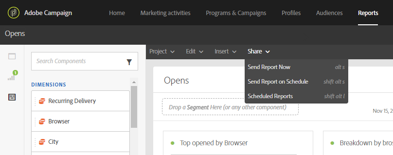

# 報告介面{#reporting-interface}

例如，頂端工具列可讓您修改、儲存或列印報表。

使用「項 **目** 」頁籤可以：

* **開啟……**:開啟先前建立的報表或範本。
* **另存新檔……**:複製範本以便能夠修改範本。
* **重新整理專案**:根據新資料和篩選條件的變更，更新您的報表。
* **下載CSV**:將報表匯出為CSV檔案。

「編 **輯** 」標籤可讓您：

* **還原**:取消控制面板上的最後一個動作。
* **全部清除**:刪除控制面板上的每個面板。

「插 **入** 」表格可讓您在控制面板中新增圖形和表格，以自訂報表：

* **新的空白麵板**:新增空白麵板至控制面板。
* **全新自由格式**:新增自由表格至控制面板。
* **新行**:新增折線圖至控制面板。
* **新列**:新增長條圖至控制面板。

**相關主題：**

* [新增面板](../../reporting/using/adding-panels.md)
* [新增視覺效果](../../reporting/using/adding-visualizations.md)
* [新增元件](../../reporting/using/adding-components.md)
* [透過電子郵件自動與利益相關者分享報告](https://helpx.adobe.com/campaign/kb/simplify-campaign-management.html#Reportandshareinsightswithallstakeholders)

## 標籤 {#tabs}

左側標籤可讓您建立報表並視需要篩選資料。

這些標籤可讓您存取下列項目：

* **[!UICONTROL Panels]**:新增空白麵板或自由格式至報表，以開始篩選資料。 有關此功能的詳細資訊，請參閱「新增面板」區段
* **[!UICONTROL Visualizations]**:拖放一系列視覺化項目，讓您的報表擁有圖形維度。 如需詳細資訊，請參閱「新增視覺化」區段。
* **[!UICONTROL Components]**:使用不同的維度、量度、區段和時段自訂報表。

## 工具列 {#toolbar}

工具列可在您的工作區上方找到。 它由不同的標籤組成，可讓您修改、儲存、共用或列印報表。

**相關主題：**

* [新增面板](../../reporting/using/adding-panels.md)
* [新增視覺效果](../../reporting/using/adding-visualizations.md)
* [新增元件](../../reporting/using/adding-components.md)

### 「項目」頁籤 {#project-tab}

使用「項 **目** 」頁籤可以：

* **開啟……**:開啟先前建立的報表或範本。
* **另存新檔……**:複製範本以便能夠修改範本。
* **重新整理專案**:根據新資料和篩選條件的變更，更新您的報表。
* **下載CSV**:將報表匯出為CSV檔案。
* **[!UICONTROL Print]**:列印您的報表。

### 編輯頁籤 {#edit-tab}

「編 **輯** 」標籤可讓您：

* **還原**:取消控制面板上的最後一個動作。
* **全部清除**:刪除控制面板上的每個面板。

### 「插入」頁籤 {#insert-tab}

「插 **入** 」標籤可讓您在控制面板中新增圖形和表格，以自訂報表：

* **新的空白麵板**:新增空白麵板至控制面板。
* **全新自由格式**:新增自由表格至控制面板。
* **新行**:新增折線圖至控制面板。
* **新列**:新增長條圖至控制面板。

### 「共用」頁籤 {#share-tab}

此標 **[!UICONTROL Share]** 簽可讓您透過單次或經常寄送的電子郵件，向Adobe Campaign使用者傳送報表。 然後，目標使用者將會收到附上您報表的電子郵件。

* **[!UICONTROL Send report now]**:透過單次傳送的電子郵件，將您的報表傳送至所選收件者的清單。

   1. 在視 **[!UICONTROL Send report]** 窗中，視需要新增說明。

      

   1. 按一下欄位並在下拉式清單中選取收件者，或輸入其電子郵件地址，以選擇您電子郵件的收件者。
   1. 檢查 **[!UICONTROL Show scheduling options]** 您是否想要傳送週期性電子郵件。 您也可以在標籤中選取， **[!UICONTROL Send Report on schedule]** 以完成此 **[!UICONTROL Share]** 作業。
   1. 按一下 **[!UICONTROL Send now]**。接著，您的收件者將會收到電子郵件，並附上您的報表。

* **[!UICONTROL Send report on schedule]**:排程您的報表，並定期傳送電子郵件給收件者。

   1. 在視 **[!UICONTROL Send report]** 窗中，視需要新增說明。
   1. 按一下欄位並在下拉式清單中選取收件者，或輸入其電子郵件地址，以選擇您電子郵件的收件者。

      

   1. 在和欄位中選擇您的開始和結束日期，以設定您的電子郵件 **[!UICONTROL Starting on]** 有效 **[!UICONTROL Ending on]** 性。
   1. 選擇您的電子郵件的傳送頻率。

      

   1. 按一 **[!UICONTROL Send on schedule]**&#x200B;下，您的收件者會根據所選頻率，收到您的循環電子郵件。

* **[!UICONTROL Scheduled reports]**:尋找並設定所有排程報表。

   1. 在視窗 **[!UICONTROL Scheduled reports]** 中，尋找所有經常傳送的報表。

      

   1. 如果您需要刪除其中一個排程報表，請選取您要刪除的排程報表，然後按一下 **[!UICONTROL Delete the section]**。
   1. 若要設定或檢查排程報表，請直接按一下您需要變更的報表。
   1. 視 **[!UICONTROL Edit scheduled report]** 窗出現時，您現在可以視需要變更電子郵件的收件者或頻率。

然後，目標使用者會收到電子郵件，而您的報表會直接附加在其收件箱中。 使用者隨時都可以決定停止接收循環電子郵件，而使用每個循環電子郵件中提供的取消訂閱連結。

**相關主題：**

* [透過電子郵件自動與利益相關者分享報告](https://helpx.adobe.com/campaign/kb/simplify-campaign-management.html#Reportandshareinsightswithallstakeholders)
