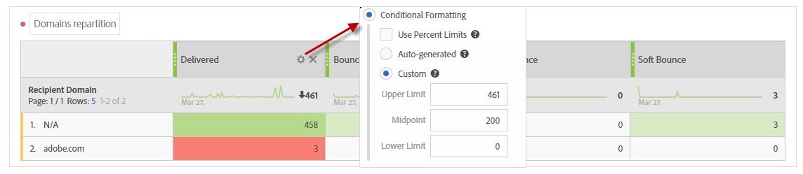

# 疑難排解{#troubleshooting}

您可在本節中找到與動態報表相關的常見問題。

## 對於「唯一」開啟和「唯一」點按，匯整列的計數與個別列的計數不符{#unique-open-clicks-no-match}

這是預期的行為。
我們可以以下例子來解釋此行為。

電子郵件會傳送至描述檔P1和P2。

P1會在第一天開啟兩次電子郵件，然後在第二天開啟三次。

但是，P2會在第一天開啟一次電子郵件，而不會在後幾天重新開啟。
以下是描述檔與已傳送電子郵件互動的視覺化呈現：

<table> 
 <thead> 
  <tr> 
   <th align="center"> <strong>Day</strong>   </th> 
   <th align="center"> <strong>開啟的郵件</strong>   </th> 
   <th align="center"> <strong>唯一開啟</strong>   </th> 
  </tr> 
 </thead> 
 <tbody> 
  <tr> 
   <td align="center"> 第1天  </td> 
   <td align="center"> 2 + 1 = 3&lt;a0/  </td> 
   <td align="center"> 1 + 1 = 2&lt;a0/  </td> 
  </tr> 
  <tr> 
   <td align="center"> 第2天  </td> 
   <td align="center"> 3 + 0 = 3&lt;a0/  </td> 
   <td align="center"> 1 + 0 = 1  </td> 
  </tr>
 </tbody> 
</table>

若要瞭解唯一開啟的總數，我們需要總和&#x200B;**[!UICONTROL Unique Opens]**&#x200B;的列計數，此列計數會提供值3。 但是，由於電子郵件的目標僅為2個設定檔，因此開放率應顯示150%。

為了不獲得高於100的百分比，**[!UICONTROL Unique Opens]**&#x200B;的定義將保持為開啟的唯一廣播的數量。 在此情況下，即使P1在第1天和第2天開啟電子郵件，其唯一開啟次數仍為1。

這將產生下表：

<table> 
 <thead> 
  <tr> 
   <th align="center"> <strong>日</strong>   </th> 
   <th align="center"> <strong>開啟的郵件</strong>   </th> 
   <th align="center"> <strong>唯一開啟</strong>   </th> 
  </tr> 
 </thead> 
 <tbody> 
  <tr> 
   <td align="center"> 第1天  </td> 
   <td align="center"> 6  </td> 
   <td align="center"> 2  </td>
  </tr> 
  <tr> 
   <td align="center"> 第2天  </td> 
   <td align="center"> 3  </td> 
   <td align="center"> 2  </td> 
  </tr> 
 </tbody> 
</table>

>[!NOTE]
>
>唯一計數是以HLL為基礎的草圖為基礎，這可能會在大計數時造成輕微的錯誤。

## 開啟計數與資料庫計數{#open-counts-no-match-database}不匹配

這可能是因為，即使我們無法追蹤&#x200B;**[!UICONTROL Open]**&#x200B;動作，動態報表中也會使用啟發式來追蹤開啟。

例如，如果用戶在其客戶端上禁用了映像，並按一下電子郵件中的連結，則資料庫可能不會跟蹤&#x200B;**[!UICONTROL Open]**，但&#x200B;**[!UICONTROL Click]**&#x200B;將跟蹤。

因此，**[!UICONTROL Open]**&#x200B;追蹤記錄計數在資料庫中可能不具有相同計數。

此類事件會新增為&#x200B;**「電子郵件點按表示電子郵件開啟」**。

>[!NOTE]
>
>由於唯一計數是以HLL為基礎的草圖為基礎，因此可體驗計數之間細微的不一致。

## 如何計算循環／交易傳送的計數？{#counts-recurring-deliveries}

使用循環傳送和交易傳送時，計數會歸因於父傳送和子傳送。
我們可以舉一個名為**R1**的循環傳送的示例，該傳送設定為每天在第1天(RC1)、第2天(RC2)和第3天(RC3)運行。
假設只有一個人多次開啟所有子交貨。 在這種情況下，個別循環的子傳送會將每個的**[!UICONTROL Open]**計數顯示為1。
但是，由於同一人點按了所有傳送，因此父循環傳送的**[!UICONTROL Unique open]**&#x200B;也會顯示為1。

報表應如下所示：

<table> 
 <thead> 
  <tr> 
   <th align="center"> <strong>傳送</strong>   </th> 
   <th align="center"> <strong>已傳送</strong>   </th> 
   <th align="center"> <strong>交付</strong>   </th>
   <th align="center"> <strong>開啟的郵件</strong>   </th> 
   <th align="center"> <strong>唯一開啟</strong>   </th>
  </tr> 
 </thead> 
 <tbody> 
  <tr> 
   <td align="center"> <strong>R1  </td> 
   <td align="center"> <strong>100  </td> 
   <td align="center"> <strong>90  </td> 
   <td align="center"> <strong>10  </td> 
   <td align="center"> <strong>1  </td> 
  </tr> 
  <tr> 
   <td align="center"> RC1  </td> 
   <td align="center"> 20  </td> 
   <td align="center"> 20  </td> 
   <td align="center"> 6  </td> 
   <td align="center"> 1  </td> 
  </tr>
    <tr> 
   <td align="center"> RC2  </td> 
   <td align="center"> 40  </td> 
   <td align="center"> 30  </td> 
   <td align="center"> 2  </td> 
   <td align="center"> 1  </td> 
  </tr> 
    <tr> 
   <td align="center"> RC3  </td> 
   <td align="center"> 40  </td> 
   <td align="center"> 40  </td> 
   <td align="center"> 2  </td> 
   <td align="center"> 1  </td> 
  </tr> 
 </tbody> 
</table>

## 顏色在我的報告表裡有什麼意義？{#reports-color-signification}

報表上顯示的顏色是隨機的，無法個人化。 它們代表進度列，並會顯示，以協助您更好地反白標示報表中達到的最大值。

在以下範例中，儲存格的顏色相同，因為其值是100%。

如果您將&#x200B;**[!UICONTROL Conditional formatting]**&#x200B;變更為自訂，當值達到上限時，儲存格會變得更綠色。 然而，如果達到下限，就會變紅。

例如，我們在這裡將&#x200B;**[!UICONTROL Upper limit]**&#x200B;設為500，將&#x200B;**[!UICONTROL Lower limit]**&#x200B;設為0。

## 為什麼值N/A會出現在我的報表中？

值&#x200B;**N/A**&#x200B;有時會出現在動態報表中。 這可顯示的原因有二：

* 傳送已刪除，並顯示為&#x200B;**N/A**，以免造成結果不一致。
* 將&#x200B;**[!UICONTROL Transactional Delivery]**&#x200B;維度拖放至報表時，值&#x200B;**N/A**可能會因此出現。 這是因為動態報表會擷取每個傳送，即使它們不是交易性的。
當將**[!UICONTROL Delivery]**&#x200B;維度拖放至報表時，也會發生此情況，但此時&#x200B;**N/A**&#x200B;值將代表交易傳送。
