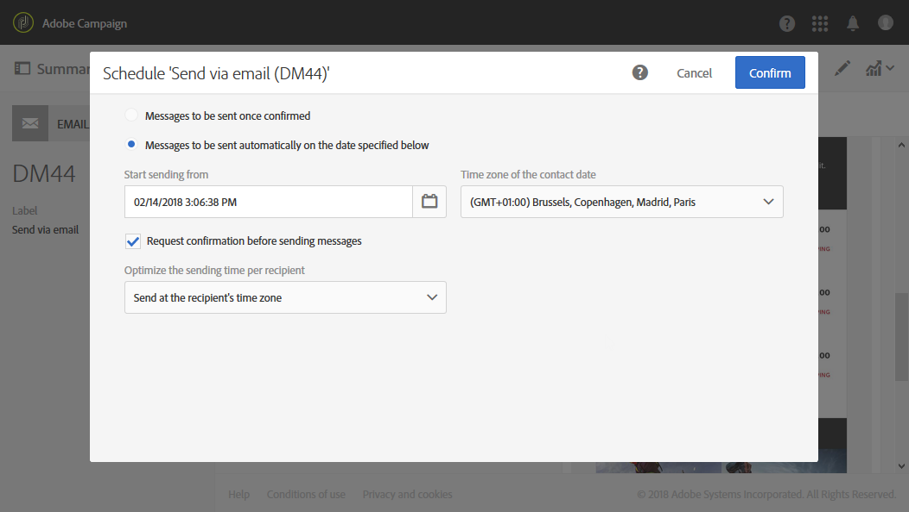

# 關於排程訊息{#about-scheduling-messages}

>[!CAUTION]
>
>每當變更傳送的排程時，您必須先按一下「準備」按鈕，再按一下「確認」，以重 **新準備** 傳送 **作業**。

在訊息控制面板中， **[!UICONTROL Schedule]** 此區塊可讓您定義訊息（電子郵件、簡訊或推播通知）的傳送時間。

這些 **[!UICONTROL Schedule]** 屬性可讓您設定電子郵件、簡訊或推播通知的傳送選項：

* **[!UICONTROL Messages to be sent once confirmed]**:訊息會在確認傳送後立即傳送。 See [Confirming the send](../../sending/using/confirming-the-send.md).

   

* **[!UICONTROL Messages to be sent automatically on the date specified below]**:消息將在稍後的日期和時間發送。 在「開始傳 **送來源** 」欄位中 **指定聯絡日期** 。

   您可以準備並確認傳送，但訊息只會從選取的日期和時間開始傳送。 準備和確認傳送會顯示在準備 [傳送和確認](../../sending/using/preparing-the-send.md)[傳送區段中](../../sending/using/confirming-the-send.md) 。

   下 **[!UICONTROL Time zone of the contact date]** 拉式清單可讓您修改要考慮傳送時間的時區。 例如，如果您在欄位中輸入9:00 AM，而您在下拉式清單中選取「布魯塞爾」、「哥本哈根」、「馬德里」、「巴黎」(GMT+1)，則所有收件者都會在巴黎時間上午9:00收到訊息。 **[!UICONTROL Start sending from]****[!UICONTROL Time zone of the contact date]** 因此，位於莫斯科的收件者(GMT+3)將於莫斯科時間上午11:00收到此訊息。

   如果您想要手動確認傳送，請勾選選 **[!UICONTROL Request confirmation before sending messages]** 選項。 預設會啟用此選項。

   

>[!CAUTION]
>
>複製傳送時，會刪除所有排程設定。 除非您排程新的連絡日期，否則複製的傳送將在確認傳送後立即傳送。

**相關主題**:

* [最佳化傳送時間](../../sending/using/optimizing-the-sending-time.md)
* [在收件者的時區傳送訊息](../../sending/using/sending-messages-at-the-recipient-s-time-zone.md)
* [計算傳送日期](../../sending/using/computing-the-sending-date.md)

