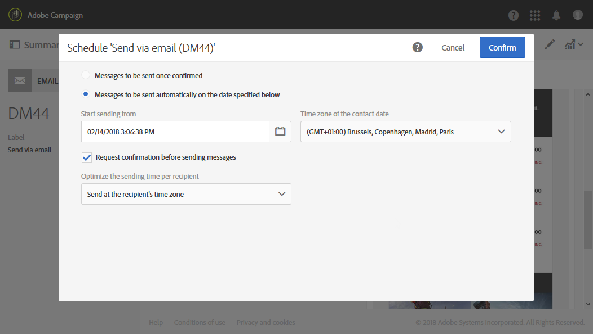

# 關於排程訊息{#about-scheduling-messages}

>[!IMPORTANT]
>
>每當對傳送排程進行變更時時，您必須先按一下 **Prepare** 按鈕，再按 **Confirm**，以重新準備傳送作業。

在訊息控制面板中，**[!UICONTROL Schedule]** 區塊可讓您定義訊息（電子郵件、簡訊或推播通知）的傳送時間。

**[!UICONTROL Schedule]** 屬性可讓您設定電子郵件、簡訊或推播通知的傳送選項：

* **[!UICONTROL Messages to be sent once confirmed]**：訊息會在確認傳送後立即傳送。 請參閱[確認傳送](../../sending/using/confirming-the-send.md)。

  

* **[!UICONTROL Messages to be sent automatically on the date specified below]**：訊息將在稍後日期及時間傳送。 在 **tart sending from** 欄位中指定&#x200B;**聯絡日期**。

  您可以準備並確認傳送，但訊息只會從選取的日期和時間開始傳送。 準備和確認傳送會顯示在[準備傳送](../../sending/using/preparing-the-send.md)及[確認傳送](../../sending/using/confirming-the-send.md)區段。

  **[!UICONTROL Time zone of the contact date]** 下拉式清單可讓您修改要考慮傳送時間的時區。 例如，如果您在&#x200B;**[!UICONTROL Start sending from]**&#x200B;欄位中輸入9:00 AM，並在&#x200B;**[!UICONTROL Time zone of the contact date]**&#x200B;下拉式清單中選取Brussels， Copenhagen， Madrid， Paris (GMT+1)，則所有收件者都會在巴黎時間上午9:00收到訊息。 因此，位於莫斯科的收件者(GMT+3)將於莫斯科時間上午11:00收到訊息。

  如果您想要手動確認傳送，請核取 **[!UICONTROL Request confirmation before sending messages]** 選項。 依預設，會啟用此選項。

  

>[!IMPORTANT]
>
>複製傳送時，會刪除所有排程設定。 除非您已排程新的聯絡日期，否則將在確認傳送後立即傳送複製的傳送。

**相關主題**：

* [最佳化傳送時間](../../sending/using/optimizing-the-sending-time.md)
* [在收件者的時區傳送訊息](../../sending/using/sending-messages-at-the-recipient-s-time-zone.md)
* [計算傳送日期](../../sending/using/computing-the-sending-date.md)
