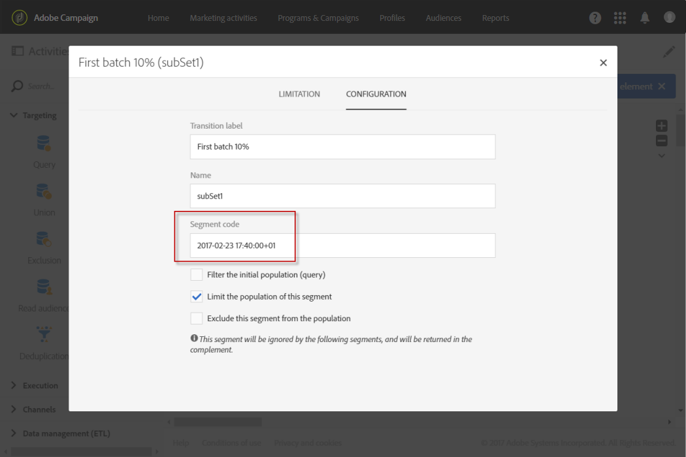
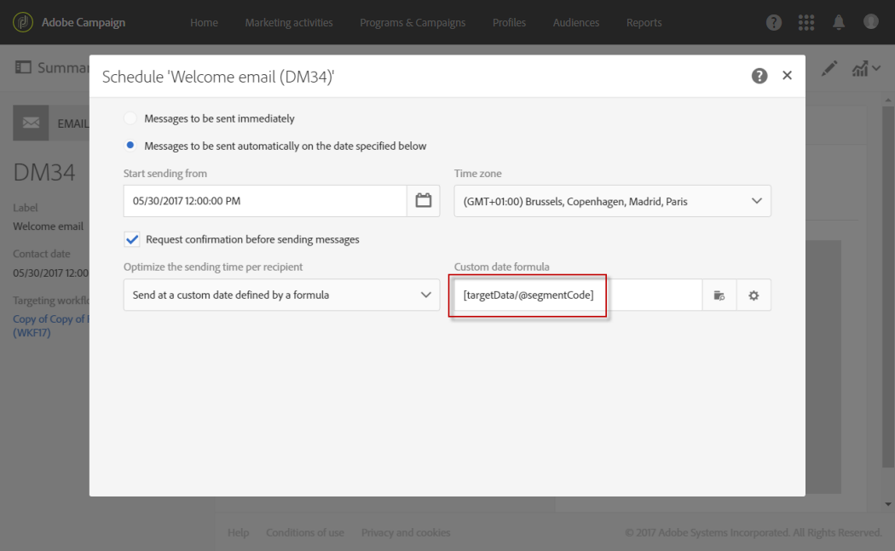
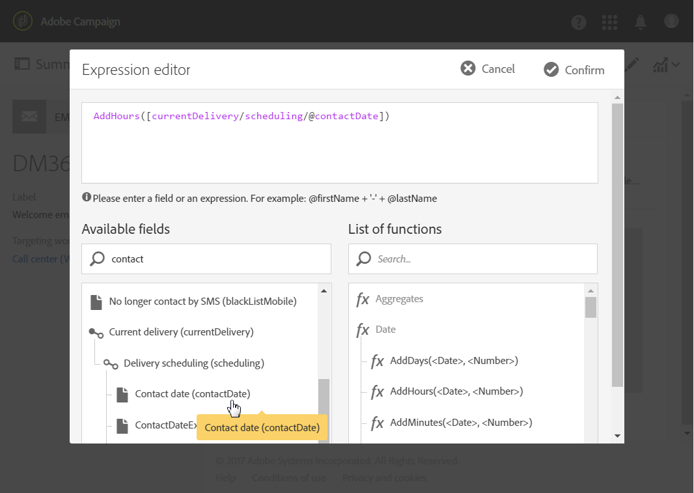

# 計算傳送日期{#computing-the-sending-date}

您可以定義公式，在特定日期和時間將訊息傳送給每個收件者。

## 自訂日期公式 {#customizing-date-formula}

例如，您可以在啟動程式期間使用傳送時間最佳化。

當使用新平台傳送電子郵件時，網際網路服務供應商(ISP)會懷疑無法辨識的IP位址。 如果突然傳送大量電子郵件，ISP通常會將它們標示為垃圾訊息。

為避免標示為垃圾訊息，您可以透過在不同時間散布大量電子郵件，逐漸增加傳送的郵件量。 這應確保啟動階段的順利開發，並讓您降低無效地址的總體速率。

例如，您可以隨機分段目標對象，以五批傳送您的傳送。 您將於6月1日10:00 AM傳送第一批代表目標受眾10%的受眾，24小時後傳送第二批代表目標受眾15%的受眾，依此類推。

您可以使用工作流程來排程此作業。


1. 存取行銷活動清單並建立新的工作流程。 See [Creating a workflow](../../automating/using/building-a-workflow.md#creating-a-workflow).
1. Drag and drop a **Query** activity into your workflow and open it. 請參閱 [查詢](../../automating/using/query.md) 節。
1. 選取對象（例如所有Gold客戶），然後按一下以 **[!UICONTROL Confirm]** 儲存查詢。
1. Drag and drop a **Segmentation** activity into your workflow and open it. 請參閱 [區段](../../automating/using/segmentation.md) 。
1. 定義五個區段。 針對每個區段：

   * 填寫欄 **[!UICONTROL Segment code]** 位：手動輸入要傳送訊息的日期和時間。

      例如，您想在6月1日10:00 AM GMT+1傳送第一批批。 使用下列格式： **YYYY-MM-DD hh:mm:ss+tz**。

      

      要在次日發送下一批，請為第 **二個段輸入2017-06-02 10:00:00+01** 。

      對於其餘段，按如下方式定義下一批：

      * **2017-06-03 10:00:00+01**
      * **2017-06-04 10:00:00+01**
      * **2017-06-05 10:00:00+01**
   * 請確定您選取了 **[!UICONTROL Limit the population of this segment]** 選項。

      在標籤 **[!UICONTROL Limitation]** 中，選 **[!UICONTROL Random sampling]** 取並輸入每個區段的所需百分比：第一批10，第二批15，依此類推。

      


1. 定義所有區段後，選取並 **[!UICONTROL Generate all segments in the same transition]** 按一下 **[!UICONTROL Confirm]**。

   

1. Drag and drop an **Email delivery** activity into your workflow and open it. 請參閱「電 [子郵件傳送](../../automating/using/email-delivery.md) 」區段。
1. 按一下電 **[!UICONTROL Schedule]** 子郵件控制面板中的區段，然後選取 **[!UICONTROL Messages to be sent automatically on the date specified below]**。
1. 在欄位 **[!UICONTROL Start sending from]** 中，定義連絡人日期。
1. 從傳送時間最佳化下拉式功能表中，選擇 **[!UICONTROL Send at a custom date defined by a formula]**。
1. 按一下 **[!UICONTROL Edit an expression]** 欄位的按 **[!UICONTROL Custom date formula]** 鈕。

   

1. 使用函式和欄位建立 **[!UICONTROL ToDateTime]** 下列運算 **[!UICONTROL Segment code]** 式。 您也可以直接在運算式中輸入，但請務必使用正確的語法和拼字。

   ```
   ToDateTime([targetData/@segmentCode])
   ```

   此函 **[!UICONTROL ToDateTime]** 數會將區段代碼從文字字串轉換為日期和時間值。

   確認運算式以返回上一個畫面。

   

   在窗口 **[!UICONTROL Schedule]** 中，自定義日期公式顯示如下：

   ```
   ToDateTime([targetData/@segmentCode])
   ```

   

1. 確認排程、儲存傳送並執行工作流程。

在五天內，遞送內容會逐步傳送給所有目標收件者。

>[!NOTE]
>
>確認傳送時，請確定所有日期都在未來。 否則，消息將在確認發送後立即發送。

## 使用運算式 {#using-an-expression}

傳送時間最佳化也適用於呼叫中心相關的促銷活動。 您可以確保不會同時收到所有消息。 這可讓您的組織根據其能力處理呼叫數。

例如，您想要傳送電子郵件，邀請客戶聯絡客服中心以取得促銷優惠。 為避免客服中心擠佔客服中心，您決定隨機將目標對象分為四批傳送電子郵件。

您可以使用工作流程來排程此作業。


1. 存取行銷活動清單並建立新的工作流程。 See [Creating a workflow](../../automating/using/building-a-workflow.md#creating-a-workflow).
1. Drag and drop a **Query** activity into your workflow and open it. 請參閱 [查詢](../../automating/using/query.md) 節。
1. 選取對象，例如超過35個描述檔，然後按一下 **[!UICONTROL Confirm]** 以儲存查詢。
1. Drag and drop a **Segmentation** activity into your workflow and open it. 請參閱 [區段](../../automating/using/segmentation.md) 。
1. 定義四個區段。 針對每個區段：

   * 定義區段代碼如下：

      * 8:00 AM - 10:00 AM: **0**. 訊息將於上午8:00（聯絡日期）傳送至目標人口的第一季。
      * 10:00 AM - 12:00 PM: **2**. 訊息將於上午10:00（聯絡日期+ 2小時）傳送至目標人口的第二季。
      * 2:00 PM - 4:00 PM: **6**. 客服中心在下午12:00至2:00之間關閉，訊息將於下午2:00（聯絡日期+ 6小時）傳送至目標人口的第三季。
      * 4:00 PM - 6:00 PM: **8**. 訊息將於下午4:00（聯絡日期+ 8小時）傳送至目標人口的最後一季。

      >[!NOTE]
      >
      >聯絡日期將在工作流程的稍後「電子郵件傳送」活動中定義。

   * 請確定您選取了 **[!UICONTROL Limit the population of this segment]** 選項。
   * 在標籤 **[!UICONTROL Limitation]** 中，選 **[!UICONTROL Random sampling]** 取並輸入每個區段的所需百分比： **25**.


1. 定義所有區段後，選取並 **[!UICONTROL Generate all segments in the same transition]** 按一下 **[!UICONTROL Confirm]**。

   

1. Drag and drop an **Email delivery** activity into your workflow and open it. 請參閱「電 [子郵件傳送](../../automating/using/email-delivery.md) 」區段。
1. 按一下電 **[!UICONTROL Schedule]** 子郵件儀表板中的區段。
1. 選取 **[!UICONTROL Messages to be sent automatically on the date specified below]**。
1. 在欄位 **[!UICONTROL Start sending from]** 中，定義連絡人日期。

   在此範例中，選取5月25日8:00 AM。

1. 從傳送時間最佳化下拉式功能表中，選擇並 **[!UICONTROL Send at a custom date defined by a formula]** 按一下按 **[!UICONTROL Edit an expression]** 鈕。

   

1. 在中， **[!UICONTROL Expression editor]**&#x200B;設定日期和區段代碼，以計算每個客戶的資料。

   在函式清單中，選擇 **[!UICONTROL AddHours]**。

   

   在可用欄位中，選取 **[!UICONTROL Current delivery]** > **[!UICONTROL Delivery scheduling]** > **[!UICONTROL Contact date]**。

   

   這可讓您擷取欄位中指定的日期和時間 **[!UICONTROL Start sending from]** 。

   在函式清單中，選擇 **[!UICONTROL ToInteger]**。 在可用欄位中，選取 **[!UICONTROL Additional data]** > **[!UICONTROL Segment code]**。

   

   這可讓您擷取您在區段代碼中指定的數字。

   您應取得下列公式：

   ```
   AddHours([currentDelivery/scheduling/@contactDate], ToInteger([targetData/@segmentCode]))
   ```

1. 確認儲存運算式。 確認排程、儲存傳送並執行工作流程。

* 第一個區段會在聯絡日（5月25日上午8:00）收到訊息。
* 第二組將在兩小時後（5月25日上午10:00）收到消息。
* 第三組將在六小時後（5月25日下午2:00）收到訊息。
* 第四組將在8小時後（5月25日下午4:00）收到訊息。

