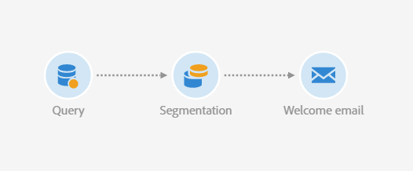
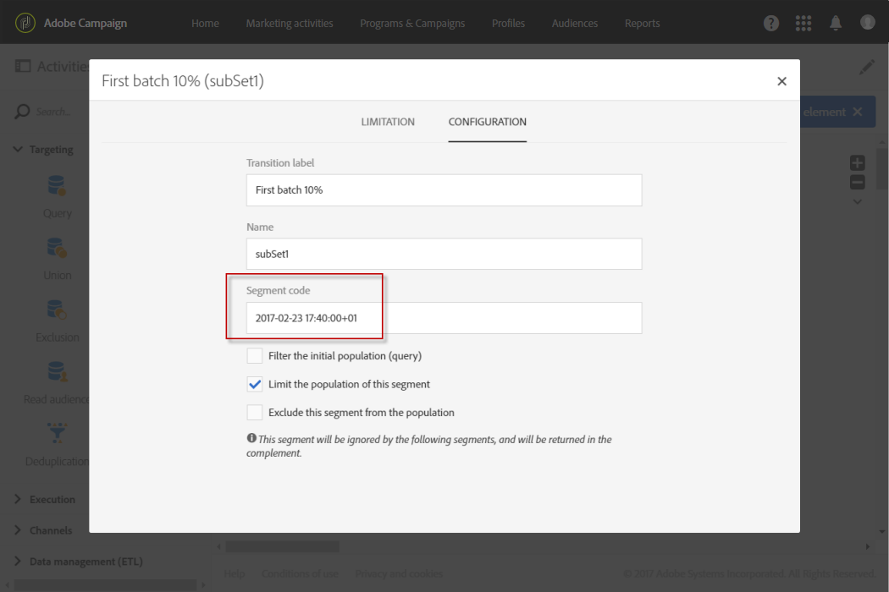
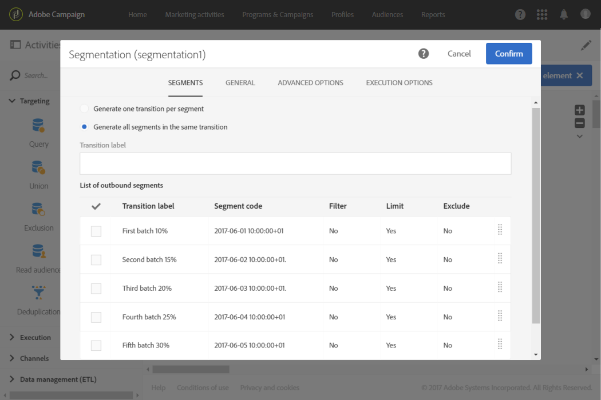
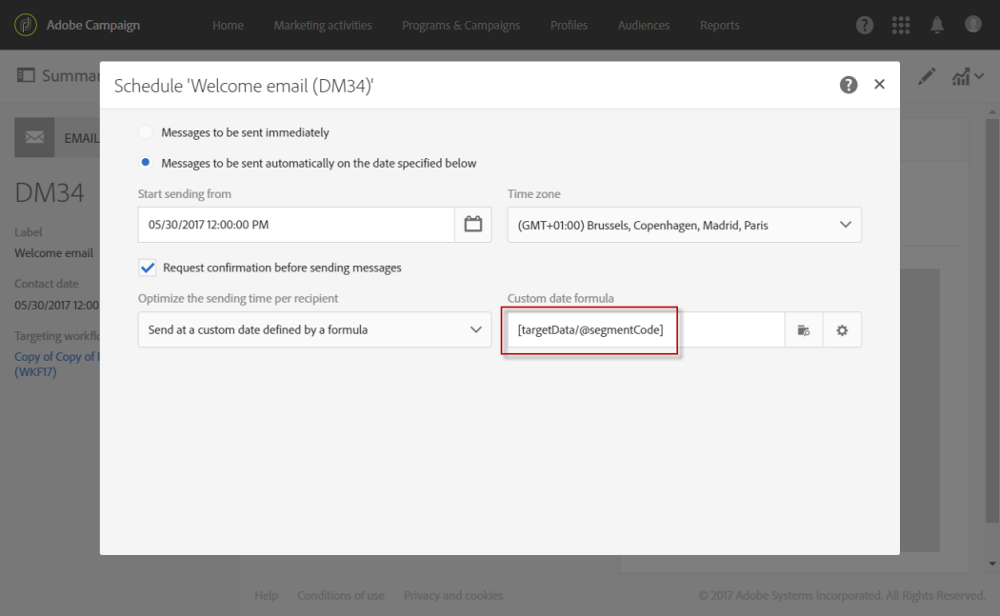
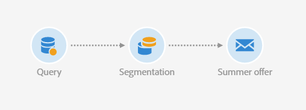
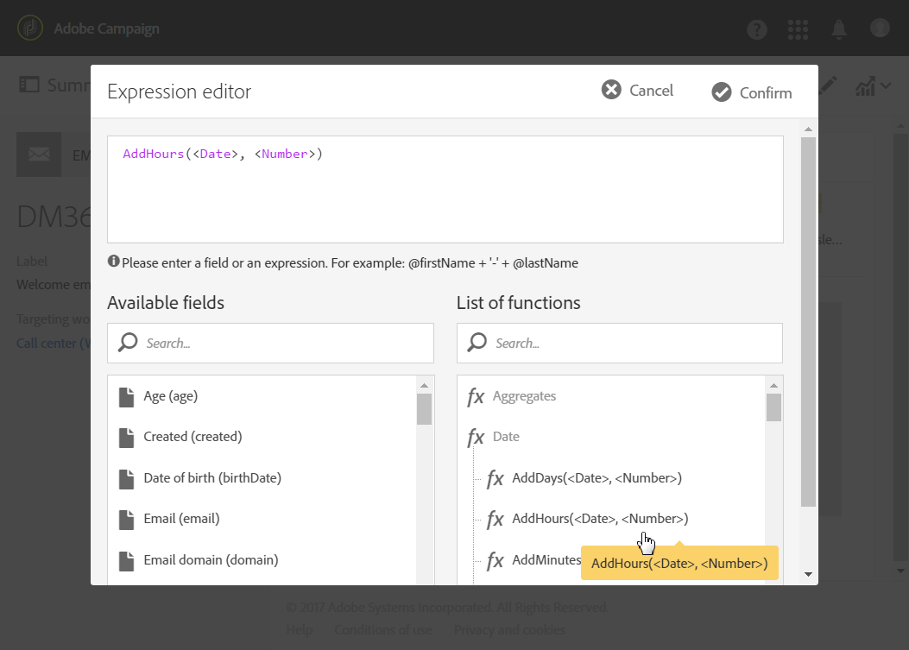
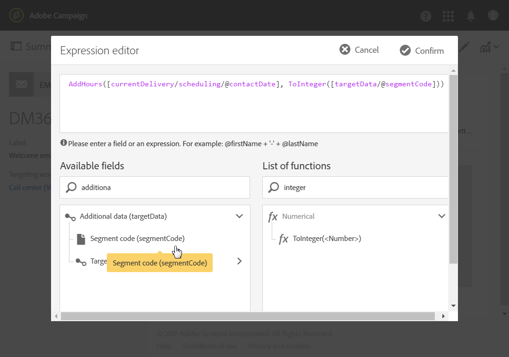

# 計算傳送日期{#computing-the-sending-date}

您可以定義公式，以在特定日期和時間將訊息傳送給每位收件者。

## 自訂日期公式 {#customizing-date-formula}

例如，您可以在啟動過程中使用傳送時間最佳化。

使用新平台傳送電子郵件時，網際網路服務提供者(ISP)會懷疑無法辨識的IP位址。 如果突然傳送大量電子郵件，ISP通常會將其標籤為垃圾郵件。

為了避免被標籤為垃圾郵件，您可以透過在不同時間分送大量電子郵件來逐步增加傳送量。 這應該可以確保啟動階段的順利發展，並且讓您降低無效的位址的整體比率。

例如，您可以隨機將目標對象分段，以五個批次傳送您的傳遞。 您將會在6月1日上午10:00傳送代表目標對象10%的第一批次、在24小時後傳送包含15%對象的第二批次，以此類推。

您可以使用工作流程進行排程。



1. 存取行銷活動清單並建立新的工作流程。 請參閱[建立工作流程](../../automating/using/building-a-workflow.md#creating-a-workflow)。
1. 將&#x200B;**查詢**&#x200B;活動拖放到工作流程中並加以開啟。 請參閱[查詢](../../automating/using/query.md)區段。
1. 選取對象，例如您的所有Gold客戶，然後按一下&#x200B;**[!UICONTROL Confirm]**&#x200B;以儲存查詢。
1. 將&#x200B;**Segmentation**&#x200B;活動拖放到工作流程中並加以開啟。 請參閱[分段](../../automating/using/segmentation.md)區段。
1. 定義五個區段。 對於每個區段：

   * 填寫&#x200B;**[!UICONTROL Segment code]**&#x200B;欄位：手動輸入傳送訊息所需的日期和時間。

     例如，您想要在6月1日上午10:00 GMT+1傳送第一批次。 使用以下格式： **`YYYY-MM-DD hh:mm:ss+tz`**。

     

     若要在隔天傳送下一個批次，請為第二個區段輸入&#x200B;**2017-06-02 10:00:00+01**。

     針對剩餘的區段，定義後續的批次，如下所示：

      * **2017-06-03 10:00:00+01**
      * **2017-06-04 10:00:00+01**
      * **2017-06-05 10:00:00+01**

   * 請務必選取&#x200B;**[!UICONTROL Limit the population of this segment]**&#x200B;選項。

     在&#x200B;**[!UICONTROL Limitation]**&#x200B;索引標籤中，選取&#x200B;**[!UICONTROL Random sampling]**&#x200B;並為每個區段輸入想要的百分比：第一個批次10，第二個批次15，依此類推。

     

1. 定義所有區段後，請選取&#x200B;**[!UICONTROL Generate all segments in the same transition]**&#x200B;並按一下&#x200B;**[!UICONTROL Confirm]**。

   

1. 將&#x200B;**電子郵件傳遞**&#x200B;活動拖放到工作流程中並加以開啟。 請參閱[電子郵件傳遞](../../automating/using/email-delivery.md)區段。
1. 按一下電子郵件控制面板中的&#x200B;**[!UICONTROL Schedule]**&#x200B;區段，然後選取&#x200B;**[!UICONTROL Messages to be sent automatically on the date specified below]**。
1. 在&#x200B;**[!UICONTROL Start sending from]**&#x200B;欄位中，定義聯絡日期。
1. 從傳送時間最佳化下拉式功能表，選擇&#x200B;**[!UICONTROL Send at a custom date defined by a formula]**。
1. 按一下&#x200B;**[!UICONTROL Custom date formula]**&#x200B;欄位的&#x200B;**[!UICONTROL Edit an expression]**&#x200B;按鈕。

   

1. 使用&#x200B;**[!UICONTROL ToDateTime]**&#x200B;函式和&#x200B;**[!UICONTROL Segment code]**&#x200B;欄位建立下列運算式。 您也可以直接在運算式中輸入，但請確定使用正確的語法和拼字。

   ```
   ToDateTime([targetData/@segmentCode])
   ```

   **[!UICONTROL ToDateTime]**&#x200B;函式將區段代碼從文字字串轉換為日期和時間值。

   確認運算式以返回上一個畫面。

   

   在&#x200B;**[!UICONTROL Schedule]**&#x200B;視窗中，自訂日期公式顯示如下：

   ```
   ToDateTime([targetData/@segmentCode])
   ```

   

1. 確認排程、儲存傳遞並執行工作流程。

此傳遞將會在五天內逐步傳送給所有目標收件者。

>[!NOTE]
>
>確認傳送時，請確定所有日期都是未來的日期。 否則，訊息會在確認傳送後立即傳送。

## 使用運算式 {#using-an-expression}

傳送時間最佳化對於涉及客服中心的行銷活動也很有用。 您可以確保所有訊息不會同時收到。 這可讓您的組織根據其容量處理通話次數。

例如，您想要傳送電子郵件邀請客戶連絡客服中心，以取得促銷優惠。 為避免客服中心人滿為患，您決定隨機將目標受眾分段，以四批傳送您的電子郵件。

您可以使用工作流程進行排程。



1. 存取行銷活動清單並建立新的工作流程。 請參閱[建立工作流程](../../automating/using/building-a-workflow.md#creating-a-workflow)。
1. 將&#x200B;**查詢**&#x200B;活動拖放到工作流程中並加以開啟。 請參閱[查詢](../../automating/using/query.md)區段。
1. 選取對象，例如超過35個設定檔，然後按一下&#x200B;**[!UICONTROL Confirm]**&#x200B;以儲存查詢。
1. 將&#x200B;**Segmentation**&#x200B;活動拖放到工作流程中並加以開啟。 請參閱[分段](../../automating/using/segmentation.md)區段。
1. 定義四個區段。 對於每個區段：

   * 依下列方式定義區段代碼：

      * 上午8:00 — 上午10:00： **0**。 訊息將於上午8:00 （聯絡日期）傳送到目標母體的第一季。
      * 上午10:00 — 下午12:00： **2**。 訊息將於上午10:00 （聯絡日期+ 2小時）傳送到目標母體的第二季。
      * 下午2:00 — 下午4:00： **6**。 呼叫中心在下午12:00點至下午2:00點之間關閉，訊息將會在下午2:00點傳送給第三季的目標母體（聯絡日期+ 6小時）。
      * 下午4:00 - 6:00下午： **8**。 訊息將於下午4:00 （聯絡日期+ 8小時）傳送到目標人口的最後一個季度。

     >[!NOTE]
     >
     >聯絡日期將於稍後在工作流程中的電子郵件傳送活動中定義。

   * 請務必選取&#x200B;**[!UICONTROL Limit the population of this segment]**&#x200B;選項。
   * 在&#x200B;**[!UICONTROL Limitation]**&#x200B;索引標籤中，選取&#x200B;**[!UICONTROL Random sampling]**&#x200B;並為每個區段輸入想要的百分比： **25**。

1. 定義所有區段後，請選取&#x200B;**[!UICONTROL Generate all segments in the same transition]**&#x200B;並按一下&#x200B;**[!UICONTROL Confirm]**。

   

1. 將&#x200B;**電子郵件傳遞**&#x200B;活動拖放到工作流程中並加以開啟。 請參閱[電子郵件傳遞](../../automating/using/email-delivery.md)區段。
1. 按一下電子郵件控制面板中的&#x200B;**[!UICONTROL Schedule]**&#x200B;區段。
1. 選取 **[!UICONTROL Messages to be sent automatically on the date specified below]**。
1. 在&#x200B;**[!UICONTROL Start sending from]**&#x200B;欄位中，定義聯絡日期。

   在此範例中，選取五月二十五日上午8:00。

1. 從傳送時間最佳化下拉式功能表，選擇&#x200B;**[!UICONTROL Send at a custom date defined by a formula]**&#x200B;並按一下&#x200B;**[!UICONTROL Edit an expression]**&#x200B;按鈕。

   

1. 在&#x200B;**[!UICONTROL Expression editor]**&#x200B;中，設定日期和區段代碼，以計算每個客戶的資料。

   在函式清單中，選取&#x200B;**[!UICONTROL AddHours]**。

   

   在可用的欄位中，選取&#x200B;**[!UICONTROL Current delivery]** > **[!UICONTROL Delivery scheduling]** > **[!UICONTROL Contact date]**。

   

   這可讓您擷取&#x200B;**[!UICONTROL Start sending from]**&#x200B;欄位中指定的日期和時間。

   在函式清單中，選取&#x200B;**[!UICONTROL ToInteger]**。 在可用的欄位中，選取&#x200B;**[!UICONTROL Additional data]** > **[!UICONTROL Segment code]**。

   

   這可讓您擷取您在區段代碼中指定的數字。

   您應會取得下列公式：

   ```
   AddHours([currentDelivery/scheduling/@contactDate], ToInteger([targetData/@segmentCode]))
   ```

1. 確認以儲存運算式。 確認排程、儲存傳遞並執行工作流程。

* 第一個區段將在聯絡日期（5月25日上午8:00）收到訊息。
* 第二個區段將在兩小時後（5月25日上午10:00）收到訊息。
* 第三個區段將在六小時後（5月25日下午2:00）收到訊息。
* 第四個區段將在八小時後（5月25日下午4:00）收到訊息。
