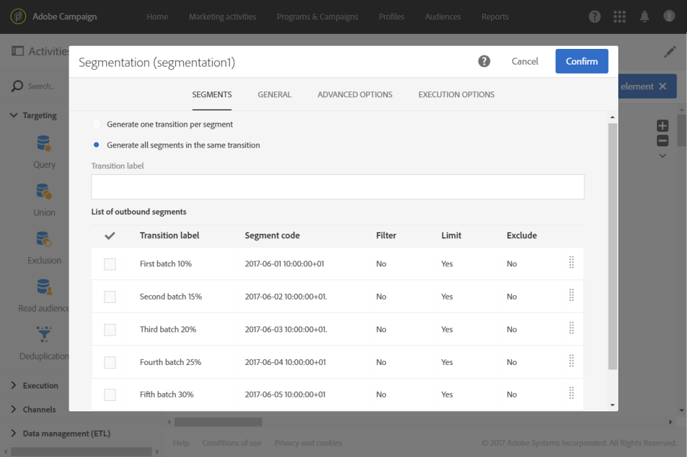

# Computing the sending date{#computing-the-sending-date}

您可以定義公式，在特定日期和時間傳送訊息給每位收件者。

## Customizing date formula {#customizing-date-formula}

例如，您可以在啓動程序期間使用傳送時間最佳化。

使用新平台傳送電子郵件時，Internet服務供應商(ISP)會懷疑無法辨識的IP位址。如果突然傳送大量電子郵件，ISP通常會將它們標示為垃圾郵件。

為避免標示為垃圾郵件，您可以漸進式增加大量電子郵件傳送大量電子郵件傳送的量。這應確保開始階段順利進行，並讓您降低無效位址的總費率。

例如，您可以隨機分段目標受眾，以五批次傳送傳送您的傳送內容。您將會在月日的10：00AM中傳送第一批代表10%目標受眾的批次，在24小時後再傳送第二批，以及觀眾的15%等等。

您可以使用工作流程來排程此項目。


1. 存取行銷活動清單，並建立新工作流程。See [Creating a workflow](../../automating/using/building-a-workflow.md#creating-a-workflow).
1. Drag and drop a **Query** activity into your workflow and open it. See the [Query](../../automating/using/query.md) section.
1. Select an audience, for example all your Gold customers and click **[!UICONTROL Confirm]** to save the query.
1. Drag and drop a **Segmentation** activity into your workflow and open it. See the [Segmentation](../../automating/using/segmentation.md) section.
1. 定義五個區段。針對每個區段：

   * Fill in the **[!UICONTROL Segment code]** field: manually enter the desired date and time for sending the message.

      例如，您想要在月日10：00AM GMT+傳送第一批批次。Use the following format: **YYYY-MM-DD hh:mm:ss+tz**.

      

      To send the next batch the day after, enter **2017-06-02 10:00:00+01** for the second segment.

      對於剩下的區段，請定義下一批次如下：

      * **2017-06-03 10:00:00+01**
      * **2017-06-04 10:00:00+01**
      * **2017-06-05 10:00:00+01**
   * Make sure you select the **[!UICONTROL Limit the population of this segment]** option.

      In the **[!UICONTROL Limitation]** tab, select **[!UICONTROL Random sampling]** and enter the desired percentage for each segment: 10 for the first batch, 15 for the second, and so on.

      


1. Once all segments are defined, select **[!UICONTROL Generate all segments in the same transition]** and click **[!UICONTROL Confirm]**.

   

1. Drag and drop an **Email delivery** activity into your workflow and open it. See the [Email delivery](../../automating/using/email-delivery.md) section.
1. Click the **[!UICONTROL Schedule]** section in the email dashboard and select **[!UICONTROL Messages to be sent automatically on the date specified below]**.
1. In the **[!UICONTROL Start sending from]** field, define a contact date.
1. From the send time optimization drop-down menu, choose **[!UICONTROL Send at a custom date defined by a formula]**.
1. Click the **[!UICONTROL Edit an expression]** button of the **[!UICONTROL Custom date formula]** field.

   

1. Create the following expression using the **[!UICONTROL ToDateTime]** function and the **[!UICONTROL Segment code]** field. 您也可以直接鍵入運算式，但務必使用正確語法和拼字。

   ```
   ToDateTime([targetData/@segmentCode])
   ```

   **[!UICONTROL ToDateTime]** 函數會將區段程式碼從文字字串轉換為日期和時間值。

   確認運算式返回上一個畫面。

   

   **[!UICONTROL Schedule]** 在視窗中，自訂日期公式顯示如下：

   ```
   ToDateTime([targetData/@segmentCode])
   ```

   

1. 確認排程、儲存傳送並執行工作流程。

將會在五天內逐步傳送傳送給所有目標收件者。

>[!NOTE]
>
>確認傳送時，所有日期都是未來的日期。否則會在確認傳送時傳送訊息。

## Using an expression {#using-an-expression}

傳送時間最佳化也適用於有關呼叫中心的促銷活動。您可以確保不會同時收到所有訊息。這可讓貴組織根據其容量處理呼叫數目。

例如，您想要傳送電子郵件邀請客戶聯絡客服中心，以取得促銷優惠。為避免客服中心過大，您決定隨機細分目標受眾，以四批次傳送您的電子郵件。

您可以使用工作流程來排程此項目。


1. 存取行銷活動清單，並建立新工作流程。See [Creating a workflow](../../automating/using/building-a-workflow.md#creating-a-workflow).
1. Drag and drop a **Query** activity into your workflow and open it. See the [Query](../../automating/using/query.md) section.
1. Select an audience, for example over 35 profiles and click **[!UICONTROL Confirm]** to save the query.
1. Drag and drop a **Segmentation** activity into your workflow and open it. See the [Segmentation](../../automating/using/segmentation.md) section.
1. 定義四個區段。針對每個區段：

   * 定義區段代碼如下：

      * 8:00 AM - 10:00 AM: **0**. 訊息將會於上午8：00(聯絡日期)傳送至目標人口的第一季。
      * 10:00 AM - 12:00 PM: **2**. 訊息將會傳送至10：00AM(聯絡日期+小時)的目標人口第二季。
      * 2:00 PM - 4:00 PM: **6**. 客服中心會在下午12：00到2：00之間關閉，訊息將會傳送至2：00PM(聯絡日期+小時)的目標人口。
      * 4:00 PM - 6:00 PM: **8**. 訊息將於4：00PM(聯絡日期+小時)傳送給最後一季的目標人口。
      >[!NOTE]
      >
      >聯絡日期將在稍後工作流程中的電子郵件傳送活動中定義。

   * Make sure you select the **[!UICONTROL Limit the population of this segment]** option.
   * In the **[!UICONTROL Limitation]** tab, select **[!UICONTROL Random sampling]** and enter the desired percentage for each segment: **25**.


1. Once all segments are defined, select **[!UICONTROL Generate all segments in the same transition]** and click **[!UICONTROL Confirm]**.

   

1. Drag and drop an **Email delivery** activity into your workflow and open it. See the [Email delivery](../../automating/using/email-delivery.md) section.
1. Click the **[!UICONTROL Schedule]** section in the email dashboard.
1. Select **[!UICONTROL Messages to be sent automatically on the date specified below]**.
1. In the **[!UICONTROL Start sending from]** field, define a contact date.

   在此範例中，選取月25日上午8：00。

1. From the send time optimization drop-down menu, choose **[!UICONTROL Send at a custom date defined by a formula]** and click the **[!UICONTROL Edit an expression]** button.

   

1. In the **[!UICONTROL Expression editor]**, set the date and the segment codes to compute the data for each customer.

   In the list of functions, select **[!UICONTROL AddHours]**.

   

   In the available fields, select **[!UICONTROL Current delivery]** &gt; **[!UICONTROL Delivery scheduling]** &gt; **[!UICONTROL Contact date]**.

   

   This enables you to retrieve the date and time specified in the **[!UICONTROL Start sending from]** field.

   In the list of functions, select **[!UICONTROL ToInteger]**. In the available fields, select **[!UICONTROL Additional data]** &gt; **[!UICONTROL Segment code]**.

   

   這可讓您擷取您在區段代碼中指定的數字。

   您應取得下列公式：

   ```
   AddHours([currentDelivery/scheduling/@contactDate], ToInteger([targetData/@segmentCode]))
   ```

1. 確認以儲存您的運算式。確認排程、儲存傳送並執行工作流程。

* 第一個區段會收到聯絡日期的訊息(月25日上午8：00)。
* 第二個區段將於兩小時後收到訊息(月25日上午10：00AM)。
* 第三個區段將於六小時後收到(月25日下午2：00)。
* 第四個區段將於小時後收到訊息(月25日下午4：00)。

