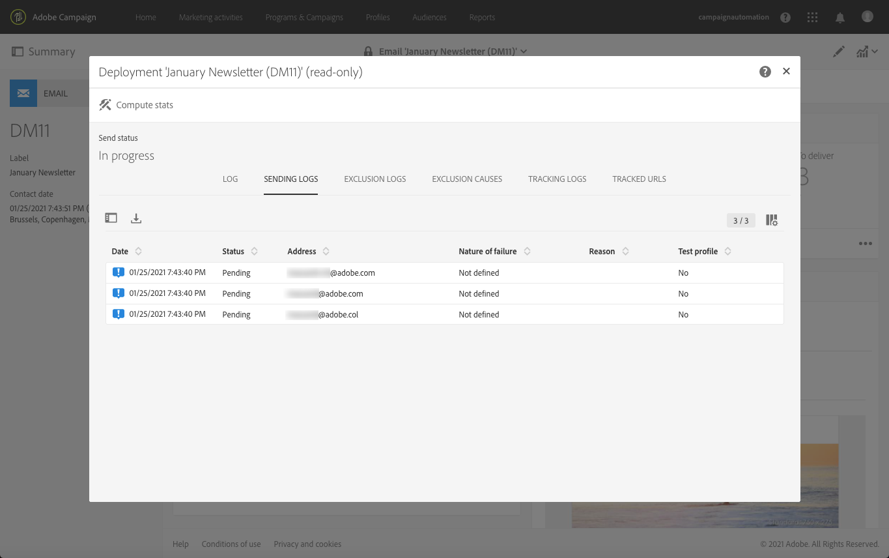

# 確認傳送{#confirming-the-send}

在您j完成訊息準備並執行核准步驟後，即可傳送訊息。如需訊息準備的詳細資訊，請參閱[準備傳送](../../sending/using/preparing-the-send.md)。

只有具有 **[!UICONTROL Start deliveries]** 角色的使用者才能確認傳送。如需詳細資訊，請參閱[角色清單](../../administration/using/list-of-roles.md)區段。

<!--Users without this role will see the following message: 

-->

## 發送消息{#sending-message}

準備完成後，請依照下列步驟傳送訊息。

1. 按一下消息操作欄中的&#x200B;**[!UICONTROL Confirm send]**&#x200B;按鈕。

   

1. 按一下&#x200B;**[!UICONTROL OK]**&#x200B;按鈕完成發送。

   

1. 正在發送消息，請稍候。 **[!UICONTROL Deployment]** 區塊會顯示傳送的進度。

>[!NOTE]
>
>如果已排程訊息，則會在達到傳送時間時傳送訊息。如需排程訊息的詳細資訊，請參閱[本區段](../../sending/using/about-scheduling-messages.md)。

如果您使用不含彙總期間的循環傳送，則可在傳送傳遞前要求確認。若要這麼做，在設定訊息時，請開啟傳送控制面板的&#x200B;**[!UICONTROL Schedule]**&#x200B;區塊並啟動專用選項。

## 瞭解消息指示符{#message-indicators}

將消息傳送給聯絡人之後，**[!UICONTROL Deployment]** 區域會顯示您的 KPI（關鍵績效指標）資料，包含：

* 要傳送的訊息數量
* 已傳送的訊息數量
* 已傳送的訊息百分比
* 退信及錯誤的百分比
* 已開啟訊息的百分比
* 訊息中的點按百分比（電子郵件）

   >[!NOTE]
   >
   >**[!UICONTROL Open rate]** 及 **[!UICONTROL Click-through rate]** 每小時會更新一次。

如果KPI更新時間太長或未考慮發送日誌的結果，請按一下&#x200B;**[!UICONTROL Deployment]**&#x200B;窗口中的&#x200B;**[!UICONTROL Compute stats]**&#x200B;按鈕。

您可以在其中一個目標描述檔的歷史記錄中檢視該訊息。 請參閱[整合式客戶設定檔](../../audiences/using/integrated-customer-profile.md)。

傳送訊息後，您可以追蹤收件者的行為，並監控訊息以評估其影響。 如需詳細資訊，請參閱下列區段。

* [追蹤訊息](../../sending/using/tracking-messages.md)
* [監控傳送](../../sending/using/monitoring-a-delivery.md)

### 傳送成功報告{#delivered-status-report}

>[!NOTE]
>
>本節僅適用於電子郵件渠道。

在每封電子郵件的&#x200B;**[!UICONTROL Summary]**&#x200B;檢視中，當軟彈回和硬彈回報告回<!--from the Enhanced MTA to Campaign-->時，**[!UICONTROL Delivered]**&#x200B;百分比從100%開始，然後在傳送[有效期](../../administration/using/configuring-email-channel.md#validity-period-parameters)期間逐漸降低。

事實上，當所有訊息從促銷活動成功中繼至增強的MTA（訊息傳送代理）時，傳送記錄檔[中的訊息會立即顯示為&#x200B;**[!UICONTROL Sent]**。 ](../../sending/using/monitoring-a-delivery.md#sending-logs)除非或直到該訊息的[bounce](../../sending/using/understanding-delivery-failures.md#delivery-failure-types-and-reasons)從增強的MTA傳回至促銷活動，否則這些訊息仍維持該狀態。

當硬彈回訊息從增強的MTA回報時，其狀態會從&#x200B;**[!UICONTROL Sent]**&#x200B;變更為&#x200B;**[!UICONTROL Failed]**，而&#x200B;**[!UICONTROL Delivered]**&#x200B;百分比會相應降低。

當從增強的MTA回報軟反彈訊息時，仍會顯示為&#x200B;**[!UICONTROL Sent]**，且&#x200B;**[!UICONTROL Delivered]**&#x200B;百分比尚未更新。 然後，在傳送有效期間內，將[retryed](../../sending/using/understanding-delivery-failures.md#retries-after-a-delivery-temporary-failure)軟彈跳消息：

* 如果重試在有效期結束前成功，則消息狀態將保持為&#x200B;**[!UICONTROL Sent]**，而&#x200B;**[!UICONTROL Delivered]**&#x200B;百分比將保持不變。

* 否則，狀態變化為&#x200B;**[!UICONTROL Failed]**&#x200B;並相應地降低&#x200B;**[!UICONTROL Delivered]**&#x200B;百分比。

<!--Soft-bouncing messages increment an error counter. When the error counter reaches the limit threshold or when the validity period is over, their status changes to **[!UICONTROL Failed]**.-->

<!--For more on retries after a delivery temporary failure, see [this section](../../sending/using/understanding-delivery-failures.md#retries-after-a-delivery-temporary-failure).-->

因此，您應等到有效期結束時，才能查看最終的&#x200B;**[!UICONTROL Delivered]**&#x200B;百分比，以及實際的&#x200B;**[!UICONTROL Sent]**&#x200B;和&#x200B;**[!UICONTROL Failed]**&#x200B;訊息的最終數字。

### 電子郵件回饋服務（測試版）{#email-feedback-service}

>[!NOTE]
>
>本節僅適用於電子郵件渠道。

借助電子郵件反饋服務(EFS)功能，可以準確報告每封電子郵件的狀態，因為反饋是直接從增強的MTA（消息傳輸代理）中捕獲的。

>[!IMPORTANT]
>
>電子郵件回饋服務目前提供測試版功能。

傳送開始後，當訊息從促銷活動成功中繼至增強的MTA時，**[!UICONTROL Delivered]**&#x200B;百分比不會變更。

傳送記錄顯示每個目標地址的&#x200B;**[!UICONTROL Pending]**&#x200B;狀態。

當訊息實際傳送至目標描述檔，並且從增強MTA即時回報此資訊後，傳送記錄會顯示成功接收訊息之每個位址的&#x200B;**[!UICONTROL Sent]**&#x200B;狀態。 每次成功傳送時，**[!UICONTROL Delivered]**&#x200B;百分比會隨之增加。

當硬彈回訊息從增強的MTA回報時，其記錄狀態會從&#x200B;**[!UICONTROL Pending]**&#x200B;變更為&#x200B;**[!UICONTROL Failed]**，而&#x200B;**[!UICONTROL Bounces + errors]**&#x200B;百分比也會隨之增加。

當從增強的MTA返回軟彈跳消息時，其日誌狀態也從&#x200B;**[!UICONTROL Pending]**&#x200B;變為&#x200B;**[!UICONTROL Failed]**，並相應地增加&#x200B;**[!UICONTROL Bounces + errors]**&#x200B;百分比。 **[!UICONTROL Delivered]**&#x200B;百分比保持不變。 然後在傳送[有效期](../../administration/using/configuring-email-channel.md#validity-period-parameters)期間重試軟彈跳消息：

* 如果在有效期結束之前成功重試，則消息狀態將變為&#x200B;**[!UICONTROL Sent]**，並相應地增加&#x200B;**[!UICONTROL Delivered]**&#x200B;百分比。

* 否則，狀態仍為&#x200B;**[!UICONTROL Failed]**。 **[!UICONTROL Delivered]**&#x200B;和&#x200B;**[!UICONTROL Bounces + errors]**&#x200B;百分比保持不變。

>[!NOTE]
>
>如需硬彈回數和軟彈回數的詳細資訊，請參閱[本節](../../sending/using/understanding-delivery-failures.md#delivery-failure-types-and-reasons)。
>
>如需傳送暫時失敗後重試的詳細資訊，請參閱[本節](../../sending/using/understanding-delivery-failures.md#retries-after-a-delivery-temporary-failure)。

<!--Soft-bouncing messages increment an error counter. When the error counter reaches the limit threshold or when the validity period is over, the address goes into quarantine and the status remains as **[!UICONTROL Failed]**. For more on conditions for sending an address to quarantine, see [this section](../../help/sending/using/understanding-quarantine-management.md#conditions-for-sending-an-address-to-quarantine).-->

### EFS {#changes-introduced-by-efs}引入的更改

下表顯示了EFS功能引入的KPI和發送日誌狀態的更改。

| 發送進程中的步驟  | KPI摘要 沒有EFS | 發送日誌狀態 不帶EFS | KPI摘要 具有EFS | 發送日誌狀態 WITH EFS |
|--- |--- |--- | --- | --- |
| 訊息從促銷活動成功中繼至增強的MTA | <ul><li>**[!UICONTROL Delivered]** 百分比以100%開始</li><li>**[!UICONTROL Bounces + errors]** 百分比開始為0%</li></ul> | 已傳送 | <ul><li>**[!UICONTROL Delivered]** 百分比開始為0%</li><li>**[!UICONTROL Bounces + errors]** 百分比開始為0%</li></ul> | 待定 |
| 從增強的MTA回報硬反彈訊息 | <ul><li>**[!UICONTROL Delivered]** 百分比會因此減少</li><li>**[!UICONTROL Bounces + errors]** 百分比隨之增加</li></ul> | 失敗 | <ul><li>**[!UICONTROL Delivered]**&#x200B;百分比無變化</li><li>**[!UICONTROL Bounces + errors]** 百分比隨之增加</li></ul> | 失敗 |
| 從增強的MTA回報軟反彈訊息 | <ul><li>**[!UICONTROL Delivered]**&#x200B;百分比無變化</li><li>**[!UICONTROL Bounces + errors]**&#x200B;百分比無變化</li></ul> | 已傳送 | <ul><li>**[!UICONTROL Delivered]**&#x200B;百分比無變化</li><li>**[!UICONTROL Bounces + errors]** 百分比隨之增加</li></ul> | 失敗 |
| 軟反彈訊息重試成功 | <ul><li>**[!UICONTROL Delivered]**&#x200B;百分比無變化</li><li>**[!UICONTROL Bounces + errors]**&#x200B;百分比無變化</li></ul> | 已傳送 | <ul><li>**[!UICONTROL Delivered]** 百分比隨之增加</li><li>**[!UICONTROL Bounces + errors]** 百分比會因此減少</li></ul> | 已傳送 |
| 軟反彈訊息重試失敗 | <ul><li>**[!UICONTROL Delivered]** 百分比會因此減少</li><li>**[!UICONTROL Bounces + errors]** 百分比隨之增加</li></ul> | 失敗 | <ul><li> **[!UICONTROL Delivered]**&#x200B;百分比無變化 </li><li> **[!UICONTROL Bounces + errors]**&#x200B;百分比無變化 </li></ul> | 失敗 |
