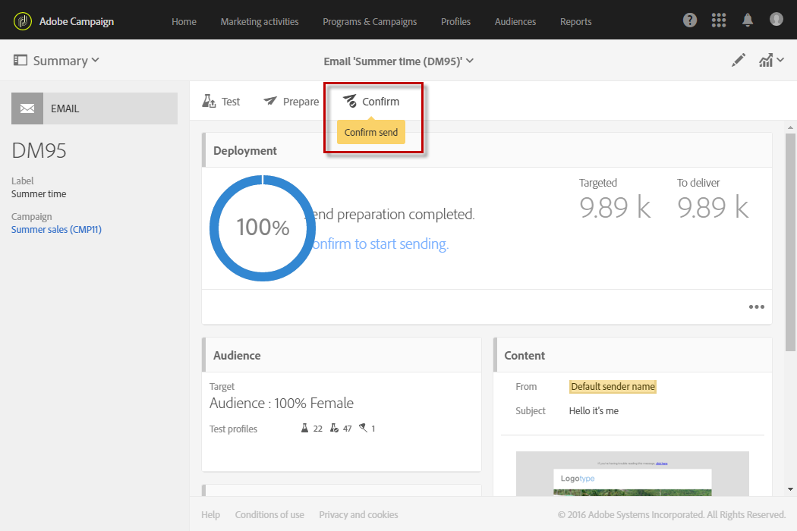

# 確認傳送{#confirming-the-send}

在您j完成訊息準備並執行核准步驟後，即可傳送訊息。如需訊息準備的詳細資訊，請參閱[準備傳送](../../sending/using/preparing-the-send.md)。

只有具有 **[!UICONTROL Start deliveries]** 角色的使用者才能確認傳送。如需詳細資訊，請參閱[角色清單](../../administration/using/list-of-roles.md)區段。

沒有此角色的使用者會看到下列訊息：

若要傳送您的傳遞，請按一下訊息動作列中的 **[!UICONTROL Confirm send]** 按鈕。

系統會要求您按一下 **[!UICONTROL OK]** 按鈕，以便確定完成傳送作業。

正在傳送訊息。

>[!NOTE]
>
>如果已排程訊息，則會在達到傳送時間時傳送訊息。如需排程訊息的詳細資訊，請參閱[本區段](../../sending/using/about-scheduling-messages.md)。

如果您使用不含彙總期間的循環傳送，則可在傳送傳遞前要求確認。若要執行此作業，請開啟傳送控制面板的 **[!UICONTROL Schedule]** 區塊，然後啟動專用選項。

**[!UICONTROL Deployment]** 區塊會顯示傳送的進度。

將消息傳送給聯絡人之後，**[!UICONTROL Deployment]** 區域會顯示您的 KPI（關鍵績效指標）資料，包含：

* 要傳送的訊息數量
* 已傳送的訊息數量
* 已傳送的訊息百分比
* 退信及錯誤的百分比
* 已開啟訊息的百分比
* 訊息中的點按百分比（電子郵件）

   >[!NOTE]
   >
   >**[!UICONTROL Open rate]** 及 **[!UICONTROL Click-through rate]** 每小時會更新一次。

如果 KPI 更新時間太長或是未考慮到傳送記錄檔的結果，請按一下 **[!UICONTROL Deployment]** 視窗中的 **[!UICONTROL Compute stats]** 按鈕。

您可以在其中一個用戶端描述檔的歷史記錄中檢視訊息，這些描述檔也是對象的一部分。請參閱[整合式客戶設定檔](../../audiences/using/integrated-customer-profile.md)。

傳送訊息之後，您可以追蹤其收件者的行為並監控訊息，以評估其影響。如需詳細資訊，請參閱下列區段。

* [追蹤訊息](../../sending/using/tracking-messages.md)
* [監控傳送](../../sending/using/monitoring-a-delivery.md)

