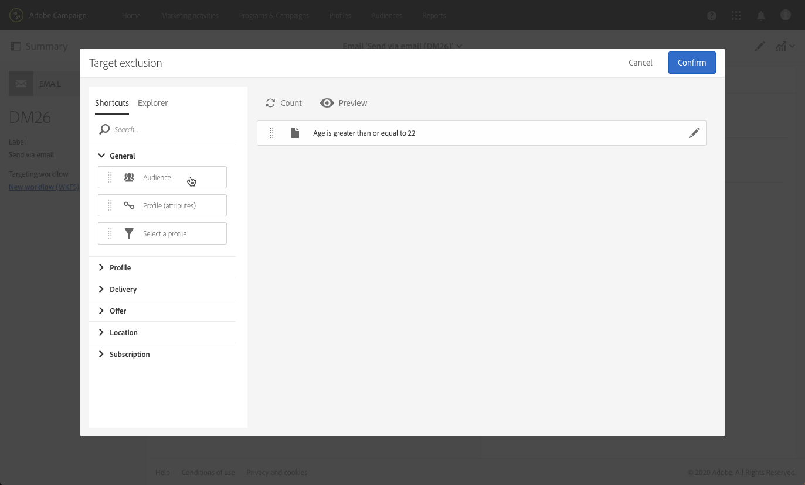

# 新增控制組 {#adding-control-group}

您可以使用控制組來避免傳送訊息給部分觀眾，以評估行銷活動的影響。

若要在 Adobe Campaign 中執行此動作，請在定義傳送目標時，建立<b>控制組</b>。設定檔會隨機新增至控制組、篩選或不篩選，或根據標準。

然後，您將能夠將接收到消息的目標人口的行為與未作為目標的連絡人的行為進行比較。根據傳送日誌，您也可以在未來的行銷活動中定位控制群。

<!--The control group is built when the delivery is prepared.-->

## 概觀 {#overview}

可以從主要目標隨機擷取控制組和/或從特定人口中選取。因此，定義控制組的主要方法有兩種：
* 從主要目標&#x200B;**擷取**&#x200B;多個設定檔。
* 根據查詢中定義的條件&#x200B;**排除**&#x200B;一些設定檔。

定義控制組時，可以使用這兩種方法。

在傳送準備步驟中屬於控制組的所有設定檔將會從主要目標中移除。訊息傳送後，他們將無法接收。

## 從目標人口中擷取 {#extraction-target-population}

若要定義控制組，您可以選擇從目標人口中隨機或基於排序、百分比或固定數量的設定檔中擷取。

### 目標擷取 {#target-extraction}

首先，定義從目標中擷取設定檔的方式： **隨機**&#x200B;或根據&#x200B;**排序**。

在 **[!UICONTROL Target extraction]** 部分下，選擇以下選項之一：

* **[!UICONTROL Random sampling]**：在準備傳送時，Adobe Campaign 將隨機擷取與百分比或您設定為[大小限制](#size-limit)的最大數量對應的多個設定檔。

   例如，如果您接著在 **[!UICONTROL Limits]** 部分中將臨界值設為 10，則控制組將從目標人口隨機選取10%。<!--Change screenshot to match example)-->

   

* **[!UICONTROL Keep only the first records after sorting]**：此選項可讓您根據一或多個排序順序定義限制。

   例如：

   * 選取 **[!UICONTROL Age]** 欄位作為排序標準。
   * 在 **[!UICONTROL Limits]** 部分將 100 定義為臨界值（請參閱[大小限制](#size-limit)）。
   * 保留 **[!UICONTROL Descending sort]** 選項為已核取狀態。

   因此，控制組將由 100 個最舊的收件者組成。<!--Change screenshot to match example)-->

   

   定義包含很少或頻繁購買的設定檔的控制組，並將他們的行為與已聯絡的收件人行為進行比較，這可能很有趣。

>[!NOTE]
>
>如果您不想使用 **[!UICONTROL Target extraction]** 選項，請選取 **[!UICONTROL No extraction]**。

<!---->

### 大小限制 {#size-limit}

無論您選取 **[!UICONTROL Random sampling]** 或 **[!UICONTROL Keep only the first records after sorting]**，您必須設定如何限制從主要目標擷取的設定檔數量。執行下列任一項項目：

* 選取 **[!UICONTROL Size (as a % of the initial population)]**，並填入對應的框架。

   例如，如果您設定 10，則根據以上所選取的選項，Adobe Campaign 會：
   * 隨機擷取目標人口的 10%。
   * 如果您選取 **[!UICONTROL Age]** 欄位作為排序標準，請從目標人口中擷取最舊 10% 的設定檔。

   >[!NOTE]
   >
   >如果您取消核取 **[!UICONTROL Descending sort]** 選項，將會擷取 10% 最年輕的設定檔。

* 選取 **[!UICONTROL Maximum size]**，並填入對應的框架。

   例如，如果您設定 100，Adobe Campaign 將會：
   * 從目標人口中隨機擷取 100 個設定檔。
   * 如果您選取 **[!UICONTROL Age]** 欄位作為排序標準，則從目標人口中擷取 100 個最舊的設定檔。

   >[!NOTE]
   >
   >如果您取消核取 **[!UICONTROL Descending sort]** 選項，將會擷取 100 個最年輕的設定檔。

## 排除特定人口 {#excluding-specific-population}

定義控制組的另一種方法是使用査詢從目標中排除特定的人口。

操作步驟：

1. 在 **[!UICONTROL Target exclusion]** 部分中，按一下 **[!UICONTROL Define target exclusion]**。

   

1. 使用[查詢編輯器](../../automating/using/editing-queries.md)定義排除條件。您也可以選取之前已建立的[閱聽眾](../../audiences/using/about-audiences.md)。

   

1. 按一下 **[!UICONTROL Confirm]**。

與查詢結果相符的設定檔將從目標中排除。

<!--For more on using the query editor, see the [Editing queries](../../automating/using/editing-queries.md) section.-->

## 使用案例：設定控制組 {#control-group-example}

以下範例說明如何使用這兩種方法定義控制組：從主要目標擷取設定檔，以及使用查詢排除特定人口。

1. 建立工作流程。[建立工作流](../../automating/using/building-a-workflow.md)區段中會列出建立工作流程的詳細步驟。
1. 在 **[!UICONTROL Activities]** > **[!UICONTROL Targeting]** 中，拖放[查詢](../../automating/using/query.md)活動。連按兩下活動並定義您的目標。 <!--For example, in **[!UICONTROL Shortcuts]**, drag and drop **[!UICONTROL Profile]**, select **[!UICONTROL Age]** with the operator **[!UICONTROL Greater than]** and type 25 in the **[!UICONTROL Value]** field.-->

1. 在 **[!UICONTROL Activities]** > **[!UICONTROL Channels]** 中，在主要目標細分和編輯後，拖放[電子郵件傳送](../../automating/using/email-delivery.md)活動。
1. 從傳送控制面板按一下 **[!UICONTROL Audience]** 區塊。

1. 選取 **[!UICONTROL Control group]** 索引標籤。

   

1. 從 **[!UICONTROL Target extraction]** 區段中選取 **[!UICONTROL Keep only the first records after sorting]**。
1. 依年齡排序，並保留 **[!UICONTROL Descending]** 排序選項為已核取。

   

1. 將 100 設定為最大大小。將從目標中擷取 100 個最舊的設定檔。

1. 在 **[!UICONTROL Target exclusion]** 區段中，根據您使用[查詢編輯器](../../automating/using/editing-queries.md)選擇的條件，定義將從目標中排除的設定檔。例如，「年齡小於 20 歲」。

   

   年齡在 20 歲以下的設定檔將被排除在外。

1. 啟動[傳送準備](../../sending/using/preparing-the-send.md)，並[確認傳送](../../sending/using/confirming-the-send.md)。

擷取的設定檔（100 個最舊的設定檔）和根據査詢定義的設定檔（20 個以下的設定檔）將從主要目標中撤回。他們並不會收到訊息。

## 比較此結果 {#delivery-logs}

既然您已傳送訊息，您可以對控制組做什麼？

您可以擷取&#x200B;**發送日誌**，以將未接收到通訊的控制組行為與有效目標進行比較。您也可以使用傳送記錄來&#x200B;**建置其他目標定位**。

>[!IMPORTANT]
>
>您必須擁有[管理員角色](../../administration/using/users-management.md#functional-administrators) ，並成為 **[!UICONTROL All]** [組織單位](../../administration/using/organizational-units.md)的一 員 ，才能與 Adobe Campaign 連線。如果要限制特定使用者或使用者群組的存取權，請勿將其連結到能夠存取傳送記錄的 **[!UICONTROL All]** 單位。

### 檢查傳送記錄 {#checking-logs}

查看在發送訊息後從目標中刪除的設定檔，請檢查 **[!UICONTROL Delivery logs]**。如需傳送記錄的詳細資訊以及存取傳送記錄的方法，請參閱[本節](../../sending/using/monitoring-a-delivery.md#delivery-logs)。

* 在 **[!UICONTROL Sending logs]** 索引標籤中，您可以查看已擷取和已排除的設定檔。他們擁有 **[!UICONTROL Ignored]** 狀態，並且 **[!UICONTROL Control group]** 為失敗的原因。

   

* 您也可以檢查 **[!UICONTROL Exclusion causes]** 索引標籤，以查看傳送中未包含的設定檔數量。

   

### 使用控制組日誌 {#using-logs}

傳送後，您可以使用傳送記錄來篩選未接收訊息的設定檔。請遵循以下步驟：

1. 建立工作流程。[建立工作流](../../automating/using/building-a-workflow.md)區段中會列出建立工作流程的詳細步驟。
1. 在 **[!UICONTROL Activities]** > **[!UICONTROL Targeting]** 中，拖放[查詢](../../automating/using/query.md)活動。
1. 在 **[!UICONTROL Properties]** 索引標籤中，設定 **[!UICONTROL Delivery logs]** 為 **[!UICONTROL Resource]** 和 **[!UICONTROL Profile]** 為 **[!UICONTROL Targeting dimension]**。

   

1. 在 **[!UICONTROL Target]** 索引標籤中，按一下 **[!UICONTROL Delivery logs]**。
1. 拖放 **[!UICONTROL Status]** 並選取 **[!UICONTROL Ignored]** 為篩選條件。

   

1. 按一下 **[!UICONTROL Confirm]**。

1. 仍然在 **[!UICONTROL Target]** 索引標籤中，拖放 **[!UICONTROL Nature of failure]** 並選取 **[!UICONTROL Control group]** 作為篩選條件。

   

1. 按一下 **[!UICONTROL Confirm]**。

   

然後，您可以使用&#x200B;**擷取檔案**&#x200B;活動，隨後使用&#x200B;**傳輸檔案**&#x200B;活動（作為範例）匯出日誌資料。這將使您能夠在您自己的報告工具中分析與控制組相比的有效目標行銷活動的結果。如需匯出日誌的詳細資訊，請參閱[本節](../../automating/using/exporting-logs.md)。

### 目標定位控制組 {#targeting-control-group}

若要根據未收到訊息的設定檔進行目標定位，您也可以使用傳送記錄。請遵循以下步驟：

1. 建立工作流程。[建立工作流](../../automating/using/building-a-workflow.md)區段中會列出建立工作流程的詳細步驟。
1. 在 **[!UICONTROL Activities]** > **[!UICONTROL Targeting]** 中，拖放第一個[查詢](../../automating/using/query.md)活動。
1. 在 **[!UICONTROL Properties]** 索引標籤中，確保 **[!UICONTROL Profile]** 資源已選取作為 **[!UICONTROL Resource]** 和 **[!UICONTROL Targeting dimension]**。

   

1. 在 **[!UICONTROL Target]** 索引標籤中，展開 **[!UICONTROL Delivery]** 並拖放 **[!UICONTROL Delivery logs]**。

   

1. 在 **[!UICONTROL Add a rule]** 視窗中，拖放 **[!UICONTROL Delivery]**。

   

1. 選擇您發送的電子郵件作為篩選條件。按一下 **[!UICONTROL Confirm]**。

   

1. 返回 **[!UICONTROL Add a rule]** 視窗，拖放 **[!UICONTROL Status]** 並選擇 **[!UICONTROL Ignored]** 為篩選條件。按一下 **[!UICONTROL Confirm]**。

   

1. 拖放 **[!UICONTROL Nature of failure]** 並選取 **[!UICONTROL Control group]** 為篩選條件。按一下 **[!UICONTROL Confirm]**。

   

1. 請確定每個條件都與 **和**&#x200B;布林值運算子對齊。

   

1. 按一下 **[!UICONTROL Confirm]**。

現在，您可以定位未收到第一條訊息的設定檔，因為它們是控制組的一部分，並向他們發送另一封電子郵件。

在相同的工作流程中，您也可以建立另一個查詢來定位已收到電子郵件的設定檔，並向其發送不同的訊息。

