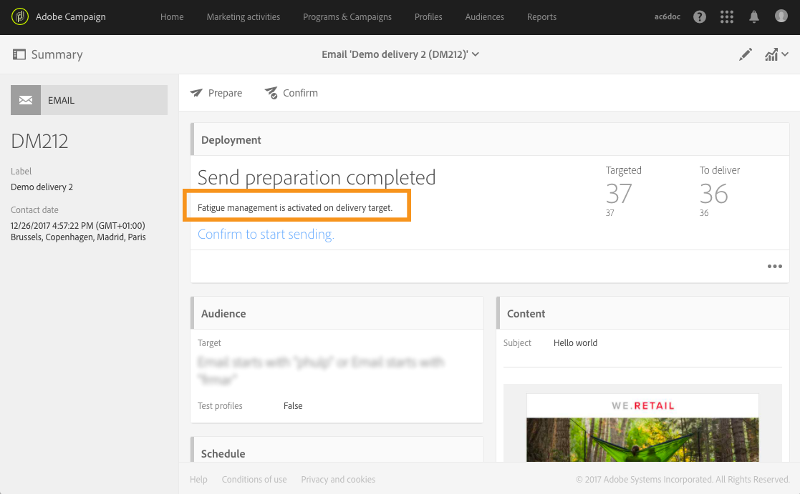

# 疲勞規則{#fatigue-rules}

## 關於疲勞規則 {#about-fatigue-rules}

疲勞規則可讓行銷人員設定全球跨通道企業規則，自動排除行銷活動中過度請求的設定檔。

若要實施疲勞規則，請定義每個設定檔的最大訊息數量，並選取將套用該規則的期間。在準備傳送期間，設定檔會根據已傳送給設定檔的訊息數量，從傳送中排除（如果適用）。

>[!NOTE]
>
>若要套用疲勞規則，您必須定義傳送的聯繫日期。如果您選取立即傳送訊息，則不會套用疲勞規則。

相關主題：

* [準備](../../administration/using/configuring-email-channel.md#preparation)
* [管理類型](../../sending/using/managing-typologies.md)
* [類型規則](../../sending/using/managing-typology-rules.md)
* [最佳化通訊頻率以防止聯繫疲勞](https://helpx.adobe.com/tw/campaign/kb/simplify-campaign-management.html#Engageyourcustomersateverystep)

## 建立疲勞規則 {#creating-a-fatigue-rule}

若要建立與設定 **[!UICONTROL Fatigue]** 類型規則，請套用下列步驟：

1. 按一下介面左上角的 Adobe Campaign 標誌，然後選取 **[!UICONTROL Administration]** > **[!UICONTROL Channels]** > **[!UICONTROL Typologies]** > **[!UICONTROL Typology rules]**。

   

1. 在類型規則清單中，按一下 **[!UICONTROL Create]**。

   

1. 在 **[!UICONTROL Rule type]** 欄位中，選取 **[!UICONTROL Fatigue]**。

   

1. 在 **[!UICONTROL Channel]** 欄位中，選取您的規則將要套用的通道。您可以選取單一通道（電子郵件、簡訊、直接郵件、行動應用程式）或選取 **[!UICONTROL All channels]**。請參閱[選取通道](#choosing-the-channel)。

   

1. 在 **[!UICONTROL General]** 索引標籤中，定義計算每個設定檔最大訊息數量的方法。您可以選取常數臨界值或變數。您也可以精簡設定檔與傳送的臨界值。如需詳細資訊，請參閱[定義臨界值](#defining-the-threshold)。

   

1. 選取將套用類型規則的 **[!UICONTROL Sliding period]**。如需詳細資訊，請參閱[設定滑動期間](#setting-the-sliding-period)。

   

   在此範例（請參閱之前的螢幕擷取畫面）中，我們選取在 15 天的滑動期間內最多傳送 4 個訊息。

1. 在 **[!UICONTROL Application criteria]** 索引標籤中，您可以選取將此規則套用於所有傳送，或根據要發送的消息限制規則的適用性。只有在符合應用程式條件時，才會執行規則。例如，您只能對索引標籤以特定字詞開頭或 ID 包含特定字母的訊息套用此規則。請參閱[限制篩選規則的適用性](../../sending/using/filtering-rules.md#restricting-the-applicability-of-a-filtering-rule)。

   

1. 選取 **[!UICONTROL Typologies]** 索引標籤，並將您的類型規則連結至傳送時使用的類型。請參閱[管理類型](../../sending/using/managing-typologies.md)與[類型規則](../../sending/using/managing-typology-rules.md)。

   

   >[!NOTE]
   >
   >可以在傳遞範本中定義類型，以便自動套用至使用此範本建立的所有傳送。

在準備傳送期間，設定檔會視情況從傳送中排除，且是根據已傳送給設定檔的傳送數量而定。您可以在傳送記錄檔中檢視疲勞規則執行結果。請參閱[檢視疲勞結果](#viewing-the-fatigue-results)。

>[!IMPORTANT]
>
>為了讓疲勞規則生效，您需要為傳送定義聯繫日期。如果您選取立即傳送訊息，則不會套用疲勞規則。

## 選取通道 {#choosing-the-channel}

疲勞規則適用於各種通道。通道是在類型規則設定 **[!UICONTROL Channel]** 欄位中定義。您可以選取單一通道或選取 **[!UICONTROL All channels]**。

**可用通道**

可以使用以下通道：

* 電子郵件
* 行動裝置（簡訊）
* 直接郵件
* 行動應用程式：此通道可讓您您傳送推播通知給設定檔或應用程式訂閱者。如果您選取傳送通知給設定檔，則通知會與多通道疲乏規則相容。

   >[!IMPORTANT]
   >
   >疲勞規則與傳送給應用程式訂閱者的推播通知不相容。如果您要傳送訊息給應用程式訂閱者，則不會套用疲勞規則。

* 所有通道：此選項可讓您將規則套用至所有通道。例如，您可以決定每個月在任何通道上最多傳送 3 則訊息。如果您在上週傳送 2 封電子郵件給設定檔，而您今天嘗試傳送推播通知，則會排除相同的設定檔。

**傳送類型**

疲勞規則與所有傳送類型相容：一次性傳送、重複傳送、工作流程傳送與交易式訊息。

**交易式訊息**&#x200B;可以用來傳送以事件 (rtEvent) 為目標的服務訊息，以及行銷訊息（目標定位設定檔），例如再行銷訊息。疲勞規則僅與行銷訊息相容（目標定位設定檔）。事件交易式訊息不包含設定檔資訊，因此它們與疲勞規則不相容（即使在設定檔擴充的情況下亦然）。透過交易式訊息中的行銷訊息支援，您可以&#x200B;**將疲乏規則套用至所有通道，包括行銷交易式訊息**。

## 定義臨界值 {#defining-the-threshold}

每個疲勞規則會定義一個臨界值，即在指定期間內可以發送到一個設定檔的最大消息數量。一旦達到此臨界值時，在考慮到該期間結束之前，將不再進行傳送。此程序可以讓您在訊息超過設定的臨界值時，自動將設定檔排除在傳送之外，以避免過度請求。

臨界值可以是常數或變數。這表示在指定期間，臨界值可能會因某個設定檔而異，甚至會因為相同的設定檔而有所不同。

**使用修正臨界值**

該臨界值表示在相關期間內可發送到設定檔最大的訊息數量。

依照預設，臨界值為常數，您必須指出該規則授權的訊息數量上限。

**使用變數臨界值**

若要定義變數臨界值，請在 **[!UICONTROL Depends on the recipient]** 欄位中選取 **[!UICONTROL Threshold type]** 值。

然後您有兩個選項：

* 選取設定檔欄位：每個設定檔的臨界值會依所選欄位而有所不同。例如，如果您已使用　&#39;Communication frequency&#39;　欄位擴展設定檔資源，請按一下 **[!UICONTROL Threshold computation formula]** 欄位右側的按鈕，然後選取您的欄位。對於每個設定檔，臨界值將採用　&#39;Communication frequency&#39;　欄位的值。

   

* 定義公式：按一下 **[!UICONTROL Threshold computation formula]** 欄位右側的第二個按鈕，以定義進階臨界值計算公式。例如，您可以根據設定檔所屬的區段來索引授權訊息的數量。這表示屬於　&#39;Web&#39;　區段的設定檔可能會收到比其他設定檔更多的訊息。**[!UICONTROL Iif (@origin='Web', 5, 3)]** 類型公式可以授權傳送 5 則訊息至網頁區段的設定檔，而其他區段則授權傳送 3 則訊息。

   

**精簡設定檔與傳送的臨界值**

預設情況下，所有訊息都將考慮到臨界值計算。核取 **[!UICONTROL Refine Threshold on profiles and deliveries]** 方塊以篩選設定檔與傳送，以便在準備傳送時計算。

在以下範例中，只會計算男性設定檔，且只會計算以　**Newsletters**　開頭之索引標籤的傳送。

精簡傳送時的臨界值與限制整個規則（**[!UICONTROL Application criteria]** 索引標籤）的適用性不同：

* **[!UICONTROL Application criteria]**：您選取是否根據特定準則執行此規則。例如，如果您的應用程式條件是「以電子報開頭的索引標籤」，則規則僅適用於符合此條件的傳送。如果傳送的索引標籤以「促銷活動」開頭，則完全不會執行此規則。
* **[!UICONTROL Refine threshold on profiles and deliveries > Deliveries to count]**：使用此分類規則的所有傳送都會執行此規則，但您會在過去和已排程的傳送中決定要計算哪些傳送。例如，若您的限制是「以電子報開頭的索引標籤」，則即使傳送索引標籤以「促銷」開頭，也會執行規則。在選取的滑動期間，它會計算其索引標籤以「電子報」開頭的傳送數量。

## 設定滑動期間 {#setting-the-sliding-period}

疲勞規則定義於 n 天滾動期間。該期間在 **[!UICONTROL Sliding period]** 部分中設定，例如 2 週、7 天或 5 小時。

執行規則時，會同時考慮過去的傳送與已排程的傳送。這保證在指定的滑動期間內，不會超過臨界值。

例如，如果您定義 48 小時期間，系統會在&#x200B;**聯繫日期前** 48 小時與在&#x200B;**聯繫日期後**　48 小時查看。因此，選定的期間將翻倍，以便將未來傳送與之前傳送整合一起。

若要考慮將傳送限制在 2 週期間，請在　**Sliding period**　區段中輸入　**Day** 及 **7** 或 1 週。在計算時，會考慮到在傳送日期前 7 天發送的傳送以及在適用規則的傳送日期後 7 天排程該傳送。

## 檢視疲勞結果 {#viewing-the-fatigue-results}

在準備傳送期間，設定檔會視情況從傳送中排除，且是根據已傳送給設定檔的傳送數量而定。若要檢視疲勞規則執行結果，請按一下 **[!UICONTROL Deployment]** 區塊右下角的按鈕。

有三個索引標籤適用，顯示疲勞執行結果的詳細資訊，包括所應用規則之名稱：

* 傳送記錄檔：

   

* 排除記錄檔：

   

* 排除原因：

   

## 檢視疲勞規則摘要報告 {#viewing-the-fatigue-rule-summary-report}

Adobe Campaign 提供疲勞規則專用報告，協助您瞭解如何將疲勞規則套用至行銷活動。這可以讓您瞭解行銷活動如何彼此影響，並進行適當的調整。

您可以從每個方案、行銷活動與訊息右上角的按鈕 **[!UICONTROL Reports]** 存取　**[!UICONTROL Fatigue rules summary]**　報告。

在螢幕的左側，您可以篩選傳送之聯繫日期的報告資料。依照預設，選取的期間會在目前日期前 15 天開始，並在之後 15 天結束。您也可以篩選特定疲勞規則。

圓形圖顯示所選期間的以下資訊：

* **[!UICONTROL Total targeted]**：訊息準備前的目標總數
* **[!UICONTROL Excluded]**：因疲勞規則應用而排除的總數
* **[!UICONTROL Other exclusions]**：因其他類型規則所排除的總數
* **[!UICONTROL To deliver]**：訊息準備後要傳送的訊息總數 (**[!UICONTROL To deliver]** = **[!UICONTROL Total targeted]** - **[!UICONTROL Excluded]** - **[!UICONTROL Other exclusions]** )

在圖表的右側，您會找到依疲勞規則劃分的排除數量。

底部資料表會顯示所選期間內的所有傳送。對於每個傳送，您都可以看到套用的疲勞規則及其對應之排除。資料表中還會顯示沒有聯繫日期的傳送。

* **[!UICONTROL 0]** 表示已套用疲勞規則，但沒有排除。
* **[!UICONTROL -N]** 表示已發生 N 個排除。
* 空白欄位表示疲勞規則不適用。

>[!NOTE]
>
>顯示的資料與您從中存取報告的方案、訊息或行銷活動無關。此報告顯示所有組織單位的所有疲勞規則與傳送。這可讓您以全局檢視所有傳送，以瞭解您的行銷活動如何受到其他行銷活動的影響。

## 範例 {#examples}

疲勞管理的實施有許多可能性。以下是您可以做的一些範例：

* 使用套用至&#x200B;**所有通道**&#x200B;的&#x200B;**常數臨界值**，建立疲勞規則：

   假設您建立多通道規則，在 7 天的滑動期間內，以 3 為常數臨界值。

   上週，您的進階設定檔收到促銷電子郵件與交易式再行銷電子郵件。您也排程了下週傳送的 簡訊。今天，您決定傳送以所有設定檔為目標的推播通知。進階設定檔將會排除在今天的推播之外，因為已達到其在 2 週期間的訊息數量上限。

   

* 根據&#x200B;**變數臨界值**，使用&#x200B;**設定檔欄位**&#x200B;建立疲勞規則：

   您已使用「通訊限制」欄位擴充設定檔資源，以定義每個設定檔的不同臨界值。在疲勞規則中，根據此欄位定義變數臨界值，並選取滑動期間為 2 天。舉兩個設定檔之範例：John 的通訊限制為 1，David 的臨界值為 2。昨天，他們兩個都收到了電子報電子郵件。您決定今天再傳送一封電子郵件給他們。只有 David 會收到，因為 John 已被排除在目標之外。

   

* 使用&#x200B;**臨界值計算公式**&#x200B;建立疲勞規則：

   您想要根據設定檔的年齡變更臨界值。如果設定檔低於 40，您想要定義限制為 4，而舊設定檔的限制為 2。您可以直接在疲勞規則中建立根據設定檔的年齡計算臨界值的公式，而不是使用擴充欄位為每個設定檔定義之臨界值。在我們的例子中，公式為 **[!UICONTROL Iif (@age<40, 4, 2)]**。

   

   >[!NOTE]
   >
   >此章節還包括使用臨界值計算公式的疲勞規則的逐步範例。

* 建立疲勞規則，可在設定檔及傳送上&#x200B;**精簡臨界值**：

   您已使用　&#39;Score&#39;　欄位擴充設定檔資源，並且已使用　&#39;Type&#39;　欄位擴充傳送資源。您想要定義常數臨界值為 3，但想從計數中排除　&#39;Alert&#39; 或 &#39;Black Friday&#39;　類型的所有傳送，以及分數大於 10 的所有描述檔。當規則執行時，會在過去和已排程的傳送中，將所有非　&#39;Alert&#39; 或 &#39;Black Friday&#39;　類型的傳送計入分數小於 10 的設定檔。

   

以下是使用臨界值計算公式的疲勞規則的逐步範例。

在此使用案例中，我們想要建立類型規則，以防止每週傳送超過 2 則訊息給進階設定檔，以及每週傳送 2 則訊息給標準設定檔。

為了識別客戶與潛在客戶，我們擴展了設定檔資源，**[!UICONTROL Status]** 欄位包含 0 個進階設定檔和 1 個標準設定檔。

若要建立規則，請套用以下步驟：

1. 建立新的&#x200B;**疲勞類型**&#x200B;類型規則。
1. 在 **[!UICONTROL Threshold]** 區段中，我們要建立一個公式以根據每個設定檔計算臨界值。在 **[!UICONTROL Depends on the recipient]** 欄位中選取 **[!UICONTROL Threshold type]** 值，然後按一下 **[!UICONTROL Threshold computation formula]** 欄位右側的第二個按鈕圖示。

   

1. 在 **[!UICONTROL List of functions]** 章節中，連按兩下　**[!UICONTROL Others]**　節點中的　**Iif**　函式。

   

1. 然後，在 **[!UICONTROL Available fields]**　區段中選取配設定檔的 **Status**。

   

1. 輸入所需值以建立以下公式：**Iif(@status=0,2,4)**

   

   此公式可讓您在狀態等於 0 時指派值為 2，而所有其他狀態的值為 4。

1. 按一下 **[!UICONTROL Confirm]** 以核准公式。
1. 指定將套用規則的 **[!UICONTROL Sliding period]** 位置：在此情況下，請在 7 天內將已考慮的傳送限制在 2 週內。

   

1. 現在將您剛建立的規則連結至類型，以便套用至您的傳送。若要這麼做，請選取 **[!UICONTROL Typologies]** 索引標籤，按一下 **[!UICONTROL Create element]** 並選取用於傳送的類型。

   

1. 儲存規則以核准建立。

此規則將根據類型套用至所有傳送。
