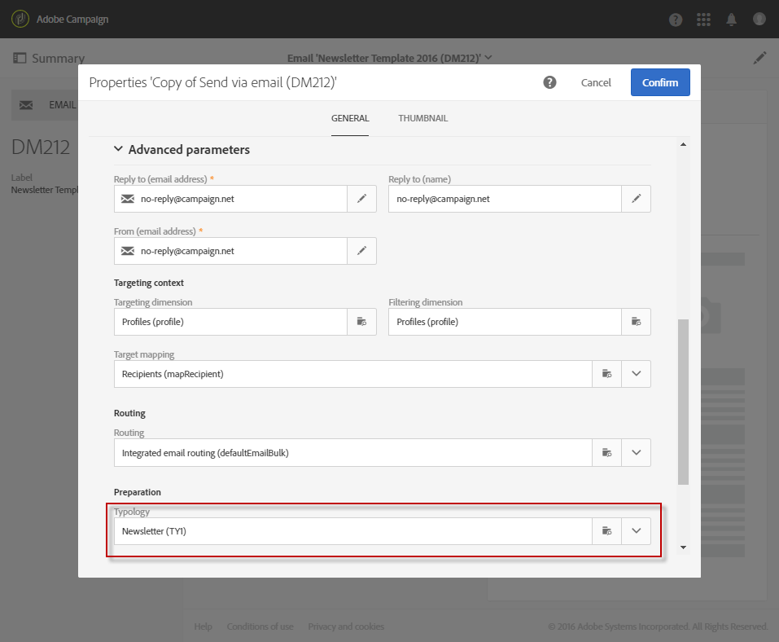

# 篩選規則 {#filtering-rules}

篩選規則可讓您根據查詢中定義的條件排除訊息目標的一部分，例如已隔離的設定檔，或已傳送特定數量電子郵件的設定檔。

## 預設篩選型別規則 {#default-filtering-typology-rules}

下表提供有關現成可用篩選規則及其相關管道的資訊。

| 標籤 | 通道 | 說明 |
| ---------|----------|---------|
| **[!UICONTROL Address not specified]** | 全部 | 排除未指定地址（電子郵件、郵寄地址等）的目標人口。 （根據選取的頻道）。 |
| **[!UICONTROL Address on denylist]** | 全部 | 排除封鎖清單上的地址。 |
| **[!UICONTROL Duplicate]** | 全部 | 根據目標母體排除重複專案 **[!UICONTROL Address]** 欄位。 |
| **[!UICONTROL Exclude mobile applications]** | 行動應用程式 | 排除與訊息中定義的行動應用程式不符的應用程式訂閱。 |
| **[!UICONTROL Exclude mobile applications for In-App]** | 應用程式內 | 排除與訊息中定義的行動應用程式不符的應用程式訂閱（應用程式內範本）。 |
| **[!UICONTROL Exclude mobile applications for In-App broadcast]** | 應用程式內 | 排除與訊息中定義的行動應用程式不符的應用程式訂閱（應用程式內廣播範本） |
| **[!UICONTROL Exclude mobile applications for Push]** | 行動應用程式 | 排除與訊息中定義的行動應用程式不符的應用程式訂閱（針對推播） |
| **[!UICONTROL Quarantined address]** | 全部 | 排除隔離的地址。 |
| **[!UICONTROL Target limited in size]** | 全部 | 檢查是否已達到目標的傳遞大小上限。 適用於啟用「傳遞限制」選項的直接郵件傳遞。 |

除了這些預設篩選規則外，還提供兩個排除規則：

* **[!UICONTROL Exclusion of addresses]** ( **[!UICONTROL addressExclusions]** )
* **[!UICONTROL Exclusion of domains]** ( **[!UICONTROL domainExclusions]** ).

在電子郵件分析期間，這些規則會將收件者電子郵件地址與傳送能力執行個體中管理的加密全域隱藏清單中所包含的禁止地址或網域名稱進行比較。 如果有相符專案，則不會傳送訊息給該收件者。

這是為了避免因惡意活動（尤其是使用Spamtrap）而新增至封鎖清單。 例如，如果使用Spamtrap透過您的其中一個Web表單進行訂閱，則會自動傳送確認電子郵件給該Spamtrap，而您的地址會自動新增至封鎖清單中。

>[!NOTE]
>
>全域隱藏清單中包含的地址和網域名稱會隱藏。 傳遞分析記錄檔中只會指出已排除的收件者數目。

## 建立篩選規則 {#creating-a-filtering-rule}

您可以視需要建立自己的篩選規則。 例如，您可以篩選電子報的目標母體，這樣18歲以下的訂閱者就不會收到通訊。

若要建立篩選型別規則，請遵循下列步驟：

1. 建立新的型別規則。 建立型別規則的主要步驟詳見 [本節](../../sending/using/managing-typology-rules.md).

1. 選取 **[!UICONTROL Filtering]** 規則型別，然後指定所需的管道。

1. 在 **[!UICONTROL Filtering criteria]** 索引標籤中，選取 **[!UICONTROL Subscription]** 類別。

   

1. 在 **[!UICONTROL Explorer]** 索引標籤中，拖放 **[!UICONTROL Subscriber]** 節點放入畫面主要部分。

   

1. 選取 **[!UICONTROL Age]** 欄位並定義篩選條件，讓訂閱者的年齡少於18歲。

   

1. 在 **[!UICONTROL Typologies]** 標籤，將此規則連結至型別。

   

1. 確保在您要使用的傳遞或傳遞範本中選取型別。 如需詳細資訊，請參閱[本章節](../../sending/using/managing-typologies.md#applying-typologies-to-messages)。

   

每當您在訊息中使用此規則時，系統都會自動排除被視為次要的訂閱者。

## 設定篩選規則的鎖定目標內容 {#configuring-filtering-rules-targeting-context}

Campaign Standard可讓您設定  **目標定位** 和 **篩選** 根據您要鎖定的資料使用的維度。

若要這麼做，請開啟型別規則的屬性，然後存取 **[!UICONTROL Advanced information]** 區段。

依預設，會對 **[!UICONTROL Profiles]**. 例如，如果規則以行動應用程式為目標，則 **[!UICONTROL Filtering dimension]** 可變更為 **[!UICONTROL Subscriptions to an application]**.

## 限制篩選規則的適用性 {#restricting-the-applicability-of-a-filtering-rule}

您可以根據要傳送的訊息限制篩選規則的適用性。

1. 在型別規則的 **[!UICONTROL Application criteria]** 標籤，取消勾選 **[!UICONTROL Apply the rule on all deliveries]** 選項，預設為啟用。

   

1. 使用查詢編輯器來定義篩選器。 例如，您只能對標籤以特定字詞開頭或ID包含特定字母的訊息套用規則。

   

在此情況下，規則只會套用至對應已定義條件的訊息。
