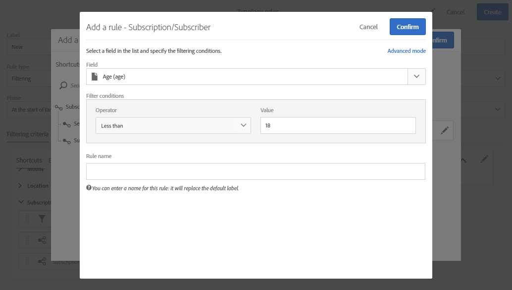

# 篩選規則 {#filtering-rules}

篩選規則可讓您根據查詢中定義的條件排除訊息目標的一部分，例如已傳送特定數量之電子郵件的隔離設定檔或設定檔。

## 預設篩選類型規則 {#default-filtering-typology-rules}

下表提供現成可用篩選規則及其相關管道的資訊。

| 標籤 | 通道 | 說明 |
| ---------|----------|---------|
| **[!UICONTROL Address not specified]** | 全部 | 排除沒有指定地址的目標人口（電子郵件、郵遞區號等）。 根據選取的頻道)。 |
| **[!UICONTROL Address on denylist]** | 全部 | 排除封鎖清單上的地址。 |
| **[!UICONTROL Duplicate]** | 全部 | 排除根據目標母體的重複項目 **[!UICONTROL Address]** 欄位。 |
| **[!UICONTROL Exclude mobile applications]** | 行動應用程式 | 排除不符合訊息中定義之行動應用程式的應用程式訂閱。 |
| **[!UICONTROL Exclude mobile applications for In-App]** | 應用程式內 | 排除不符合訊息中定義之行動應用程式的應用程式訂閱（應用程式內範本）。 |
| **[!UICONTROL Exclude mobile applications for In-App broadcast]** | 應用程式內 | 排除不符合訊息中定義之行動應用程式的應用程式訂閱（應用程式內廣播範本） |
| **[!UICONTROL Exclude mobile applications for Push]** | 行動應用程式 | 排除不符合訊息中定義之行動應用程式的應用程式訂閱（針對推送） |
| **[!UICONTROL Quarantined address]** | 全部 | 排除隔離的地址。 |
| **[!UICONTROL Target limited in size]** | 全部 | 檢查目標是否達到最大傳送大小。 套用至已啟用「傳送限制」選項的直接郵件傳送。 |

除了這些預設篩選規則外，還提供兩個排除規則：

* **[!UICONTROL Exclusion of addresses]** ( **[!UICONTROL addressExclusions]** )
* **[!UICONTROL Exclusion of domains]** ( **[!UICONTROL domainExclusions]** ).

在電子郵件分析期間，這些規則會比較收件者電子郵件地址與傳遞能力實例中管理的加密全域隱藏清單中包含的禁止地址或網域名稱。 如果有相符項目，則不會將訊息傳送給該收件者。

這是為了避免由於惡意活動（尤其是使用Spamtrap）而被添加到封鎖清單中。 例如，如果使用Spamtrap通過您的其中一個Web表單進行訂閱，則會自動向該Spamtrap發送確認電子郵件，這會導致您的地址被自動添加到封鎖清單中。

>[!NOTE]
>
>全局隱藏清單中包含的地址和域名將被隱藏。 傳送分析記錄中只會指出已排除的收件者數目。

## 建立篩選規則 {#creating-a-filtering-rule}

您可以根據自己的需求建立自己的篩選規則。 例如，您可以篩選電子報的目標母體，讓18歲以下的訂閱者永遠不會收到通訊。

若要建立篩選類型規則，請遵循下列步驟：

1. 建立新的類型規則。 建立類型規則的主要步驟於 [本節](../../sending/using/managing-typology-rules.md).

1. 選取 **[!UICONTROL Filtering]** 規則類型，然後指定所需的通道。

1. 在 **[!UICONTROL Filtering criteria]** 標籤中，選取 **[!UICONTROL Subscription]** 類別。

   

1. 在 **[!UICONTROL Explorer]** 索引標籤，拖放 **[!UICONTROL Subscriber]** 節點進入畫面的主要部分。

   

1. 選取 **[!UICONTROL Age]** 欄位，並定義篩選條件，使訂閱者的年齡達到18歲或以上。

   

1. 在 **[!UICONTROL Typologies]** 標籤，將此規則連結至類型。

   

1. 請確定已在您要使用的傳送或傳送範本中選取類型。 如需詳細資訊，請參閱[本章節](../../sending/using/managing-typologies.md#applying-typologies-to-messages)。

   

只要在訊息中使用此規則，系統就會自動排除被視為未成年的訂閱者。

## 設定篩選規則的目標內容 {#configuring-filtering-rules-targeting-context}

Campaign Standard可讓您設定  **定位** 和 **篩選** 維度，以根據您要鎖定的資料使用。

若要這麼做，請開啟類型規則的屬性，然後存取 **[!UICONTROL Advanced information]** 區段。

依預設，會對 **[!UICONTROL Profiles]**. 例如，如果規則針對行動應用程式，則 **[!UICONTROL Filtering dimension]** 可變更為 **[!UICONTROL Subscriptions to an application]**.

## 限制篩選規則的適用性 {#restricting-the-applicability-of-a-filtering-rule}

您可以根據要發送的消息限制篩選規則的適用性。

1. 在類型規則 **[!UICONTROL Application criteria]** 頁簽，取消選中 **[!UICONTROL Apply the rule on all deliveries]** 選項，預設為啟用。

   

1. 使用查詢編輯器定義篩選器。 例如，您只能對其標籤以特定字詞開頭或其ID包含特定字母的訊息套用規則。

   

在此情況下，規則只會套用至符合已定義准則的訊息。
