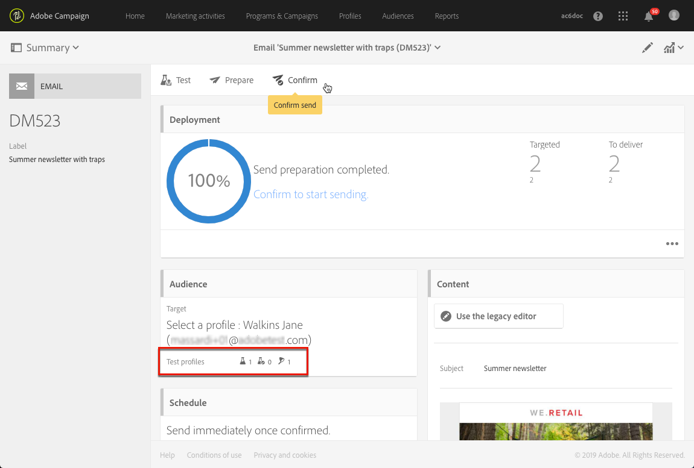

# 管理測試設定檔和傳送校樣{#managing-test-profiles-and-sending-proofs}

## 關於測試設定檔 {#about-test-profiles}

測試設定檔可讓您定位不符合已定義定位准則的其他收件者。 它們會新增至訊息的讀者群，以偵測任何詐用收件者資料庫的行為，或確保電子郵件送達收件匣。

您可以從進階功能表管理您的測試設定檔 **[!UICONTROL Profiles & audiences > Test profiles]**。

測試配置檔案包含虛構的聯繫資訊或由發送者控制的聯繫資訊，這些資訊隨後可用於以下上下文中的消息：

* 傳送校 **樣**:校對是特定訊息，用來在傳送已完成的傳送給收件者之前檢查訊息。 Proof測試設定檔負責檢查傳送的內容和格式。 請參閱 [傳送校樣](#sending-proofs)。
* 對於電 **子郵件轉譯**:電子郵件轉換測試配置檔案用於檢查根據接收郵件收件箱顯示郵件的方式。 例如，webmail、message service、mobile等。 請參閱 [電子郵件轉譯](../../sending/using/email-rendering.md)。

   「電 **子郵件** 」轉譯使用為唯讀。 使用此功能的測試設定檔僅能在Adobe Campaign中立即使用。

* 作為陷 **阱**:訊息會傳送至測試描述檔，就像傳送至主要目標一樣。 請參 [閱使用陷阱](#using-traps)。
* 要預 **覽消息** :在預覽訊息以測試個人化元素時，可選取測試描述檔。 請參閱 [預覽訊息](/help/sending/using/previewing-messages.md)。

## 管理測試設定檔 {#managing-test-profiles}

### 建立測試設定檔 {#creating-test-profiles}

1. 從進階功能表，透過Adobe Campaign標誌，選取「設定檔與觀眾 **&gt;測試設定檔** 」以存取測試設定檔清單。

   

1. 在控制面 **[!UICONTROL Test profiles]** 板中，按一下 **建立**。

   

1. 輸入此配置式的資料。

   

1. 選擇您要用於測試設定檔的用途。

   

1. 輸入聯絡人 **[!UICONTROL Email, Telephone, Mobile, Mobile app]**&#x200B;渠道，以及測試描述檔位址（如有必要）。

   >[!NOTE]
   >
   >您可以定義偏好的電子郵件格式：或 **[!UICONTROL Text]** 者 **[!UICONTROL HTML]**。

1. 如果要使用此測試設定檔來測試交易式訊息的個人化，請指定事件類型和此事件的資料。
1. 按一 **[!UICONTROL Create]** 下以儲存測試設定檔。

然後，測試描述檔會新增至描述檔清單。

**相關主題：**

[建立測試設定檔](https://helpx.adobe.com/campaign/kt/acs/using/acs-test-profiles-feature-video-use.html) 影片

### 編輯測試設定檔 {#editing-test-profiles}

若要編輯測試描述檔並參考其連結的資料，或加以修改：

1. 按一下您要編輯的測試描述檔，以選取它。
1. 請參考或修改欄位。

   

1. 如果 **[!UICONTROL Save]** 您已輸入變更，請按一下，或選取測試描述檔名稱，然後 **[!UICONTROL Test profiles]** 在畫面頂端的區段中，返回測試描述檔控制面板。

## 傳送校樣 {#sending-proofs}

證明是一種特定訊息，可讓您在將訊息傳送至主要目標之前先測試訊息。

證明的收件者負責核准訊息（其內容和表格）。 它們在測試配置檔案 **中定義**。 如需詳細資訊，請參閱「管 [理測試設定檔](#managing-test-profiles)」。

為了傳送證明，測試設定檔必須包含在訊息的觀眾中。

在訊息中：

1. Click the **[!UICONTROL Send a test]** button.

   

1. 選擇您要使用的校樣類型：

   * **[!UICONTROL Email rendering]**:選取此選項，以測試根據收件匣定位的訊息接收方式。 如需詳細資訊，請參閱「電子郵 [件轉換」](../../sending/using/email-rendering.md)。
   * **[!UICONTROL Proof]**:選擇此選項，在將消息發送到主目標之前測試該消息。 證明收件者負責核准傳送內容及格式，
   * **[!UICONTROL Proof + Email rendering]**:此選項會結合前兩個選項。
   

1. 確認您的選擇。

   校樣會傳送至測試描述檔。

   

1. 您可以使用下拉式清單 **[!UICONTROL Proofs]** 來檢視校樣。

   

1. 選取要存取其摘要的證明。 對於電子郵件，如果您已選取「 **Email rendering** 」(電子郵件轉換 **[!UICONTROL Access email rendering]** )選項作為校對類型，則校對標籤右側會顯示圖示。 請參閱 [電子郵件轉譯](../../sending/using/email-rendering.md)。

   

根據收到證明之人員的意見，您可能會被要求修改傳送的內容。 修改完成後，您必須重新開始準備電子郵件，然後重新傳送證明。 每個新校樣都可使用按鈕 **[!UICONTROL Show proofs]** 存取。

您必須視需要傳送多份校樣，直到完成傳送內容為止。 完成此作業後，您可以將傳送內容傳送至主要目標並關閉核准週期。

**相關主題：**

[傳送測試、準備和傳送電子郵件視訊](https://helpx.adobe.com/campaign/kt/acs/using/acs-sending-test-preparing-sending-email-feature-video-use.html) 。

## 使用陷阱 {#using-traps}

使用陷阱時，訊息會像傳送至主要目標一樣傳送至測試描述檔，以識別您的用戶端檔案是否被詐用。

陷阱最初是為直接郵寄而設計的。 它們允許您：
* 確認您的直接郵件提供商確實在發送通信。
* 在與客戶相同的條件下同時接收郵件。
* 保存已發送的郵件的確切副本。
* 檢查您的客戶清單是否未被您的直接郵件提供者濫用。 事實上，如果有任何其他通訊內容已傳送至您的測試設定檔位址，您的用戶端檔案可能已在您不知情的情況下使用。 這就是為什麼測試描述檔的位址僅能用於此目的。

有關向直效郵件對象添加陷阱的詳細資訊，請參 [閱添加測試和陷阱配置檔案](../../channels/using/defining-the-direct-mail-audience.md#adding-test-and-trap-profiles)。

對於其他通信通道，您可以將陷阱測試配置檔案添加到主目標中，以便：
* 檢查您的訊息是否已成功傳送。
* 取得並保留您的訊息。
* 追蹤傳送和接收的時間。

若要將測試描述檔當做陷阱，必須將其包含在訊息的觀眾中。

>[!NOTE]
>
>與用於校樣或電子郵 [件轉譯的測試描述檔](#sending-proofs)，訊息會同時傳送至主要目標和用作陷阱的測試描述檔。

定義訊息的對象時：

1. 從標籤 **[!UICONTROL Test profiles]** 中，選取測試描述檔。 請確定它已 **[!UICONTROL Trap]** 達到預期用途。

   

1. 在訊息內容準備就緒後，按一下 **[!UICONTROL Prepare]** 按鈕。 請參 [閱準備傳送](../../sending/using/preparing-the-send.md)。
   >[!NOTE]
   >
   >請確定您已選取主要目標。 否則，無法傳送您的訊息。

1. Click the **[!UICONTROL Confirm]** button. 請參 [閱確認傳送](../../sending/using/confirming-the-send.md)。

   

訊息會傳送至主要目標和測試設定檔。

>[!NOTE]
>
>當將測試配置檔案用作陷印時，對於消息中的任何富集欄位，從實際目標配置檔案中隨機選擇相應的附加資料並分配給陷印測試配置檔案。 有關擴充的詳細資訊，請參 [閱此範例](../../automating/using/enrichment.md#example--enriching-profile-data-with-data-contained-in-a-file)。
