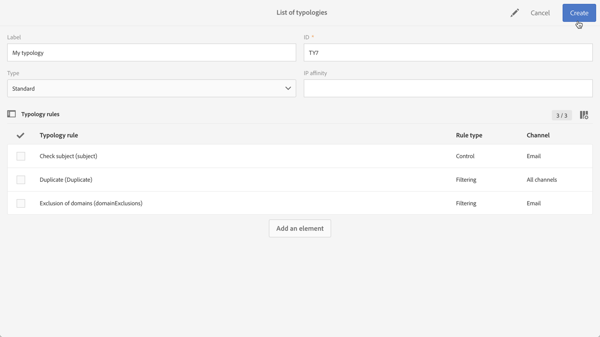

# 管理類型 {#managing-typologies}

## 關於類型 {#about-typologies}

類型是一組規則，可讓您在傳送郵件之前檢查郵件是否有效。例如：訊息內容並非空白、發生取消訂閱、排除重複內容等。

您可以透過 **[!UICONTROL Administration]** > **[!UICONTROL Channels]** > **[!UICONTROL Typologies]** 功能表選單存取類型。依預設，應用程式中會提供預設的類型。您可以依據自己的需求，建立自己的類型或修改現有的類型。

對於每個類型，**[!UICONTROL Typology rules]** 區段會列出規則集，此規則會在使用包含訊息的類型時執行。

>[!NOTE]
>
>若要取得其中一個類型規則的詳細資料，請連按兩下。規則將以唯讀模式顯示。

## 建立類型 {#creating-a-typology}

若要建立新的類型，請依照下列步驟進行：

1. 存取 **[!UICONTROL Administration]** > **[!UICONTROL Channels]** > **[!UICONTROL Typologies]** 功能表。

1. 類型清單隨即顯示。按一下 **[!UICONTROL Create]** 按鈕。

   

1. 定義類型 **[!UICONTROL Label]**，然後按一下 **[!UICONTROL Add an element]** 按鈕，以選取您要加入的類型規則。有關類型規則的詳細資訊，請參閱[本區段](../../sending/using/managing-typology-rules.md)。

   

   >[!NOTE]
   >
   >欄位 **[!UICONTROL IP affinity]** 可讓您依據自己的設定來管理相關性。會在執行個體的設定檔案中定義。如果您要使用相關性，請聯絡您的管理員。

1. 按一下 **[!UICONTROL Create]** 以確認您的選取。您的類型現已準備就緒，而可用於訊息。

## 將類型套用到訊息 {#applying-typologies-to-messages}

將分類與訊息或訊息範本產生關聯時，將執行包含在類型中的類型規則，以檢查消息是否有效。

>[!NOTE]
>
>只能為每個訊息或訊息範本指派單一類型。

若要將類型連結至訊息，請遵循下列步驟：

1. 存取訊息屬性。請注意，可從 **[!UICONTROL Resources]** > **[!UICONTROL Templates]** 導覽功能表存取訊息範本。

1. 在 **[!UICONTROL Advanced parameters]** > **[!UICONTROL Preparation]** 區段中，選取要連結至訊息的類型。

   

1. 按一下 **[!UICONTROL Confirm]**。

   選取的類型現在會連結至訊息。系統將執行其所有相關的類型規則，以檢查訊息是否有效。
