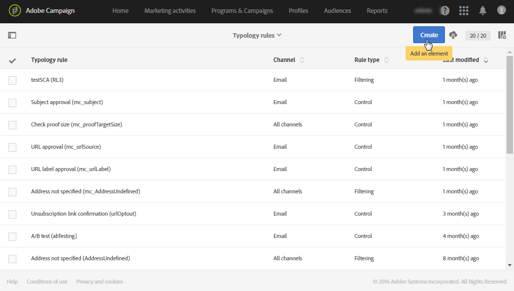

# 管理類型規則 {#managing-typology-rules}

## 關於類型規則 {#about-typology-rules}

類型規則是商業規則，可讓您在傳送訊息前先對訊息執行檢查和篩選。類型規則的可用類型為：

* **篩選**&#x200B;規則：此類型的規則可讓您根據查詢中定義的條件排除訊息目標的一部分，例如，已傳送特定數量之電子郵件的隔離設定檔。如需詳細資訊，請參閱[本區段](../../sending/using/filtering-rules.md)。

* **疲勞**&#x200B;規則：此類型的規則可讓您定義每個設定檔的訊息數目上限，以避免過度索取訊息。如需詳細資訊，請參閱[本區段](../../sending/using/fatigue-rules.md)。

* **控制**&#x200B;規則：此類型的規則可讓使用者在傳送訊息之前檢查訊息的有效性和品質，例如字元顯示、SMS　訊息大小、位址格式等。如需詳細資訊，請參閱[本區段](../../sending/using/control-rules.md)。

可於「**[!UICONTROL Administration]** > **[!UICONTROL Channels]** > **[!UICONTROL Typologies]** > **[!UICONTROL Typology rules]**」功能表取得類型規則。

依預設，有數種現成的&#x200B;**篩選**&#x200B;和&#x200B;**控制**&#x200B;類型規則可供使用。在[篩選規則](../../sending/using/fatigue-rules.md)和[控制規則](../../sending/using/control-rules.md)各節中會詳細說明這些規則。

您可以視需要修改現有的類型規則或建立新規則，但 **[!UICONTROL Control]** 規則除外，因為這類規則是唯讀狀態且無法修改。

## 建立類型規則 {#creating-a-typology-rule}

建立類型規則的主要步驟如下：

1. 存取「**[!UICONTROL Administration]** / **[!UICONTROL Channels]** / **[!UICONTROL Typologies]** / **[!UICONTROL Typology rules]**」功能表，然後按一下 **[!UICONTROL Create]**。

   

1. 輸入類型 **[!UICONTROL Label]**，然後指定該規則應套用的 **[!UICONTROL Channel]**。

   

1. 指定類型規則 **[!UICONTROL Type]**，然後視需要進行設定。請注意，類型規則設定視其類型而異。如需詳細資訊，請參閱&#x200B;**[篩選規則](../../sending/using/filtering-rules.md)**及**[&#x200B;疲勞規則](../../sending/using/fatigue-rules.md)**章節。

1. 選取您要包含新規則的類型。要執行此操作，請選取 **[!UICONTROL Typologies]** 標籤，然後按一下 **[!UICONTROL Create element]** 按鈕。

   

1. 選取需要的類型，然後按一下 **[!UICONTROL Confirm]**。

   

1. 在選取所有類型之後，按一下 **[!UICONTROL Create]** 以確認建立類型規則。

## 類型規則執行順序 {#typology-rules-execution-order}

類型規則會依定位、分析和訊息個人化階段期間指定的順序執行。

在標準操作模式下，會依下列順序套用規則：

1. 控制規則（如果這些規則是在定位開始時套用）。
1. 篩選規則：

   * 地址限定的原生應用程式規則： 塊清單上的已定義地址／未驗證地址／地址／隔離地址／地址質量。
   * 篩選由使用者定義的規則。

1. 控制規則（如果這些規則是在定位結束時套用）。
1. 控制規則（如果這些規則是在個人化開始時套用）。
1. 控制規則（如果這些規則是在個人化結束時套用）。

不過，您可以調整每個類型中相同規則類型的執行順序。事實上，在相同的訊息處理階段期間執行多個規則時，您就能選取套用這些規則的順序。

例如，執行順序位於 20 號的篩選規則將在執行順序位於 30 號的篩選規則之前執行。

在類型規則的 **[!UICONTROL Properties]**，您可以設定其執行順序。必須套用數個規則時，每個規則的執行順序會決定要優先處理的規則。如需詳細資訊，請參閱[類型規則執行順序](#typology-rules-execution-order)一節。

如果您不想在分析規則關注訊息時套用規則，則可透過其 **[!UICONTROL Properties]** 停用類型規則。

