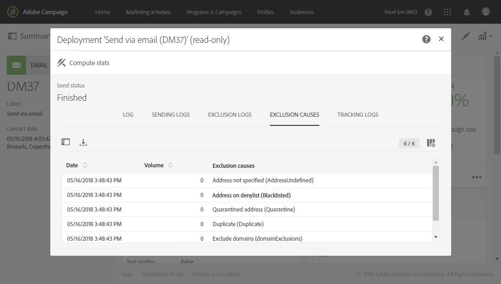

# 監控傳送{#monitoring-a-delivery}

監控交付和衡量其影響的方法有幾種：

* **消息日誌**:這些記錄檔可直接從訊息儀表板存取。 它們會顯示傳送的詳細資料、已排除的目標、原因，以及開啟和點按等追蹤資訊。

   要查看消息日誌，請按一下塊右下方的圖 **[!UICONTROL Deployment]** 標。

   數個標籤包含與、、、和 **[!UICONTROL Sending logs]**&#x200B;相關 **[!UICONTROL Exclusion logs]**&#x200B;的 **[!UICONTROL Exclusion causes]**&#x200B;資 **[!UICONTROL Tracking logs]** 訊 **[!UICONTROL Tracked URLs]**。 請參閱 [傳送記錄](#delivery-logs)。

   

   記錄檔包含與傳送和校樣相關的所有訊息。 特定圖示可讓您識別錯誤或警告。 有關詳細資訊，請參閱 [批准消息](../../sending/using/previewing-messages.md)。

   您可以按一下按鈕，以匯出記 **[!UICONTROL Export list]** 錄檔。

   

* **傳送警報**:為了追蹤傳送成功或失敗，Adobe Campaign提供電子郵件警報系統，可傳送通知給使用者重要的系統活動。
* **報表**:從訊息控制面板，您可以存取此特定訊息的數個報表。 您也有功 **[!UICONTROL Reports]** 能表，可讓您存取內建或自訂報表的完整清單，以便用來概述與訊息或促銷活動相關的特定量度。
* 管理員也可以匯出個別檔案中的記錄檔，以便在您自己的報表或BI工具中處理。 有關詳細資訊，請參 [閱導出日誌](../../automating/using/exporting-logs.md)。

**相關主題：**

* [發生故障時接收警報](../../sending/using/receiving-alerts-when-failures-happen.md)
* [報表](../../reporting/using/about-dynamic-reports.md)

## 傳送記錄檔 {#delivery-logs}

### 傳送記錄檔 {#sending-logs}

此標 **[!UICONTROL Sending logs]** 簽提供此傳送每次發生的記錄。 已傳送訊息的清單及其狀態會儲存在此處。 它可讓您檢視每個收件者的傳送狀態。

對於每個具有狀態 **[!UICONTROL Sent]** 的配置檔案， **[!UICONTROL Date]** 列顯示消息的發送時間。

要訪問特定發送日誌的詳細資訊，請按一下相應行右側的鉛筆表徵圖。

所有發送日誌詳細資訊均為只讀。 您也可以看到鏡像頁面的預覽。

>[!NOTE]
>
>若要在促銷活動使用者介面中顯示鏡像頁面演算，鏡像頁面伺服器URL必須安全。 在這種情況下，在設定您的品牌時，請使用https://而非http://來 [設定此URL](../../administration/using/branding.md#configuring-and-using-brands)。

### 排除記錄檔 {#exclusion-logs}

該選 **[!UICONTROL Exclusion logs]** 項卡列出已從已發送的目標中排除的所有消息，並指定發送失敗的原因。

### 排除原因 {#exclusion-causes}

該選 **[!UICONTROL Exclusion causes]** 項卡顯示從目標發送中排除的消息的卷（以消息數計）。

