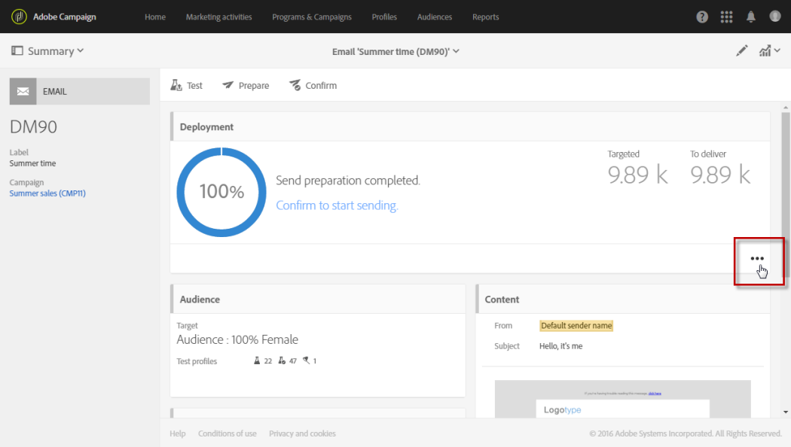

# 準備傳送{#preparing-the-send}

準備對應於計算目標母體以及為目標中包含的每個設定檔產生訊息內容的步驟。 準備完成後，即可立即發送消息，或在[計畫日期和時間](../../sending/using/about-scheduling-messages.md)發送消息。

1. 若要開始準備傳送，請按一下動作列中的&#x200B;**Prepare**&#x200B;按鈕。

   

1. **[!UICONTROL Deployment]**&#x200B;區塊會顯示準備進度，然後顯示準備統計資料：目標訊息數、要傳送的訊息數等。

   根據目標母體的大小，此操作可能需要一些時間。

   

1. 使用動作列中的&#x200B;**Stop**&#x200B;按鈕，隨時停止準備工作。

   在準備階段期間，不會傳送任何訊息。 因此，您可以開始或停止此操作，而不會有影響任何內容的風險。

   

1. 您的訊息會在準備傳送階段期間自動儲存。 如果您需要在準備步驟後對訊息的排程進行任何變更，則需確定您再次按一下&#x200B;**[!UICONTROL Prepare]**&#x200B;按鈕，以便將這些變更納入考量。 有關如何調度消息的詳細資訊，請參閱此[page](../../sending/using/about-scheduling-messages.md)。

   

1. 若要檢視準備記錄，請按一下位於區塊右下方的按鈕。

   

1. 將開啟&#x200B;**[!UICONTROL Deployment]**&#x200B;窗口，更正所有錯誤，然後重新開始準備。

   最後一條日誌消息顯示所有錯誤消息和錯誤數。 特定圖示會顯示遇到的錯誤類型：黃色表徵圖表示非關鍵處理錯誤，紅色表徵圖表示阻止傳送的嚴重錯誤。

   

1. 確認傳送訊息之前，請先檢查準備統計資料。 如果要傳送的訊息數量與您的設定不對應，請編輯目標母體（請參閱[在訊息](../../audiences/using/selecting-an-audience-in-a-message.md)中選取對象）並重新開始準備。

準備完成後，即可傳送您的訊息。 如需詳細資訊，請參閱[確認傳送](../../sending/using/confirming-the-send.md)。

**類型規則**

Adobe Campaign隨附一組內建類型規則，這些規則會在訊息準備期間套用。 它們用於檢查郵件是否有效並符合您的質量標準。 請參閱[類型](../../sending/using/about-typology-rules.md)。 例如，您可以定義自己的類型規則，以設定全域跨通道疲勞規則，該規則會自動從促銷活動中排除過度請求的設定檔。 請參閱[疲勞規則](../../sending/using/fatigue-rules.md)。

**SMS訊息檢查**

如果您已將個人化欄位或條件文字插入SMS訊息的內容，這些因素可能會引入GSM編碼未考慮的字元。 執行準備時，會監控訊息長度，且如果訊息超過限制，則會顯示警告訊息。

如需詳細資訊，請參閱[SMS編碼、長度和音譯](../../administration/using/configuring-sms-channel.md#sms-encoding--length-and-transliteration)及[個人化SMS訊息](../../channels/using/personalizing-sms-messages.md)區段。
