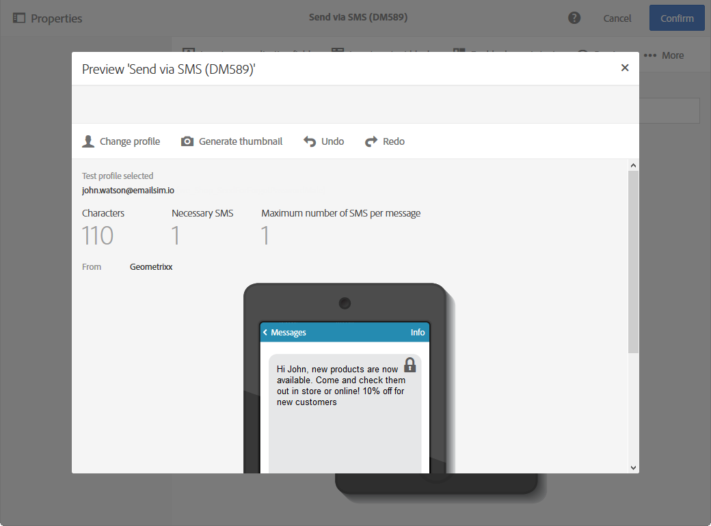

# 預覽傳遞 {#previewing-messages}

## 預覽電子郵件 {#previewing-emails}

Campaign Standard可讓您在傳送訊息之前預覽訊息，以檢查其個人化以及收件者如何看到訊息。

訊息預覽是使用 **測試設定檔** 新增至訊息目標的訊息。

針對 **電子郵件** 訊息，Campaign Standard可讓您使用目標設定檔來預覽訊息，而非測試設定檔。 這可讓您取得特定設定檔將收到之訊息的精確表示。 如需詳細資訊，請參閱[使用目標設定檔測試電子郵件訊息](../../sending/using/testing-messages-using-target.md)。

若要使用測試設定檔預覽訊息，請遵循下列步驟：

1. 在 [電子郵件設計工具](../../designing/using/designing-content-in-adobe-campaign.md)，按一下 **[!UICONTROL Preview]** 按鈕。

   

   案頭檢視和您電子郵件的回應式行動檢視會並排顯示。

1. 每次預覽時都會執行自動反垃圾郵件檢查。 按一下 **[!UICONTROL Anti-spam analysis]** 按鈕，以了解有關警告的詳細資訊。

   

1. 選取 **[!UICONTROL Change profile]** 按鈕，選擇要測試個人化元素的測試設定檔。

   

1. 若要退出 **[!UICONTROL Preview]** 模式，按一下 **[!UICONTROL Edit]** 按鈕。

   

**相關主題**

* [管理測試設定檔](../../audiences/using/managing-test-profiles.md)
* [使用目標設定檔測試電子郵件訊息](../../sending/using/testing-messages-using-target.md)
* [傳送校樣](../../sending/using/sending-proofs.md)

## 預覽SMS訊息 {#previewing-sms}

針對 **簡訊** 訊息，Campaign Standard可讓您使用測試設定檔預覽訊息。 這可讓您取得特定設定檔將收到之訊息的精確表示。 如需詳細資訊，請參閱[管理測試設定檔](../../audiences/using/managing-test-profiles.md)。

若要使用測試設定檔預覽SMS訊息，請遵循下列步驟：

1. 填入 **[!UICONTROL Properties]** 您的SMS訊息和選取的對象，您可以個人化您的傳送。 如需詳細資訊，請參閱 [節](../../channels/using/personalizing-sms-messages.md).

   

1. 個人化您的內容後，按一下 **[!UICONTROL Create]** 若要存取 **[!UICONTROL Summary]** 窗口。

1. 從 **[!UICONTROL Summary]** 按一下 **[!UICONTROL Content]** 以開始預覽您的傳送。

   

1. 按一下 **[!UICONTROL Preview]** 的下一頁。

   

1. 按一下 **[!UICONTROL Change profile]** 選取測試設定檔，然後 **[!UICONTROL Confirm]**.

   

您現在可以根據選取的測試設定檔，看到訊息的確切表示。

**相關主題**

* [關於簡訊訊息](../../channels/using/about-sms-messages.md)
* [建立簡訊訊息](../../channels/using/creating-an-sms-message.md)
* [個人化簡訊訊息](../../channels/using/personalizing-sms-messages.md)

## 預覽推播通知 {#previewing-push}

針對 **推播通知**,Campaign Standard可讓您使用測試設定檔預覽訊息。 這可讓您取得特定設定檔將收到之訊息的精確表示。 如需詳細資訊，請參閱[管理測試設定檔](../../audiences/using/managing-test-profiles.md)。

若要使用測試設定檔預覽推播通知，請遵循下列步驟：

1. 填入 **[!UICONTROL Properties]** 您的推播通知和選取的對象，您可以個人化您的傳送。 如需詳細資訊，請參閱 [自訂推播通知](../../channels/using/customizing-a-push-notification.md).

1. 個人化內容後，您可以根據預覽視窗中的裝置和作業系統，直接檢查推播通知的轉譯。

   

1. 若要使用測試設定檔預覽推播通知，請按一下 **[!UICONTROL Preview with test profile]**.

   

1. 然後選取您的測試設定檔 **[!UICONTROL Confirm]**.

您現在可以根據選取的測試設定檔，看到訊息的確切表示。

**相關主題**

* [關於推送通知](../../channels/using/about-push-notifications.md)
* [準備和傳送推送通知](../../channels/using/preparing-and-sending-a-push-notification.md)
* [自訂推送通知](../../channels/using/customizing-a-push-notification.md)

## 預覽應用程式內訊息 {#previewing-in-app}

針對 **應用程式內**,Campaign Standard可讓您使用測試設定檔預覽訊息。 這可讓您取得特定設定檔將收到之訊息的精確表示。 如需詳細資訊，請參閱[管理測試設定檔](../../audiences/using/managing-test-profiles.md)。

若要使用測試設定檔預覽應用程式內訊息，請遵循下列步驟：

1. 填入 **[!UICONTROL Properties]** ，請選取您的對象並設定您的 **[!UICONTROL Triggers]**，您可以個人化您的傳遞。 如需詳細資訊，請參閱 [自訂應用程式內訊息](../../channels/using/customizing-an-in-app-message.md).

1. 將內容個人化後，您可以根據預覽視窗中的裝置和作業系統，直接檢查應用程式內訊息的轉譯。

   

1. 若要使用測試設定檔預覽應用程式內訊息，請按一下 **[!UICONTROL Preview]**.

   

1. 然後選取您的測試設定檔 **[!UICONTROL Confirm]**.

您現在可以根據選取的測試設定檔，看到訊息的確切表示。

**相關主題**

* [關於應用程式內訊息傳送](../../channels/using/about-in-app-messaging.md)
* [準備和傳送應用程式內訊息](../../channels/using/preparing-and-sending-an-in-app-message.md)
* [自訂應用程式內訊息](../../channels/using/customizing-an-in-app-message.md)
