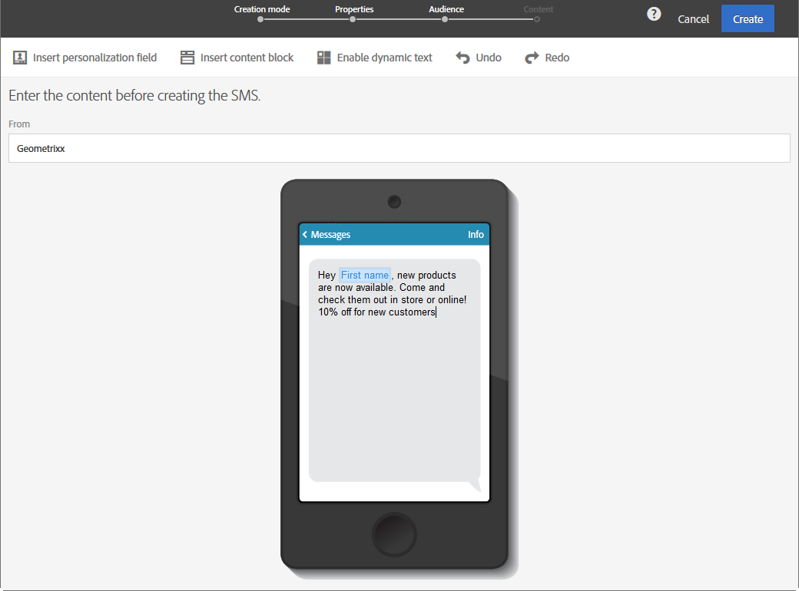
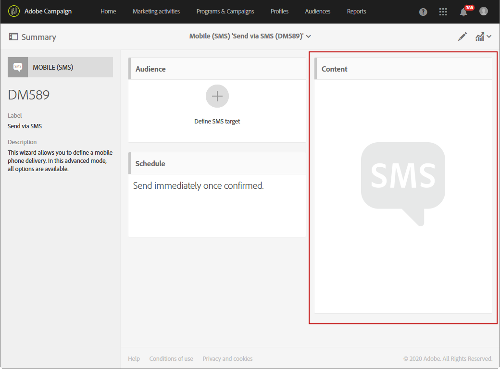

# 預覽傳送 {#previewing-messages}

## 預覽電子郵件 {#previewing-emails}

Campaign Standard可讓您在傳送訊息之前先預覽訊息，以檢查其個人化及收件者將如何看到訊息。

訊息預覽是使用您新 **增至訊息目標的** 「測試設定檔」來執行。

對於 **電子郵件** ,Campaign Standard可讓您使用目標描述檔來預覽訊息，而非測試描述檔。 這可讓您獲得特定描述檔將會收到之訊息的精確表示。 如需詳細資訊，請參閱[使用目標設定檔測試電子郵件訊息](../../sending/using/testing-messages-using-target.md)。

若要使用測試設定檔預覽訊息，請依照下列步驟進行：

1. 在「電子郵 [件設計器](../../designing/using/designing-content-in-adobe-campaign.md)」中，按一下 **[!UICONTROL Preview]** 按鈕。

   

   案頭檢視和回應式行動裝置檢視會並排顯示您的電子郵件。

1. 每次預覽期間會執行自動反垃圾郵件檢查。 按一下 **[!UICONTROL Anti-spam analysis]** 按鈕，以進一步瞭解警告。

   

1. 選擇 **[!UICONTROL Change profile]** 按鈕，以選擇要測試個人化元素的測試描述檔。

   

1. 要退出模 **[!UICONTROL Preview]** 式，請按一下 **[!UICONTROL Edit]** 螢幕左上角的按鈕。

   

**相關主題**

* [管理測試設定檔](../../audiences/using/managing-test-profiles.md)
* [使用目標設定檔測試電子郵件訊息](../../sending/using/testing-messages-using-target.md)
* [傳送校樣](../../sending/using/sending-proofs.md)

## 預覽SMS訊息 {#previewing-sms}

對於 **SMS訊息** ,Campaign Standard可讓您使用測試設定檔預覽訊息。 這可讓您獲得特定描述檔將會收到之訊息的精確表示。 如需詳細資訊，請參閱[管理測試設定檔](../../audiences/using/managing-test-profiles.md)。

若要使用測試設定檔預覽SMS訊息，請依照下列步驟進行：

1. 在您填入SMS訊息 **[!UICONTROL Properties]** 並選取受眾後，您就可以個人化您的傳遞內容。 For more information, refer to [section](../../channels/using/personalizing-sms-messages.md).

   

1. 個人化您的內容後，按一 **[!UICONTROL Create]** 下以存取視 **[!UICONTROL Summary]** 窗。

1. 在視窗中 **[!UICONTROL Summary]** ，按一下以 **[!UICONTROL Content]** 開始預覽您的傳送。

   

1. 在工 **[!UICONTROL Preview]** 具列中按一下。

   

1. 按一 **[!UICONTROL Change profile]** 下以選擇您的測試設定檔 **[!UICONTROL Confirm]**。

   

您現在可以根據選取的測試設定檔，看到訊息的精確表示。

**相關主題**

* [關於 SMS 訊息](../../channels/using/about-sms-messages.md)
* [建立 SMS 訊息](../../channels/using/creating-an-sms-message.md)
* [個人化 SMS 訊息](../../channels/using/personalizing-sms-messages.md)

## 預覽推播通知 {#previewing-push}

對於推 **播通知**,Campaign Standard可讓您使用測試設定檔預覽訊息。 這可讓您獲得特定描述檔將會收到之訊息的精確表示。 如需詳細資訊，請參閱[管理測試設定檔](../../audiences/using/managing-test-profiles.md)。

若要使用測試設定檔預覽推播通知，請遵循下列步驟：

1. 在您填入推播通 **[!UICONTROL Properties]** 知並選取受眾後，就可以個人化您的傳送。 如需詳細資訊，請參閱自 [訂推播通知](../../channels/using/customizing-a-push-notification.md)。

1. 在個人化您的內容後，您可以在預覽視窗中，根據裝置和作業系統，直接檢查推播通知的轉譯。

   

1. 若要使用測試設定檔預覽推播通知，請按一下 **[!UICONTROL Preview with test profile]**。

   

1. 然後選擇您的測試設定檔 **[!UICONTROL Confirm]**。

您現在可以根據選取的測試設定檔，看到訊息的精確表示。

**相關主題**

* [關於推播通知](../../channels/using/about-push-notifications.md)
* [準備和傳送推播通知](../../channels/using/preparing-and-sending-a-push-notification.md)
* [自訂推播通知](../../channels/using/customizing-a-push-notification.md)

## 預覽應用程式內訊息 {#previewing-in-app}

對於 **應用程式內**,Campaign Standard可讓您使用測試設定檔預覽訊息。 這可讓您獲得特定描述檔將會收到之訊息的精確表示。 如需詳細資訊，請參閱[管理測試設定檔](../../audiences/using/managing-test-profiles.md)。

若要使用測試設定檔預覽應用程式內訊息，請依照下列步驟進行：

1. 在您填入應用程 **[!UICONTROL Properties]** 式內訊息、選取受眾並設定後，就可以 **[!UICONTROL Triggers]**&#x200B;個人化您的傳送。 如需詳細資訊，請參 [閱自訂應用程式內訊息](../../channels/using/customizing-an-in-app-message.md)。

1. 在個人化您的內容後，您可以在預覽視窗中，根據裝置和作業系統，直接檢查應用程式內訊息的轉譯。

   

1. 若要使用測試設定檔預覽應用程式內訊息，請按一下 **[!UICONTROL Preview]**。

   

1. 然後選擇您的測試設定檔 **[!UICONTROL Confirm]**。

您現在可以根據選取的測試設定檔，看到訊息的精確表示。

**相關主題**

* [關於應用程式內訊息傳送](../../channels/using/about-in-app-messaging.md)
* [準備和傳送應用程式內訊息](../../channels/using/preparing-and-sending-an-in-app-message.md)
* [自訂應用程式內訊息](../../channels/using/customizing-an-in-app-message.md)