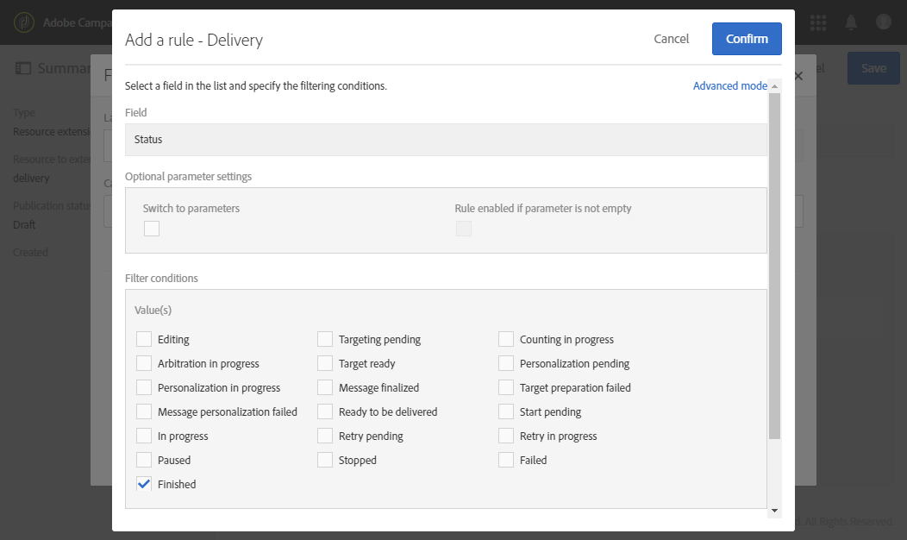

# 發生故障時收到警報{#receiving-alerts-when-failures-happen}

## 關於傳送警報{#about-delivery-alerting}

**傳送警報**&#x200B;功能是警報管理系統，使一組用戶能夠自動接收包含其傳送執行資訊的通知。

所傳送的通知依預設包含下列准則的報表：

* 傳送失敗
* 準備失敗的交貨
* 軟反彈錯誤率不佳的傳送
* 硬反彈錯誤率不佳的傳送
* 待定狀態比平常長的傳送
* 低吞吐量的傳送
* 傳送進行中

警報的收件者可監控Adobe Campaign正在處理的傳送，並在執行時發生問題時採取適當的動作。

這些警報通知可根據Adobe Campaign介面中控制面板所定義的特定警報標準加以自訂。

>[!NOTE]
>
>警報通知僅通過電子郵件發送。

傳送的通知包含：

* **[!UICONTROL Summary]**&#x200B;顯示符合您所定義標準的傳送數量，以及您針對每個標準選擇的標籤／色彩。
* **[!UICONTROL Details]**&#x200B;區段會列出為對應控制面板定義的所有傳送標準，以及每個標準的所有傳送。

## 傳送警報控制面板{#delivery-alerting-dashboards}

### 關於傳送警報控制面板{#about-delivery-alerting-dashboards}

若要管理通知的收件者，請定義警報標準並存取警報記錄，您必須使用控制面板。

>[!NOTE]
>
>要訪問和配置控制面板和警報標準，您必須具有管理權限或顯示在&#x200B;**交付監管員**&#x200B;安全組中。 標準使用者無法存取Adobe Campaign介面中的控制面板。 他們只能接收警報通知。 如需Adobe Campaign中使用者與安全性的詳細資訊，請參閱[使用者類型](../../administration/using/users-management.md)和[關於安全性群組](../../administration/using/managing-groups-and-users.md#about-security-groups)。

從Adobe Campaign介面，您可以：

* 建立並管理傳送警報控制面板。 請參閱[建立傳送警報儀表板](#creating-a-delivery-alerting-dashboard)。
* 定義並管理每個控制面板的傳送警報標準。 例如，您可以根據準備失敗的傳送或只有低吞吐量的傳送來建立警報。 請參閱[關於警報標準](#about-alerting-criteria)。
* 修改每個控制面板的條件參數。 請參閱[標準參數](#criteria-parameters)。
* 為每個控制面板定義一組收件者。

   例如，您只想通知具有失敗傳送之管理權限的使用者。 但是，您希望行銷使用者以彈跳錯誤率接收有關傳送的資訊。 因此，您需要建立兩個不同的控制面板，並定義每個收件者群組所需的准則。

* 存取每個控制面板所有已傳送警報的歷史記錄。

   選取控制面板時，預設會顯示此控制面板的上次傳送警報。 所有傳送的警報都列在畫面左側。 按一下&#x200B;**[!UICONTROL History]**&#x200B;清單中的項目，以存取對應的警報。

### 建立傳送警報控制面板{#creating-a-delivery-alerting-dashboard}

如果您想要根據特定條件傳送通知給不同的使用者群組，則需要使用數個控制面板。 若要建立新控制面板：

1. 前往 **[!UICONTROL Administration]** > **[!UICONTROL Channels]** > **[!UICONTROL Delivery alerting]**。
1. 選取 **[!UICONTROL Delivery alerting dashboards]** 並按一下 **[!UICONTROL Create]**。
1. 勾選&#x200B;**[!UICONTROL Enabled]**&#x200B;方塊以啟用目前的控制面板。

   如果此選項已停用，連結至此控制面板的通知將不再傳送。 此選項預設為停用。

   

1. 從&#x200B;**[!UICONTROL Alert group]**&#x200B;下拉式清單中選取您要通知的收件者群組。 要修改或建立組，請參閱[建立安全組和分配用戶](../../administration/using/managing-groups-and-users.md#creating-a-security-group-and-assigning-users)。
1. 在&#x200B;**[!UICONTROL Delivery alerting criteria]**&#x200B;區段中，按一下&#x200B;**[!UICONTROL Create element]**&#x200B;以新增條件。 請參閱[關於警報標準](#about-alerting-criteria)。
1. 選取 **[!UICONTROL Edit properties]** 按鈕。在&#x200B;**[!UICONTROL Criteria parameters]**&#x200B;標籤中，定義如何套用標準。 請參閱[標準參數](#criteria-parameters)。
1. 按一下&#x200B;**[!UICONTROL Create]**&#x200B;以儲存控制面板。

現在，每當傳送符合您在此控制面板中定義的標準時，就會傳送警報通知給指定的使用者群組。

## 傳送警報標準{#delivery-alerting-criteria}

### 關於警報條件{#about-alerting-criteria}

要訪問傳送警報標準，請轉至&#x200B;**[!UICONTROL Administration]** > **[!UICONTROL Channels]** > **[!UICONTROL Delivery alerting]**&#x200B;並選擇&#x200B;**[!UICONTROL Delivery alerting criteria]**。

傳送警報控制面板中可使用下列標準：

* **[!UICONTROL Deliveries failed]**:在定義範圍內排程的任何傳送，其狀態都有誤。
* **[!UICONTROL Deliveries with preparation failed]**:任何在定義範圍內修改的傳送，其準備步驟（目標計算和內容產生）均失敗。有關詳細資訊，請參閱[準備send](../../sending/using/preparing-the-send.md)。
* **[!UICONTROL Delivery with bad error ratio for soft bounces]**:任何已排程在定義範圍內的傳送，其狀態至少為 **[!UICONTROL In progress]**，且軟反彈錯誤率大於定義的百分比。
* **[!UICONTROL Delivery with bad error ratio for hard bounces]**:任何已排程在定義範圍內的傳送，其狀態至少 **[!UICONTROL In progress]**&#x200B;為，硬反彈錯誤率大於定義的百分比。
* **[!UICONTROL Deliveries with long start pending]**:任何在定義範圍內排程的傳送， **[!UICONTROL Start pending]** 其狀態長於定義的持 **[!UICONTROL Start pending]** 續時間，狀態表示系統尚未考慮訊息。
* **[!UICONTROL Deliveries with low throughput]**:任何開始的傳送時間都超過定義的持續時間，且小於已處理消息的定義百分比，且吞吐量低於定義值。
* **[!UICONTROL Deliveries in progress]**:在已定義範圍內，以狀態排程的任何 **[!UICONTROL In progress]** 傳送。

>[!NOTE]
>
>套用至上述准則的所有參數都有預設值。 這些值可在傳送警報控制面板的&#x200B;**[!UICONTROL Criteria parameters]**&#x200B;標籤中變更。 請參閱[標準參數](#criteria-parameters)。

您可以從&#x200B;**[!UICONTROL Delivery alerting criteria]**&#x200B;清單中選取任何項目來存取其詳細資訊。

對於每個標準，可以定義以下設定：

* **[!UICONTROL Indicators to add in alerts]**，也就是說，在通知區段中，對應於選 **[!UICONTROL Details]** 定標準的傳送會出現的欄。

   

* **[!UICONTROL Alert type]**，這表示通知摘要中傳送標準旁出現的標籤和顏色。

   

* **[!UICONTROL Criteria frequency]**:如果滿足一個傳送的標準，則在監控期間內發送的每個通知中重複該標準。否則，每天（第一次發生時）只會根據一個傳送的警報標準傳送一個警報。

   根據預設，所有准則的此選項都設為每天一次。

**相關主題：**

* [傳送記錄檔](../../sending/using/monitoring-a-delivery.md#sending-logs)
* [警報頻率](#alerting-frequency)
* [行銷活動圖示和狀態](../../start/using/marketing-activities.md#marketing-activity-icons-and-statuses)

### 建立傳送警報標準{#creating-a-delivery-alerting-criterion}

您可以建立新的交付警報標準，以更好地滿足您的需求。

例如，您可以建立新標準，以傳送列出所有狀態為&#x200B;**[!UICONTROL Finished]**&#x200B;的傳送的通知。

為此，您首先需要擴充&#x200B;**Delivery**&#x200B;資源，並新增篩選器，讓您只選擇狀態為&#x200B;**[!UICONTROL Finished]**&#x200B;的傳送。

1. 前往&#x200B;**Adobe Campaign** > **管理** > **開發** > **自訂資源**，然後按一下&#x200B;**[!UICONTROL Create]**。
1. 選擇&#x200B;**[!UICONTROL Extend an existing resource]**，從下拉清單中選擇&#x200B;**[!UICONTROL Delivery]**&#x200B;資源，然後按一下&#x200B;**[!UICONTROL Create]**&#x200B;進行編輯。

   

   有關擴展現有資源的詳細資訊，請參閱[定義資源](../../developing/using/creating-or-extending-the-resource.md)。

1. 在&#x200B;**[!UICONTROL Delivery]**&#x200B;資源中，轉至&#x200B;**[!UICONTROL Filter definition]**&#x200B;頁籤，然後按一下&#x200B;**[!UICONTROL Add an element]**&#x200B;以建立篩選器。

   

1. 編輯新的篩選定義：在&#x200B;**[!UICONTROL Filter definition]**&#x200B;視窗中，將&#x200B;**[!UICONTROL Status]**&#x200B;項目拖放至工作區，並選取&#x200B;**[!UICONTROL Finished]**&#x200B;作為篩選條件。

   

   如需建立和編輯自訂篩選器的詳細資訊，請參閱[定義篩選器](../../developing/using/configuring-filter-definition.md)。

1. 儲存變更並發佈資源。 有關詳細資訊，請參閱[發佈自定義資源](../../developing/using/updating-the-database-structure.md#publishing-a-custom-resource)。

   過濾器已建立，現在可以在新的傳送警報標準中選擇。

1. 前往&#x200B;**[!UICONTROL Administration]** > **[!UICONTROL Channels]** > **[!UICONTROL Delivery alerting]**，選擇&#x200B;**[!UICONTROL Delivery alerting criteria]**&#x200B;並按一下&#x200B;**[!UICONTROL Create]**。
1. 在&#x200B;**[!UICONTROL Delivery filter applied by this criterion]**&#x200B;下拉式清單中，選取您剛建立的篩選。

   

   您可以用與預設准則相同的方式定義准則的設定。 請參閱[關於警報標準](#about-alerting-criteria)。

建立後，這些准則可以新增至傳送警報控制面板以及其他准則。 請參閱[關於傳送警報控制面板](#about-delivery-alerting-dashboards)。

**相關主題：**

[新增或擴充資源](../../developing/using/key-steps-to-add-a-resource.md)

## 傳送警報參數{#delivery-alerting-parameters}

### 准則參數{#criteria-parameters}

在[傳送警報控制面板](#creating-a-delivery-alerting-dashboard)的&#x200B;**[!UICONTROL Criteria parameters]**&#x200B;標籤中，您可以定義套用至此控制面板中所選標準的設定。

* **[!UICONTROL Delivery target minimum size]**:例如，如果您在此欄位中輸入100，則只會針對目標等於或大於100個收件者的傳送傳送通知。此參數適用於所有條件。
* **[!UICONTROL Monitoring period before and after the contact date (in hours)]**:當前時間前後的小時數。只考慮具有此時間範圍內之聯繫日期的交貨。 此參數適用於所有條件。 依預設，此欄位的值會設為24小時。

   有關聯繫日期的詳細資訊，請參閱[關於計畫](../../sending/using/about-scheduling-messages.md)。

* **[!UICONTROL Maximum ratio of soft bounce errors]**:系統會針對所有傳送傳送傳送一則通知，其彈跳錯誤率大於指定值。依預設，此欄位的值會設為0.05(5%)。

   有關軟彈回錯的詳細資訊，請參閱[彈回郵件資格](../../sending/using/understanding-delivery-failures.md#bounce-mail-qualification)和[交貨失敗類型清單](../../sending/using/understanding-delivery-failures.md#delivery-failure-types-and-reasons)。

* **[!UICONTROL Maximum ratio of hard bounce errors]**:所有傳送的硬反彈錯誤率大於指定值時，都會傳送通知。依預設，此欄位的值會設為0.05(5%)。

   有關硬彈回錯誤的詳細資訊，請參閱[彈回郵件資格](../../sending/using/understanding-delivery-failures.md#bounce-mail-qualification)和[交貨失敗類型清單](../../sending/using/understanding-delivery-failures.md#delivery-failure-types-and-reasons)。

* **[!UICONTROL Minimum time threshold for delivery in 'Start pending' status (in minutes)]**:系統會針對狀態超過此欄 **[!UICONTROL Start pending]** 位中指定期間的所有傳送傳送 **[!UICONTROL Start pending]** 傳送通知，表示系統尚未考慮訊息。
* **[!UICONTROL Minimum time required for the computation of the throughput (in minutes)]**:此標準只會考 **[!UICONTROL In progress]** 慮超過指定持續時間的已開始傳送(狀態 **[!UICONTROL Deliveries with low throughput]** )。
* **[!UICONTROL Maximum percentage of processed messages for the computation of the throughput]**:標準中只會考慮已處理訊息百分比低於指定百分比的傳送 **[!UICONTROL Deliveries with low throughput]** 內容。
* **[!UICONTROL Minimum expected throughput (in sent messages per hour)]**:只有吞吐量低於指定值的傳送才會考慮此 **[!UICONTROL Deliveries with low throughput]** 准則。
* **[!UICONTROL Minimum processed ratio required for 'Deliveries in progress' criterion]**:只有已處理訊息的百分比高於指定百分比的傳送才會納入考量。

### 警報頻率{#alerting-frequency}

**[!UICONTROL Frequency of delivery alerting]**&#x200B;選項允許定義兩個警報發送之間的延遲。 預設為10分鐘。

您可以透過&#x200B;**[!UICONTROL Administration]** > **[!UICONTROL Application settings]** > **[!UICONTROL Options]**&#x200B;功能表來變更此設定。

>[!NOTE]
>
>此選項適用於Adobe Campaign中定義的所有控制面板。 不能為每個儀表板設定特定頻率。

## 傳送警報原因{#delivery-alerting-reasons}

**傳送警報**&#x200B;功能可透過電子郵件和儀表板自動通知您所有參與的Adobe Campaign使用者有關傳送執行狀態的資訊。

現在，當您收到傳送警報通知時，請提供一些可以執行的提示。

首先，檢查傳送的&#x200B;**記錄**&#x200B;標籤，以檢視與傳送和校樣相關的所有資訊。 紅色和黃色圖示可讓您識別錯誤或警告。 紅色圖示表示重大錯誤，無法開始傳送。

要查看每次發生傳送的歷史記錄，請選擇&#x200B;**[!UICONTROL Sending logs]**&#x200B;頁籤。 它包含已傳送訊息的清單及其狀態。 您可以在此處檢查每個收件者的傳送狀態（**[!UICONTROL Sent]**、**[!UICONTROL Pending]**、**[!UICONTROL Failed]**&#x200B;等）。 有關詳細資訊，請參閱[發送日誌](../../sending/using/monitoring-a-delivery.md#sending-logs)。

以下是根據遞送滿足的條件接收警報通知的幾個可能原因。

* **[!UICONTROL Deliveries failed]**:此准則會通知您所有狀態錯誤的傳送。這可能是因為：

   * 傳送伺服器（MTA、訊息傳送代理）有問題
   * Adobe Campaign傳送伺服器與接收伺服器之間的連線逾時
   * 可傳遞性問題
   * 錯誤的工作流程

   如果傳送是以工作流程觸發，請檢查該工作流程是否已正確啟動。 有關詳細資訊，請參閱[執行工作流](../../automating/using/about-workflow-execution.md)。 否則，請洽詢您的Adobe Campaign管理員以解決問題。

* **[!UICONTROL Deliveries with preparation failed]**:在下列情況下，傳送準備期間可能會發生錯誤：

   * 交貨缺少主題。
   * 個人化欄位中的語法錯誤。
   * 目標丟失。
   * 傳送超過大小限制。

   有關詳細資訊，請參閱[準備send](../../sending/using/preparing-the-send.md)。 不過，這些錯誤通常會在訊息分析期間發現。 請參閱[控制規則](../../sending/using/control-rules.md)。

* **[!UICONTROL Delivery with bad error ratio for soft bounces]**&#x200B;警報的可能原因可能是：

   * 收件者的伺服器已關閉。
   * 收件人的郵箱已滿。

   如需詳細資訊，請查看傳送記錄檔的&#x200B;**[!UICONTROL Exclusion logs]**&#x200B;和&#x200B;**[!UICONTROL Exclusion causes]**&#x200B;標籤。 請參閱[排除記錄](../../sending/using/monitoring-a-delivery.md#exclusion-logs)。

   **[!UICONTROL Delivery with bad error ratio for hard bounces]**&#x200B;警報的可能原因可能是：

   * 收件者會新增至密尼清單，表示他們不再想與他們聯絡。
   * 收件者的電子郵件地址不存在。
   * 收件者的網域不存在。
   * 收件者的伺服器封鎖傳送。

   若要避免軟反彈和硬反彈錯誤，請遵循下列最佳實務：

   * 建立篩選類型規則，以在傳送分析期間排除訊息目標的一部分，例如隔離的收件者。 請參閱[建立篩選規則](../../sending/using/filtering-rules.md)。
   * 定期更新客戶資料庫，以維護良好的隔離管理流程。 請參閱[關於隔離](../../sending/using/understanding-quarantine-management.md#about-quarantines)。
   * 一般而言，請盡可能提高傳遞能力。 請參閱Adobe Campaign [Deliverability](../../sending/using/about-deliverability.md)詳細檔案，並連絡您的Adobe Campaign管理員以取得協助。

* **[!UICONTROL Deliveries with long start pending]**:通常這表示在MTA（消息傳輸代理）級別存在問題。執行進程正在等待某些資源的可用性。 MTA可能尚未啟動。

   **[!UICONTROL Deliveries with low throughput]**:同樣，這是傳遞性問題，意味著MTA太慢。

   如需這些問題的詳細資訊，請洽詢您的Adobe Campaign管理員。

**相關主題：**

* [瞭解傳送故障](../../sending/using/understanding-delivery-failures.md)
* [瞭解隔離管理](../../sending/using/understanding-quarantine-management.md)
* [關於 Campaign 中的加入和退出](../../audiences/using/about-opt-in-and-opt-out-in-campaign.md)

