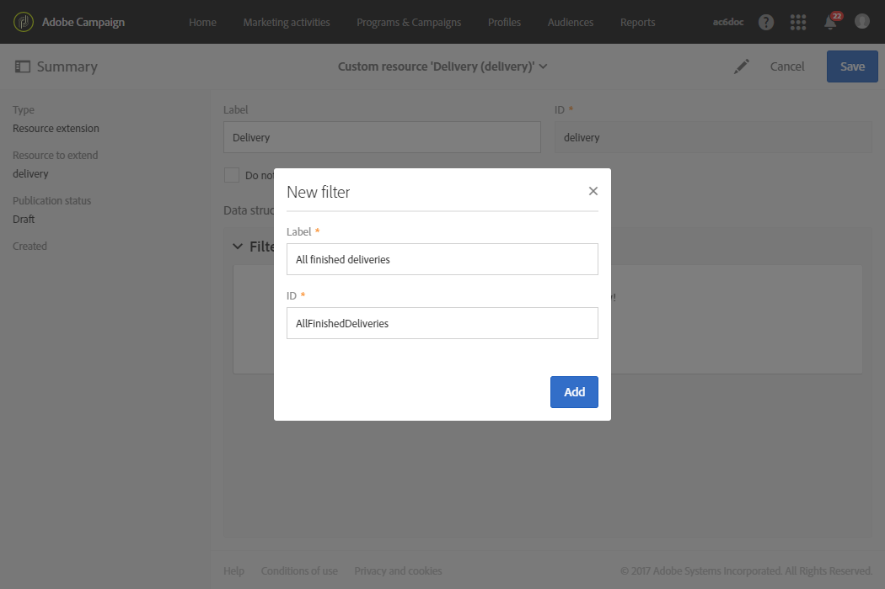

# Receiving alerts when failures happen{#receiving-alerts-when-failures-happen}

## About delivery alerting {#about-delivery-alerting}

**傳送警報** 功能是警報管理系統，可讓一組使用者自動接收通知，其中包含執行其傳送的資訊。

根據下列准則，傳送的通知依預設會包含報表：

* 失敗的傳送
* 準備失敗失敗
* 錯誤的軟反彈機率傳送
* 不良的硬碟反彈率傳送
* 比往常更長擱置狀態的傳送
* 低總處理能力的傳送
* 進行中的傳送

警報的收件者可以監控Adobe Campaign處理的傳送項目，並在執行中發生問題時採取適當的動作。

這些提醒通知可以根據特定警報標準加以自訂，這些標準是透過Adobe Campaign介面中的控制面板定義的。

>[!NOTE]
>
>警報通知只透過電子郵件傳送。

傳送的通知包含：

* A **[!UICONTROL Summary]** displaying the number of deliveries meeting the criteria that you defined and the label/color that you chose for each criterion.
* **[!UICONTROL Details]** 一個區段，列出對應控制面板的所有傳送標準，以及每個標準的所有傳送。

## Delivery alerting dashboards {#delivery-alerting-dashboards}

### About delivery alerting dashboards {#about-delivery-alerting-dashboards}

若要管理通知的收件者，定義警報條件並存取警報記錄，您必須使用控制面板。

>[!NOTE]
>
>To access and configure the dashboards and the alerting criteria, you must have administration rights or appear in the **Delivery supervisors** security group. 標準使用者無法存取Adobe Campaign介面中的控制面板。他們只能接收通知通知。For more on users and security in Adobe Campaign, see [Types of users](../../administration/using/types-of-users.md) and [About security groups](../../administration/using/managing-groups-and-users.md#about-security-groups).

從Adobe Campaign介面，您可以：

* 建立和管理傳送通知控制面板。See [Creating a delivery alerting dashboard](../../sending/using/receiving-alerts-when-failures-happen.md#creating-a-delivery-alerting-dashboard).
* 定義並管理每個控制面板的傳送警報標準。例如，您可以根據傳送失敗的準備或僅提供低總處理能力的傳送來建立警報。See [About alerting criteria](../../sending/using/receiving-alerts-when-failures-happen.md#about-alerting-criteria).
* 修改每個控制面板的標準參數。See [Criteria parameters](../../sending/using/receiving-alerts-when-failures-happen.md#criteria-parameters).
* 定義每個控制面板的收件者群組。

   例如，您想要通知使用者僅有失敗傳送的管理權限。不過，您希望行銷使用者接收有關軟反彈率錯誤的傳送資訊。因此，您需要建立兩個不同的控制面板，並定義每個收件者群組的標準。

* 存取每個控制面板的所有傳送警報記錄。

   選取控制面板時，預設會顯示此控制面板的最後傳送警報。所有傳送的警報都會列在畫面左側。Click an item in the **[!UICONTROL History]** list to access the corresponding alerts.

### Creating a delivery alerting dashboard {#creating-a-delivery-alerting-dashboard}

如果您想要根據特定標準傳送通知給不同的使用者群組，您需要使用數個控制面板。若要建立新控制面板：

1. Go to **[!UICONTROL Administration]** &gt; **[!UICONTROL Channels]** &gt; **[!UICONTROL Delivery alerting]**.
1. Select **[!UICONTROL Delivery alerting dashboards]** and click **[!UICONTROL Create]**.
1. Check the **[!UICONTROL Enabled]** box to activate the current dashboard.

   如果停用此選項，將不再傳送連結至此控制面板的通知。預設會停用此選項。

   

1. Select the group of recipients that you want to notify from the **[!UICONTROL Alert group]** drop-down list. To modify or create a group, see [Creating a security group and assigning users](../../administration/using/managing-groups-and-users.md#creating-a-security-group-and-assigning-users).
1. From the **[!UICONTROL Delivery alerting criteria]** section, click **[!UICONTROL Create element]** to add criteria. See [About alerting criteria](../../sending/using/receiving-alerts-when-failures-happen.md#about-alerting-criteria).
1. Select the **[!UICONTROL Edit properties]** button. **[!UICONTROL Criteria parameters]** 在標籤中，定義將套用標準的方式。See [Criteria parameters](../../sending/using/receiving-alerts-when-failures-happen.md#criteria-parameters).
1. Click **[!UICONTROL Create]** to save the dashboard.

現在每當傳送符合您在此控制面板中定義的標準時，就會傳送警報通知給指定的使用者群組。

## Delivery alerting criteria {#delivery-alerting-criteria}

### About alerting criteria {#about-alerting-criteria}

To access the delivery alerting criteria, go to **[!UICONTROL Administration]** &gt; **[!UICONTROL Channels]** &gt; **[!UICONTROL Delivery alerting]** and select **[!UICONTROL Delivery alerting criteria]**.

傳送警報控制面板可使用下列標準：

* **[!UICONTROL Deliveries failed]**：任何傳送都已排定在定義範圍內，且狀態有誤。
* **[!UICONTROL Deliveries with preparation failed]**：在定義範圍內修改的任何內容，準備步驟(目標計算和內容產生)失敗。For more on this, see [Preparing the send](../../sending/using/preparing-the-send.md).
* **[!UICONTROL Delivery with bad error ratio for soft bounces]**：在定義範圍內排程的任何傳送，至少有狀態 **[!UICONTROL In progress]**，且軟反彈錯誤率大於定義百分比。
* **[!UICONTROL Delivery with bad error ratio for hard bounces]**：任何已排程在定義範圍內的傳送，至少有狀態 **[!UICONTROL In progress]**，且硬碟反彈率大於定義百分比。
* **[!UICONTROL Deliveries with long start pending]**：任何傳送都已排定在定義範圍內， **[!UICONTROL Start pending]** 狀態超過定義的持續時間， **[!UICONTROL Start pending]** 狀態表示系統尚未納入訊息。
* **[!UICONTROL Deliveries with low throughput]**：任何傳送開始時間都比定義的持續時間長，且處理訊息的定義百分比小於定義的值。
* **[!UICONTROL Deliveries in progress]**：任何已排程於定義範圍內的傳送，狀態為 **[!UICONTROL In progress]** 狀態。

>[!NOTE]
>
>套用至上述標準的所有參數都有預設值。These values can be changed in the **[!UICONTROL Criteria parameters]** tab of the delivery alerting dashboards. See [Criteria parameters](../../sending/using/receiving-alerts-when-failures-happen.md#criteria-parameters).

You can select any item from the **[!UICONTROL Delivery alerting criteria]** list to access its details.

對於每個標準，您可以定義下列設定：

* **[!UICONTROL Indicators to add in alerts]**&#x200B;這表示在通知 **[!UICONTROL Details]** 區段中顯示對應至所選標準之遞送的欄。

   

* **[!UICONTROL Alert type]**&#x200B;這表示標籤摘要中顯示的標籤和顏色會出現在傳送標準的旁邊。

   

* **[!UICONTROL Criteria frequency]**：如果一個傳送符合標準，則會在監控期間內傳送的每個通知中重復該標準。否則，一天只會傳送一個警報(首次出現)，依警報標準傳送一個警報。

   依預設，此選項會針對所有標準設定一次。

**相關主題：**

* [傳送記錄檔](../../sending/using/monitoring-a-delivery.md#sending-logs)
* [警報頻率](../../sending/using/receiving-alerts-when-failures-happen.md#alerting-frequency)
* [行銷活動圖示和狀態](../../start/using/marketing-activities.md#marketing-activity-icons-and-statuses)

### Creating a delivery alerting criterion {#creating-a-delivery-alerting-criterion}

您可以建立新的傳送提醒標準，以更符合您的需求。

For example, you can create a new criterion enabling to send a notification listing all deliveries with a **[!UICONTROL Finished]** status.

To do this, you first need to extend the **Delivery** resource and add a new filter allowing you to select only the deliveries with a **[!UICONTROL Finished]** status.

1. Go to **Adobe Campaign** &gt; **Administration** &gt; **Development** &gt; **Custom resources** and click **[!UICONTROL Create]**.
1. Select **[!UICONTROL Extend an existing resource]**, select the **[!UICONTROL Delivery]** resource from the drop-down list and click **[!UICONTROL Create]** to edit it.

   

   For more on extending an existing resource, see [Define the resource](../../developing/using/creating-or-extending-the-resource.md).

1. **[!UICONTROL Delivery]** 在資源中，前往 **[!UICONTROL Filter definition]** 標籤並按一下 **[!UICONTROL Add an element]** 以建立篩選。

   

1. Edit the new filter definition: in the **[!UICONTROL Filter definition]** window, drag and drop the **[!UICONTROL Status]** item into the workspace and select **[!UICONTROL Finished]** as the filter condition.

   

   For more on creating and editing custom filters, see [Define filters](../../developing/using/configuring-filter-definition.md).

1. 儲存變更並發佈資源。For more on this, see [Publishing a custom resource](../../developing/using/updating-the-database-structure.md#publishing-a-custom-resource).

   建立篩選，現在可以在新的傳送警報標準中加以選取。

1. Go to **[!UICONTROL Administration]** &gt; **[!UICONTROL Channels]** &gt; **[!UICONTROL Delivery alerting]**, select **[!UICONTROL Delivery alerting criteria]** and click **[!UICONTROL Create]**.
1. In the **[!UICONTROL Delivery filter applied by this criterion]** drop-down list, select the filter that you just created.

   

   您可以定義標準的設定，與預設標準相同。See [About alerting criteria](../../sending/using/receiving-alerts-when-failures-happen.md#about-alerting-criteria).

建立後，這些准則便可新增至傳送警報控制面板以及其他標準。See [About delivery alerting dashboards](../../sending/using/receiving-alerts-when-failures-happen.md#about-delivery-alerting-dashboards).

**相關主題：**

[新增或擴充資源](../../developing/using/key-steps-of-adding-a-resource.md)

## Delivery alerting parameters {#delivery-alerting-parameters}

### Criteria parameters {#criteria-parameters}

In the **[!UICONTROL Criteria parameters]** tab of a [delivery alerting dashboard](../../sending/using/receiving-alerts-when-failures-happen.md#creating-a-delivery-alerting-dashboard), you can define the settings that apply to the criteria selected in this dashboard.

* **[!UICONTROL Delivery target minimum size]**：例如，如果您在此欄位中輸入100，則只會傳送通知給等於或超過100位接收者的目標傳送。此參數適用於所有標準。
* **[!UICONTROL Monitoring period before and after the contact date (in hours)]**：目前時間之前和之後的小時數。只會考量在此時間範圍內擁有連絡人日期的傳送。此參數適用於所有標準。依預設，此欄位的值設為24小時。

   For more information on the contact date, see [About the scheduling](../../sending/using/about-scheduling-messages.md).

* **[!UICONTROL Maximum ratio of soft bounce errors]**：對於所有傳送的軟反彈率大於指定值，會傳送通知給所有傳送。依預設，此欄位的值設為0.05(5%)。

   For more on soft bounce errors, see [Bounce mail qualification](../../sending/using/understanding-delivery-failures.md#bounce-mail-qualification) and [List of delivery failure types](../../sending/using/understanding-delivery-failures.md#delivery-failure-types-and-reasons).

* **[!UICONTROL Maximum ratio of hard bounce errors]**：系統會針對所有具有大於指定值之硬碟的傳送傳送通知。依預設，此欄位的值設為0.05(5%)。

   For more on hard bounce errors, see [Bounce mail qualification](../../sending/using/understanding-delivery-failures.md#bounce-mail-qualification) and [List of delivery failure types](../../sending/using/understanding-delivery-failures.md#delivery-failure-types-and-reasons).

* **[!UICONTROL Minimum time threshold for delivery in 'Start pending' status (in minutes)]**：會針對所有傳送狀態的傳送傳送通知， **[!UICONTROL Start pending]** 狀態超過此欄位中指定的時間長度， **[!UICONTROL Start pending]** 表示系統尚未納入訊息。
* **[!UICONTROL Minimum time required for the computation of the throughput (in minutes)]**：僅會考量指定期間超過指定期間的傳送( **[!UICONTROL In progress]** 含狀態) **[!UICONTROL Deliveries with low throughput]** 。
* **[!UICONTROL Maximum percentage of processed messages for the computation of the throughput]**：僅會考量以低於指定百分比之處理訊息的傳送百分比作為 **[!UICONTROL Deliveries with low throughput]** 標準。
* **[!UICONTROL Minimum expected throughput (in sent messages per hour)]**：僅會考量低於指定值的傳送，並考慮 **[!UICONTROL Deliveries with low throughput]** 標準。
* **[!UICONTROL Minimum processed ratio required for 'Deliveries in progress' criterion]**：僅會考量具有高於指定百分比之處理訊息百分比的傳送。

### Alerting frequency {#alerting-frequency}

**[!UICONTROL Frequency of delivery alerting]** 此選項可定義兩個警報訊號之間的延遲。預設值為10分鐘。

You can change this setting through the **[!UICONTROL Administration]** &gt; **[!UICONTROL Application settings]** &gt; **[!UICONTROL Options]** menu.

>[!NOTE]
>
>此選項適用於Adobe Campaign中定義的所有控制面板。您無法為每個控制面板設定特定頻率。

## Delivery alerting reasons {#delivery-alerting-reasons}

**傳送警報** 功能會透過電子郵件和儀表板，自動通知所有參與的Adobe Campaign使用者傳送執行狀態。

現在當您收到傳送通知通知時，請提供一些提示，瞭解您可以做甚麼。

First of all, check the delivery's **Log** tab to view all information relating to the delivery and proofs. 紅色和黃色圖示可讓您識別錯誤或警告。紅色圖示表示無法開始傳送的重大錯誤。

To view the history of every occurrence of a delivery, select the **[!UICONTROL Sending logs]** tab. 其中包含傳送訊息及其狀態的清單。There you can check the delivery status for each recipient ( **[!UICONTROL Sent]**, **[!UICONTROL Pending]**, **[!UICONTROL Failed]**, etc.). For more on this, see [Sending logs](../../sending/using/monitoring-a-delivery.md#sending-logs).

以下是根據滿足傳送標準的條件接收通知通知的幾個可能原因。

* **[!UICONTROL Deliveries failed]**：此准則會通知您所有具有錯誤狀態的傳送。這可能是因為：

   * 傳送伺服器的問題(MTA、訊息傳輸代理程式)
   * Adobe Campaign傳送伺服器與接收伺服器之間的連線逾時
   * 傳遞能力問題
   * 不正確的工作流程
   如果有工作流程觸發傳送，請檢查該工作流程是否已正確啓動。For more on this, see [Executing a workflow](../../automating/using/executing-a-workflow.md). 否則，請聯絡您的Adobe Campaign管理員以解決此問題。

* **[!UICONTROL Deliveries with preparation failed]**：在下列情況下，傳送準備期間可能發生錯誤：

   * 傳送遺失主旨。
   * 個人化欄位中有錯誤語法。
   * 目標遺失。
   * 傳送超出大小限制。
   For more on this, see [Preparing the send](../../sending/using/preparing-the-send.md). 但是，這些錯誤通常會在訊息分析期間引起。See [Control rules](../../administration/using/control-rules.md).

* **[!UICONTROL Delivery with bad error ratio for soft bounces]** 警報的可能原因可能是：

   * 收件者的伺服器已關機。
   * 收件者的郵箱已滿。
   For more information, check the **[!UICONTROL Exclusion logs]** and **[!UICONTROL Exclusion causes]** tabs of the delivery logs. See [Exclusion logs](../../sending/using/monitoring-a-delivery.md#exclusion-logs).

   **[!UICONTROL Delivery with bad error ratio for hard bounces]** 警報的可能原因可能是：

   * 收件者已列入黑名單，表示他們不再希望被聯繫。
   * 收件者的電子郵件地址不存在。
   * 收件者的網域不存在。
   * 收件者的伺服器正在封鎖傳送。
   若要避免軟碟和硬碟錯誤，請遵循下列最佳實務：

   * 建立篩選特徵規則，以便在傳送分析期間排除訊息目標的一部分，例如隔離收件者。See [Creating a filtering rule](../../administration/using/filtering-rules.md).
   * 定期更新您的客戶資料庫，以維護良好的隔離管理程序。See [About quarantines](../../sending/using/understanding-quarantine-management.md#about-quarantines).
   * 一般而言，提升傳遞能力的能力最好。See the Adobe Campaign v7 [Managing deliverability](http://docs.campaign.adobe.com/doc/AC/getting_started/EN/deliverability.html) detailed guide and contact your Adobe Campaign administrator for assistance.

* **[!UICONTROL Deliveries with long start pending]**：通常這表示MTA(訊息傳輸代理)層級發生問題。執行程序正在等待部分資源的可用性。MTA可能尚未開始。

   **[!UICONTROL Deliveries with low throughput]**：同樣地，這是一個傳遞能力問題，表示MTA太慢。

   如需這些問題的詳細資訊，請聯絡您的Adobe Campaign管理員。

**相關主題：**

* [瞭解傳遞失敗](../../sending/using/understanding-delivery-failures.md)
* [瞭解隔離管理](../../sending/using/understanding-quarantine-management.md)
* [管理促銷活動中的黑名單](../../audiences/using/about-opt-in-and-opt-out-in-campaign.md)

