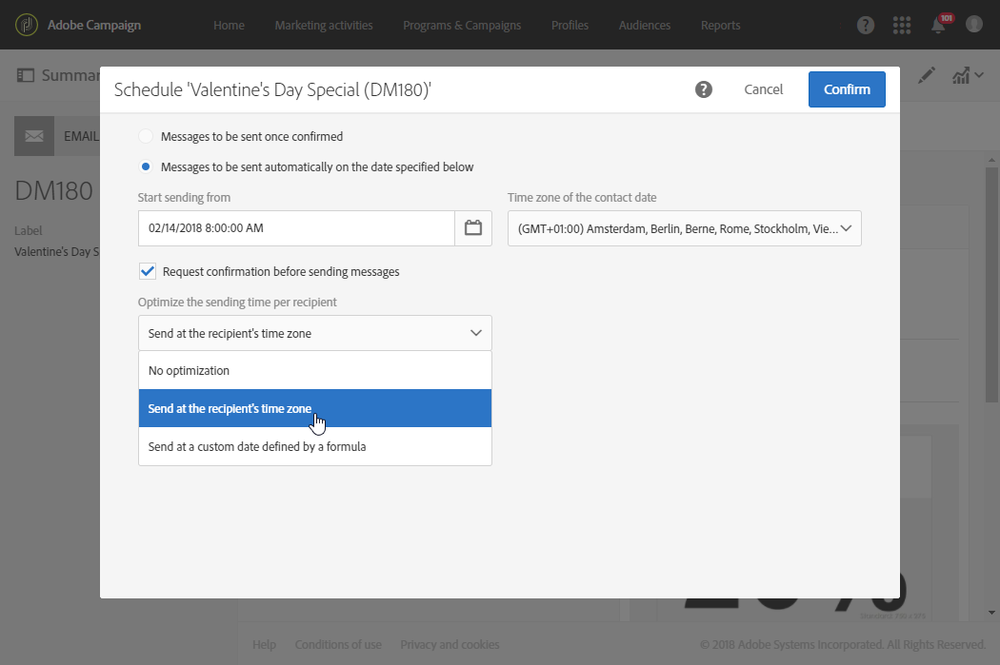
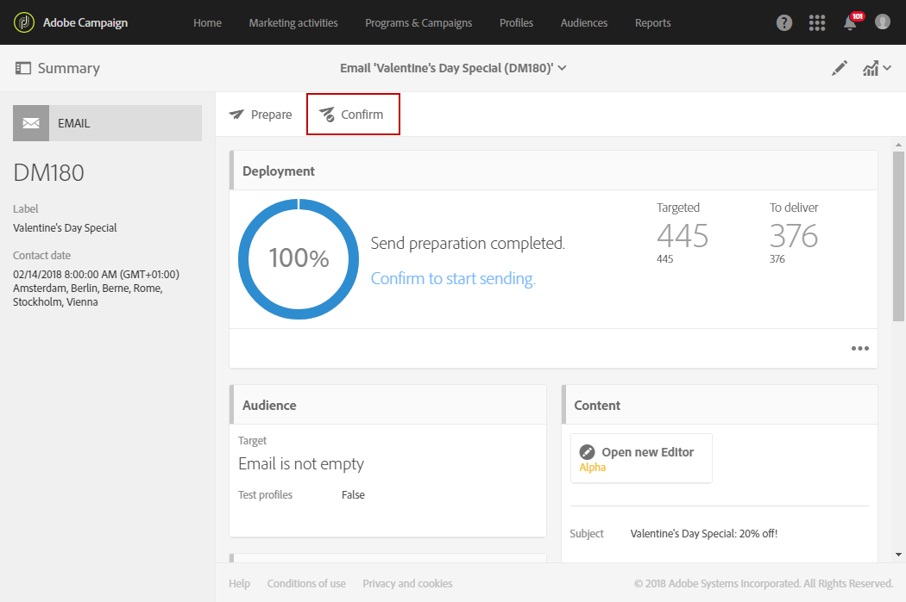

# 在收件者的時區傳送訊息{#sending-messages-at-the-recipient-s-time-zone}

在管理日期與時間很重要的行銷活動時，您可以排程將每個收件者的當地時間納入考量的傳遞：他們將在自己的時區中，於您排程的時間收到電子郵件、簡訊或推播通知。

>[!NOTE]
>
>若要使用此功能，請確定您傳送的目標輪廓在其屬性的區段中已指定&#x200B;**[!UICONTROL Address]** 時區。 如需輪廓屬性的詳細資訊，請參閱[本區段](../../audiences/using/editing-profiles.md)。

若要在收件者的時區傳送傳遞，您也可以在工作流程中使用 **[!UICONTROL Scheduler]** 活動。 如需詳細資訊，請參閱此[頁面](../../automating/using/scheduler.md)。

在以下範例中，我們想要向全世界的所有客戶發送僅在情人節當日有效的促銷代碼。 為了在白天提供足夠的時間使用，所有客戶必須在2月14日上午8:00（視其時區而定）收到您的訊息。

1. 在 **[!UICONTROL Marketing activities]** 索引標籤中，開始建立您的傳送內容，在我們的案例中是電子郵件。 如需瞭解傳遞建立的詳細資訊，請參閱[本區段](../../channels/using/creating-an-email.md)。
1. 設計您的情人節電子郵件後，按一下 **[!UICONTROL Create]** 以存取傳遞控制面板。 如需電子郵件設計的詳細資訊，請參閱[此頁面](../../designing/using/personalization.md#example-email-personalization)。

   

1. 從傳遞控制面板中，選取 **[!UICONTROL Schedule]** 區塊。

   

1. 選取 **[!UICONTROL Messages to be sent automatically on the date]** 下面指定的選項。 然後在&#x200B;**[!UICONTROL Start sending from]**&#x200B;欄位中，設定聯絡日期（在我們的案例中是2月14日上午8:00），這樣子每位收件者都會在情人節當天收到訊息。

   

1. 在欄位 **[!UICONTROL Time zone of the contact date]** 中，選取預設應傳送傳遞的時區。

   如果輪廓 **[!UICONTROL Time zone]** 被保留為 **[!UICONTROL Default]**，收件者會根據此處所選取的時區接收傳遞。

1. 從 **[!UICONTROL Optimize the sending time per recipient]** 下拉式功能表中，選取 **[!UICONTROL Send at the recipient's time zone]**。 這可以使收件者依據其時區在 2 月 14 日收到情人節電子郵件。

   

1. 確認傳遞排程後，按一下 **[!UICONTROL Prepare]** 按鈕，然後再 **[!UICONTROL Confirm]** 您的傳送內容。

   請務必至少提前 24 小時確認傳送。 否則，視其所在位置，某些收件者可能會在實際的情人節活動之前收到傳遞。

   

無論收件者位於何處，都將在當地時間2月14日上午8:00收到郵件。
