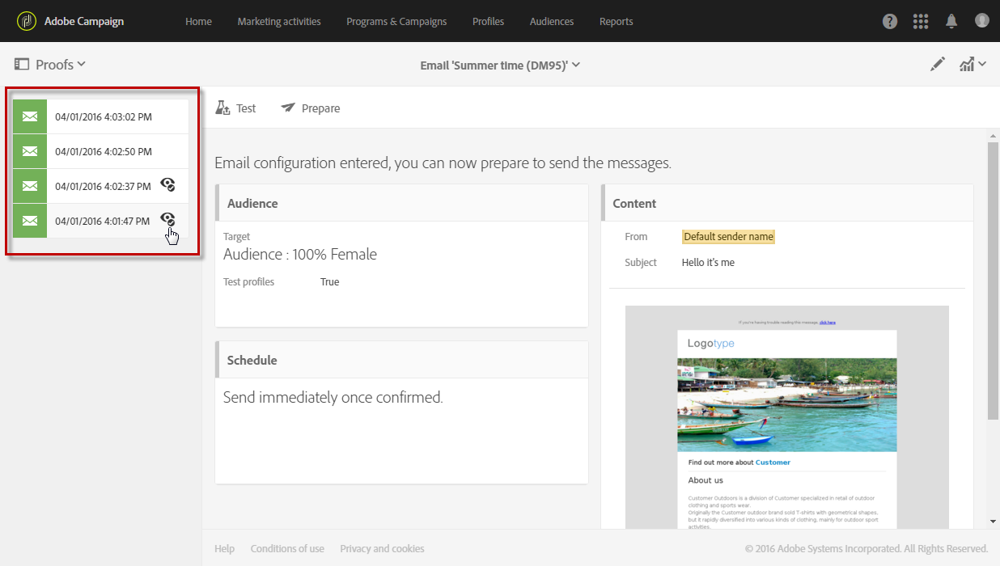
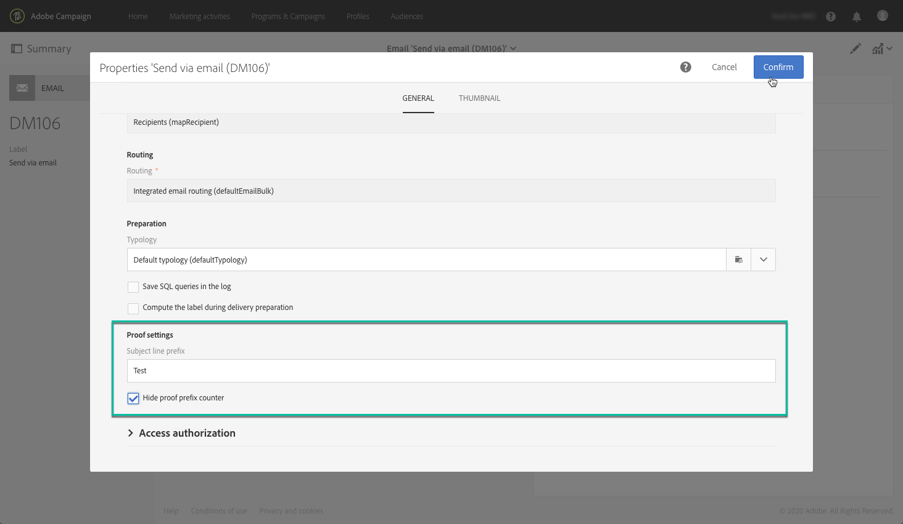

# 傳送校樣 {#sending-proofs}

## 關於校樣 {#about-proofs}

證明是一種特定訊息，可讓您在將訊息傳送至主要目標之前先測試訊息。 證明的收件者負責核准訊息（其內容和表格）。

校對收件者有兩種類型：

* **測試設定檔** ，可讓您定位不符合已定義定位准則的其他收件者。

   您可以將這些資料新增至訊息的讀者群，以偵測任何詐用收件者資料庫的行為，或確保電子郵件送達收件匣。 如需詳細資訊，請參閱「管 [理測試設定檔](../../audiences/using/managing-test-profiles.md)」。

   >[!NOTE]
   >
   >為了傳送證明，測試設定檔必須包含在訊息的觀眾中。

* **替代配置檔案** ，允許您將自己置於其中一個目標配置檔案的位置，並獲得配置檔案將接收到的消息的精確表示。 如需詳細資訊，請參閱「使 [用目標設定檔測試電子郵件訊息](../../sending/using/testing-messages-using-target.md)」。

   >[!NOTE]
   >
   >此功能僅適用於電子郵件通道。

## 傳送證明 {#sending-a-proof}

若要傳送校樣，請依照下列步驟進行：

1. 請確定校樣收件者已設定：
   * **測試設定檔** ，必須包含在訊息的讀者中。
   * **消息準備成功** 後 [，必須添加替代配置檔案(請參](../../sending/using/testing-messages-using-target.md)閱本節)。

1. Click the **[!UICONTROL Send a test]** button.

   

1. 選擇要使用的校樣類型：

   * **[!UICONTROL Email rendering]**:選取此選項，以測試根據收件匣定位的訊息接收方式。 如需詳細資訊，請參閱「電子郵 [件轉換」](../../sending/using/email-rendering.md)。
   * **[!UICONTROL Proof]**:選擇此選項，在將消息發送到主目標之前測試該消息。 證明收件者負責核准傳送內容及格式，
   * **[!UICONTROL Proof + Email rendering]**:此選項會結合前兩個選項。
   

   >[!NOTE]
   >
   >只有測試設定檔才提供電子郵件轉換功能。 如果未將測試設定檔新增至訊息，則只 **[!UICONTROL Proof]** 有選項可供選取。

1. 確認您的選擇。

   校樣會傳送至已設定的收件者。

   

1. 您可以使用下拉式清單 **[!UICONTROL Proofs]** 來檢視校樣。

   

1. 選取要存取其摘要的證明。 對於電子郵件，如果您已選取「 **Email rendering** 」(電子郵件轉換 **[!UICONTROL Access email rendering]** )選項作為校對類型，則校對標籤右側會顯示圖示。 請參閱 [電子郵件轉譯](../../sending/using/email-rendering.md)。

   

根據收到證明之人員的意見，您可能會被要求修改傳送的內容。 修改完成後，您必須重新開始準備電子郵件，然後重新傳送證明。 每個新校樣都可使用按鈕 **[!UICONTROL Show proofs]** 存取。

您必須視需要傳送多份校樣，直到完成傳送內容為止。 完成此作業後，您可以將傳送內容傳送至主要目標並關閉核准週期。

## 設定校樣的主旨行 {#configuring-proofs-subject-line}

當傳送證明時，其主旨行預設會以「 **Proof** 」首碼以及表示證明編號的計數器來設定。

要更改要使用的預設主題行，請執行以下步驟：

1. 在訊息控制面板中，按一下按 **[!UICONTROL Open properties]** 鈕。
1. 在章節 **[!UICONTROL Advanced parameters]** 中，定義您要在主旨行中預設使用的首碼。

若要隱藏主題行中的校樣編號，請啟用選 **[!UICONTROL Hide proof prefix counter]** 項。

>[!NOTE]
>
>如果要隱藏整個校對首碼，請將欄位留 **[!UICONTROL Subject line prefix]** 空。

1. 按一下 **[!UICONTROL Confirm]**. 預設會將設定套用至所選訊息所傳送的所有校樣。

**相關主題：**

* [傳送測試、準備和傳送電子郵件視訊](https://docs.adobe.com/content/help/en/campaign-learn/campaign-standard-tutorials/getting-started/sending-test-preparing-sending-email.html) 。
* [使用目標設定檔測試電子郵件訊息](../../sending/using/testing-messages-using-target.md)。
* [管理測試設定檔](../../audiences/using/managing-test-profiles.md)。
* [預覽訊息](../../sending/using/previewing-messages.md)
* [設定電子郵件通道](../../administration/using/configuring-email-channel.md)
